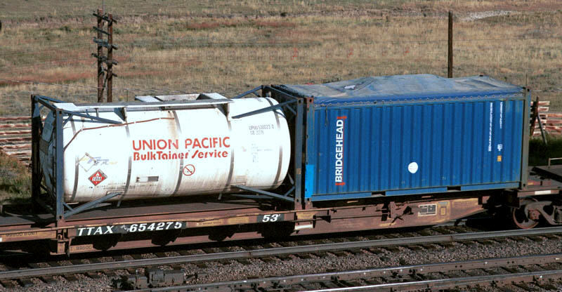
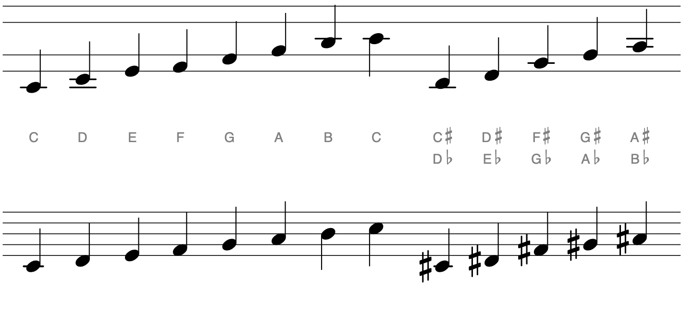
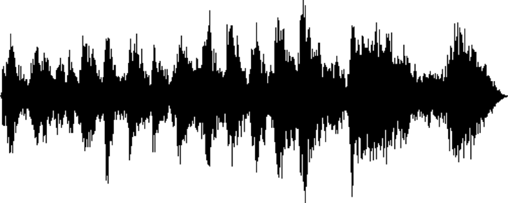
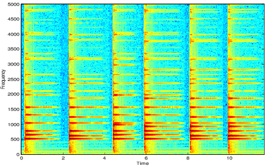
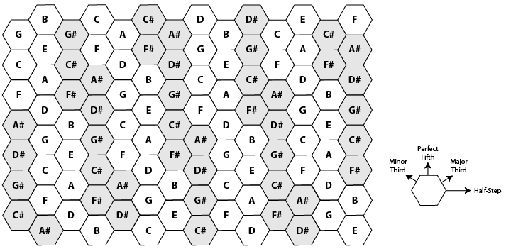

# Intro: Programming is the Art of the Possible

## Authors
Sam Tarakajian for NYU IDM

DM-GY 6063

@starakaj

## Essential Questions
- What is this class all about?
- What is networked art?
- What is a protocol? An interface? An encoding?
- Where do these show up in our everyday lives?
- What does it mean to learn programming?

## Introduction
In this introductory class, we'll spend a little time getting to know each other, as well as discussing what this course is all about. There will be an exercise to prime our understanding of the major course themes of interface, protocol, and encoding.

### Target Audience / Prerequisite & Pre-Assessment
This course is intended for students at the undergraduate or graduate level who have completed an introduction to programming. The primary programming environment used in this course is Node, so familiarity with JavaScript or a C-like programming language is a big positive. However, the course will draw on a wide skillset, so proficiency in another language or environment is helpful.

### Outcomes & Goals
1. The primary goal for this class is to learn how to make networked art. Dynamic websites with a remote backend, interactive installations and other pieces with multiple, coordinated parts all fall under the umbrella of networked art. By the end of this class, students will be able to understand how these systems work at a high and low level.
2. Another big focus in this class is on software development as a practice. Students will learn how to work on a large project with multiple parts, how to keep their work in version control, and how to coordinate with a team.
3. Finally, as a subtheme we'll investigate interface, protocol and encoding as they pertain to networked art. We'll ask how the interface to a piece of art affects its meaning, and how the existence of networked art and art-like artifacts shapes our society.

### Pacing / Duration
- 0:10 - Welcome to class, introductions, how the class works
- 0:20 - Discussion, what makes a program good? What is an elegant program? What is an efficient program? Is a program a math formula? Is a program an essay? When we write a program, who are we writing it for?
- 0:20 - Discussion, what is a protocol? An encoding? An interface? What is the Kyoto Protocol? What is the Hyper Text Transfer Protocol? What is an API? What is an API for? If you order 50 pizzas to your friends house, does that make you a hacker? What if you do it in person? What if you use the command line?
- 0:05 - Quick break
- 0:50 - Exercise, making ourselves into a protocol. Can we set up a protocol right here in class? Divide into two teams. Each team divides into two groups. Group A gets a prompt for something to draw. They can only communicate with Group B by showing them one of three cards. The goal is to get group B to draw the prompt as accurately as possible. Group B has one card that they can use to communicate back. You have 15 minutes to work out how you're going to do it.
- 0:20 - Let's talk about the methods that each group came up with. What parts were an encoding? A protocol? An interface? How did you deal with the fact that you had to express something complex using a very limited alphabet? What was the biggest strength of your particular choice. The biggest drawback? What shared assumptions did you and the drawing group have, that made things easier or harder?
- Whatever's left - Start getting set up for the next class.

## Materials Needed
- Laptop
- Internet connection

### Vocabulary (example)
* Interface:
* Protocol:
* Encoding:

## Class Script
Each class will have a section like this one. If you're reading this as a student, consider these to be class notes. If you're teaching this class yourself, you can of course say whatever you want here, adding your own examples and subtracting as much of what I've written here as you like. Of course, whatever you add or remove should still fit with the course as a whole.

### Introductions
We can start by going around and introducing each other.

If you look on GitHub, you'll see this quote to open the course "Politics is the art of the possible, the attainable — the art of the next best." That's because this class really isn't meant to be about programming or art making in the abstract. Rather, it's about making things, about creating works of digital art and all that entails.

I'm not really an academic or an artist, though I've been working with academics and artists for many years now. If there's one thing that's helped me organize the material for this course, it's the idea that the best way to learn to program is to do lots of programming. I want to try to give you the best of what ten years of working as a programmer has given me, in terms of an awareness of what programming is and how to do it well. I picture our relationship being a bit like a senior-developer to junior-developer type relationship. I'm sure there's lots of things you know that I don't, and hopefully over the next few weeks we'll all grow a lot together.

In the course title I've substituted the word "programming" for the word "politics," not to say that with progamming you never get anything real done. Rather I'm interested in drawing this distinction between coding as an area of study and programming as a discipline. It's a relationship that's sort of like geometry and architecture. When you project coding down into the real world, you get programming, which I think of like situated coding. My personal opinion, which hopefully I can convince you of by the end, is that this difference between coding and programming is more than just _pure_ versus _real_ or _clean_ vs _dirty_. Programming isn't diminished or restricted by being in the world. Rather, it draws power from its entanglements. It entangles itself with programmers, customers, audiences, society, culture, and other programs.

One way we'll see that entanglement is with each other. There are two big assignments in this course, the first being your midterm assignment. My goal for that assignment is to give you all something to work on that's too big for any one group to finish by themselves. So, each group will work on a piece of the assignment in parallel. Before you complete the assignment, we'll put the pieces together and demo the whole system working in concert. In order to work on the assignment, you'll have to figure out how to work with each other. How can one team test the interaction with another part of the system, before that part is finished? How will you test your ability to work with data, before any data has been gathered?

In the second half of this course, we'll start looking at different ways that computers can measure and manipulate data. Programming involves writing software that works with other programs. Programs expose their capabilities through interfaces, and communicate with each other using protocols. We'll look at protocols like UDP, OSC, Websockets, MIDI and Link; we'll also investigate data analysis frameworks dealing with audio, video, language, gesture, and generalized machine learning.

Throughout the course, there will be reading assignments that are chosen to get you thinking about how programming impacts the world. Programming is situated coding, and that situation includes human society and culture. Some of this reading will talk about beneficial changes that programming brings to society. Some will challenge the idea that certain technologies are always good. Some will simply reflect on what programming is, and how concepts from programming mirror our own experince as human beings.

That, in a large nutshell, is what this course will be all about.

### Cool Examples

When I say I want to help you build cool things, what kind of thing am I talking about?

- Weirdcore: https://www.youtube.com/watch?v=-0vrrTQFCjA — Stage design, just how many moving parts go into making something complex work. How many different kinds of data are moving. Tightly coordinating large systems.
- Daito Manabe: https://www.youtube.com/watch?v=Jkupc48RBRw — Drones synced to music. Representing their position with MIDI.
- Leafcutter John: https://www.youtube.com/watch?v=2jIlLHfSEfs — Making an instrument you play with light. How does the gesture make sense?
- David Bowen: https://www.dwbowen.com/telepresentwater — Tele-present water. Just very cool, but also what are the parts at play?
- Collective Of Two: https://vimeo.com/386776425 — Invisible Hand. Gathering incidental data and combining it both literally and artistically. Why does a law firm pay for something like this? Why do these guys make it?
- eCLOUD: http://www.ecloudproject.com/ - Transparent panels that reflect the state of the weather in some place (installed SF Airport).
- The Living, Twin Mirror: http://cheraudesir.com/the-living-twin-mirror-2017/ - Display imperfect representation of a person's face.
- Ronin Tool: https://100r.co/site/ronin.html - In-browser, LISP based design tool.
- The Living, Living Light: https://architizer.com/projects/living-light/ - Tree-like installations that reflect air quality.
- Matt Roberts, Waves: https://vimeo.com/20500963 - NOAA data to low frequency waves.
- Matt Kenyon, Spore 1.1: https://www.swamp.nu/projects/spore - A rubber tree that's tied, in multiple ways, to The Home Depot.

Lots of good examples of networked art here: https://www.postscapes.com/networked-art/

Looking at these examples, what kinds of techniques can you bring to your own work?

### What makes a program good?

Okay, I want to start with a discussion: what makes a program good? Now, given the experience that you've had up to this point in your academic and professional career, what would you say makes a program good? Let's write the rules.

Let's look at a case study. This is a game called VVVVVV. Maybe you've played it. It's about jumping around a space station. As far as I can tell it's quite beloved.   According to Anthony Burch on Descructoid, VVVVVV is "untarnished videogame ecstasy".

VVVVVV is interesting because the developer has recently released the source code. It's doubly interesting because, according to a lot of people who have looked at the code, it's somewhat dubious. "VVVVVV is not a technically sophisticated game! Even by the standards of self taught indie devs, it’s kind of a mess," says the creator.

Someone pointed out this particular function, involving a several-hundred case switch stetement for determining the state of the game https://github.com/TerryCavanagh/VVVVVV/blob/12497f6478149e1c57191837316cd2462bf7b1ec/desktop_version/src/Game.cpp#L692.

So, all together we have:
- The game is, on some level, good. Foremost, it actually released, which is itself an accomplishment. Further, it's well liked and relatively stable.
- Something about the code is off. Looking at the code, we feel like we could improve its organization.

Is this a good program?

Let's look at another example. This is from the original Quake source code, maybe you've seen it before.

```c
float Q_rsqrt( float number )
{
	long i;
	float x2, y;
	const float threehalfs = 1.5F;

	x2 = number * 0.5F;
	y  = number;
	i  = * ( long * ) &y;                       // evil floating point bit level hacking
	i  = 0x5f3759df - ( i >> 1 );               // what the fuck?
	y  = * ( float * ) &i;
	y  = y * ( threehalfs - ( x2 * y * y ) );   // 1st iteration
//	y  = y * ( threehalfs - ( x2 * y * y ) );   // 2nd iteration, this can be removed

	return y;
}
```

This code returns an approximation to an inverse square root, which is important when calculating lighting. It's faster than computing the equivalent using floating point arithmetic (at least on older hardware). At the same time, it involves some very difficult to understand math that depends on the underlying hardware. So, let's cast two things in tension:

- This code works. It got Quake released, and it wouldn't have been possible without this code.
- Imagine there was a bug in this code. If you were hired to fix the code and you hadn't worked on the original, how would you feel?

Given those two things, is this a good program?

One last example, take a look at this

```re
(?:[a-z0-9!#$%&'*+/=?^_`{|}~-]+(?:\.[a-z0-9!#$%&'*+/=?^_`{|}~-]+)*|"(?:[\x01-\x08\x0b\x0c\x0e-\x1f\x21\x23-\x5b\x5d-\x7f]|\\[\x01-\x09\x0b\x0c\x0e-\x7f])*")@(?:(?:[a-z0-9](?:[a-z0-9-]*[a-z0-9])?\.)+[a-z0-9](?:[a-z0-9-]*[a-z0-9])?|\[(?:(?:25[0-5]|2[0-4][0-9]|[01]?[0-9][0-9]?)\.){3}(?:25[0-5]|2[0-4][0-9]|[01]?[0-9][0-9]?|[a-z0-9-]*[a-z0-9]:(?:[\x01-\x08\x0b\x0c\x0e-\x1f\x21-\x5a\x53-\x7f]|\\[\x01-\x09\x0b\x0c\x0e-\x7f])+)\])
```

Can you guess what this does? This is the General Email Regex from RFC 5322, the Internel Message Format specification. It matches valid emails 99.99% of the time.

Is this a good program?

### Protocol, Interface, Encoding

Okay, let's keep discussing but I want to change gears a bit. Let's talk about something different. I want to talk about a few terms that get thrown around a lot: protocol, interface, encoding. What do these terms mean? Again, I want to write down the definitions.

- What is social protocol? What does it mean to violate social protocol?
- What is Hyper Text Transfer Protocol? What does it mean to violate the Hyper Text Transfer Protocol?
- What is the Kyoto Protocol? What does it mean to violate the Kyoto Protocol?

Social - Ways of speaking to and acting around other people. But also talking over each other.
HTTP - System of rules that allows two or more entities to transmit information via variation in a physical quantity.
Kyoto - Six gasses are translated to "emissions equivalents" and more developed countries have to meet stricter targets. Commitments. Financial and legal incentives to cooperate (cooperation also taking its literal meaning here: co-operate).

- What is an interface? What happens at interfaces?



Is this shipping container an interface? What does it interface?


Is this an interface?


How is this interface different?

- Encoding. Information converted to a form.



Is this an encoding? How is it different from this:



Or this:



How does it relate to this:



### Drawing Exercise

We've done a lot of thinking about protocols, interfaces and encodings. Let's see how that thinking changes after an exercise in trying to copy a drawing with very, very little information. The basic format of the exercise goes like this:

1. Split into teams of 2 or 3.
2. In the first part of the exercise, I'm going to give you three words and a series of drawings. The task for the first part of the exercise is to come up with a way of describing similar drawings using only those three words. You can use the words more than once and in any order, but those are the only three words that you can use to communicate (about drawing anyway) in the second half of the exercise.
3. So for example your three words might be "horse", "water" and "cable". You could up with a system where "horse" means draw a circle and repeating "water" makes the circle larger. So "horse water water water water" would mean "draw a very large circle. The drawer could say "horse" to mean "I understand you" and "cable" to mean "could you repeat that?" This might not be the best system but hopefully you get the idea.
4. In the second part of the exercise, choose one person to be the the drawer and another person to be the describer. From this point on, if you're describing a drawing, remember to use only the three keywords that I gave you.
5. Now the describers should all join a special mural that I will create for showing drawings. The drawers should each go into a special mural room created for each team.
6. Now you'll have five minutes to describe and draw each drawing as they are presented.
7. In the end we'll show each drawing. Each group will also describe their encoding system, and talk about why it worked well or why it didn't work so well. An interesting question might be if you could change something about your system, what would you change?

#### Drawing exercise instructor's notes

One nice thing about this exercise is that it's relatively easy to make it work even for a remote class. My approach involves Zoom breakout rooms and a handful of Mural boards, but anything that supports collaborative drawing ought to work perfectly. If everyone starts in the same Zoom call, you can split each team into a separate breakout room when the exercise starts. You'll also need `n + 1` mural rooms, where `n` is the number of groups that you have. Each drawer should have their own mural room, and you'll have one other mural room where you display all the drawings as time goes by.

As for what kind of drawings to present, that's up to you. I think a mix of simple and hard drawings makes sense. It's fun to throw in something really detailed at the very end to see how students cope with something well outside of what they were expecting to draw. Do they focus on replicating some small detail, or do they go for a low resolution approximation? Having this distinction arise organically is a nice way to spark thinking about interfaces, protocols and our experiences with both.

## Post Session aka Homework

### Installation
Make sure that you come to the next class with Node, NPM and Git installed on your machine (see installation instructions). Make sure you have an account on github. If you hate github for some moral or philosophical reason, talk to me and we'll figure out how to use some other host.

### Reading
- https://www.sametab.com/blog/frameworks-for-remote-working

### References
TBD

***With thanks and acknowledgement, this is based on the template provided by [Eyebeam](https://github.com/eyebeam/curriculum/blob/master/TEMPLATE.md)***
