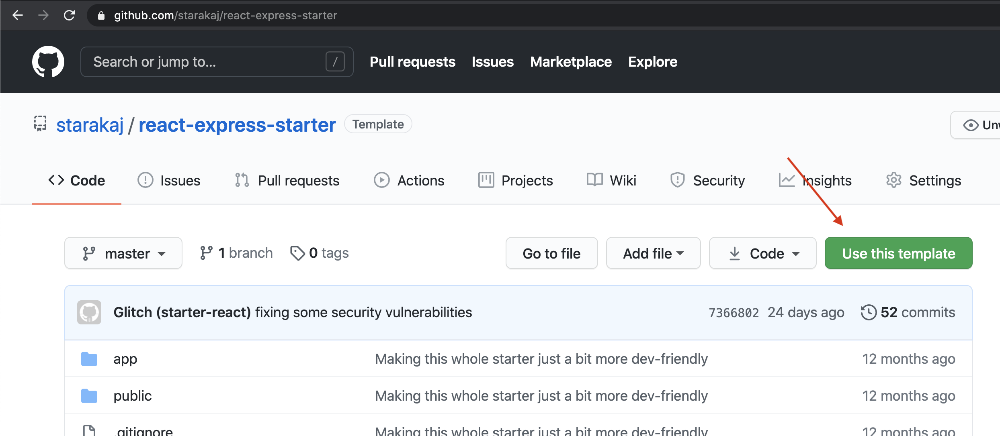
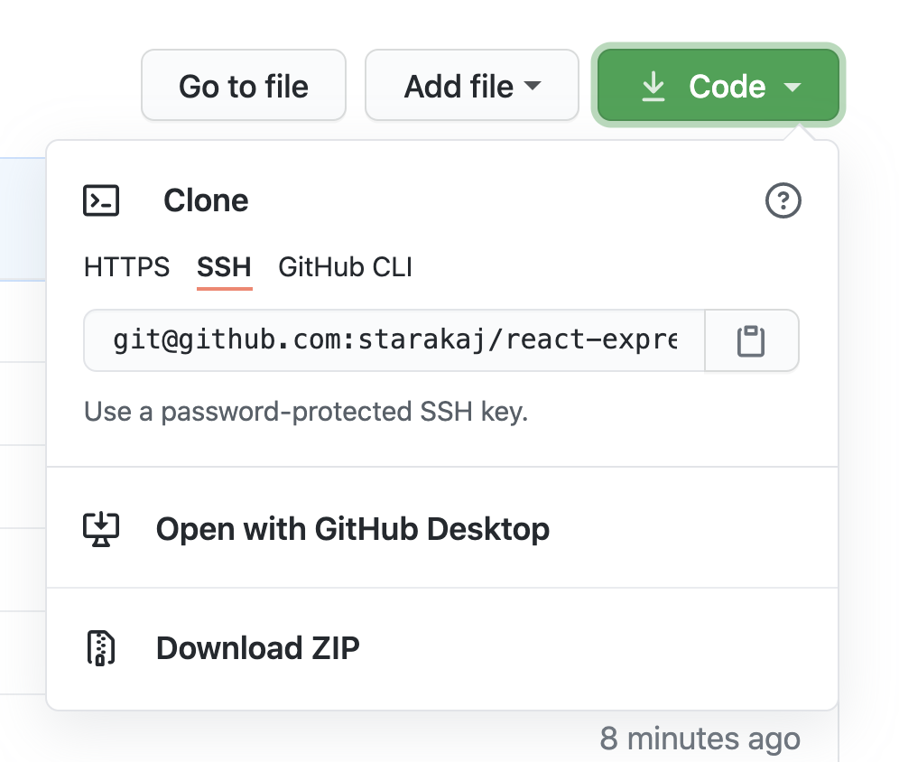
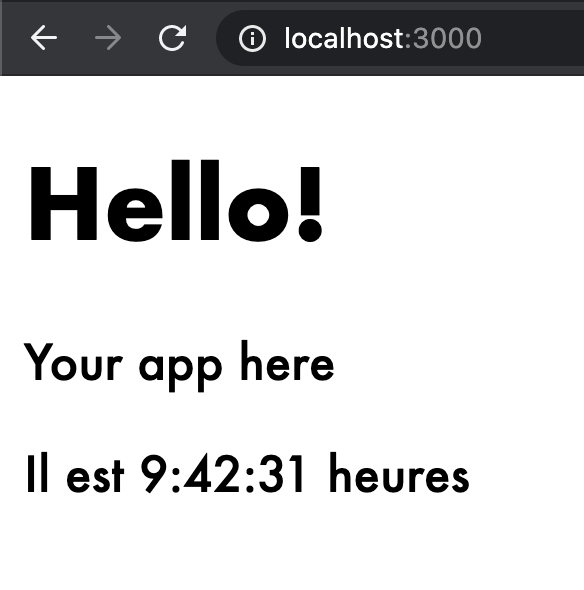
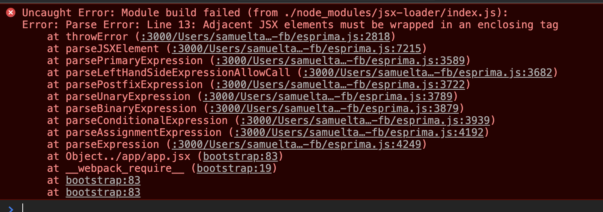

# Node, Part 2—Put it on Heroku

## Authors
Sam Tarakajian for NYU

@starakaj

## Essential Questions
- How can you render dynamic webpages? Also what is a dynamic webpage?
- What is React? Why do people use it?
- What is transpiling? How do we transpile?
- How do you actually host a Node.js script somewhere?

## Introduction
This class is about taking Node out of production and putting it on the Internet. We'll talk about how to start building a website that has both a public face, intended to be viewed by a person, as well as an API, intended to be viewed by a machine. We'll look at React, a front-end framework for building dynamic webpages.

### Outcomes & Goals
* In this class we will create a Node server that serves a dynamic webpage. The server will also have an API that another machine can use to interface with the program.
* That dynamic webpage will use React to manage its front-end interface.
* We will also deploy the program to Heroku, so that other people can actaully play around with it.

### Pacing / Duration
- 0:10 - Discuss the reading from last week.
- Create a new Node project
- Talk about React
- We'll be using React here just as a templating engine, which is just the tip of what it can do.
- Basic idea: we create templates using React, and transpile these to JavaScript before turning them into HTML using react-dom/server
- mkdir public, mkdir src
- Install Babel `npm install --save-dev @babel/core@7.1.0 @babel/cli@7.1.0 @babel/preset-env@7.1.0 @babel/preset-react@7.0.0`
- Create a .babelrc file
- Install react `npm i react@16.5.2 react-dom@16.5.2`
- Make a file called `App.jsx` in src
- Compile it using babel
- Create a server file to serve the generated content using `renderToStaticMarkup`
- Split the thing into components
- Make a component that welcomes the user
- Make a component that tells the user on what kind of operating system the server is running
- Now for a fun challenge, make a counter that tells the user how many times they've visited the page.
- Put the whole thing up on Heroku

## Materials Needed
As always, bring your own laptop. Please also make an account on [Glitch](https://glitch.com/), which we will be using to get our feet wet with React before setting up our local toolchain. You'll also need an account on [Heroku](https://www.heroku.com/), and to have installed the [Heroku CLI](https://devcenter.heroku.com/articles/heroku-cli).

### Exercises To Do Before Class
If you're new to front-end web development, and concepts like events, the DOM, and client-side state are new to you, then you might want to review. I highly recommend reading through the lesson notes for the Dynamic Web Development class at ITP, [available here](https://github.com/itp-dwd/2020-spring/blob/master/weeks/03_front-end-applications.md).

### Vocabulary (example)
* Client-side code: Code (in the context of the web, almost always JavaScript) that executes in the client's browser, as opposed to somewhere else.
* Dynamic webpage: Webpages who's structure and content can change after they are loaded.
* DOM: The Document Object Model. Basically, the structure of a web page, definied by the nesting relationship of its elements.
* Virtual DOM: A backing of the DOM that is faster to manipulate and to compare. Used by React to limit re-renders to those parts of the page that have changed.

## Exercise Descriptions
* Deploying a dead-simple Node application to Heroku.
* Playing with Glitch.com to learn the basics of client-side React.
* Installing a local toolchain to build a React app.
* Deploying our React app to the cloud.
* Working on the homework.

### Getting ready for Heroku
Last week we built a web server with Node that was able to display a simple webpage. We were able to run that server locally and to view the page on `localhost:3000`, but what if we wanted to put that server on the internet and run if from anywhere?

This is where things get a bit tricky. The first key to getting our server on the internet is to associate it with an IP address that anyone in the world can find. Up to now we've been using `localhost`, aka `127.0.0.1`, which is a special kind of IP address that always means "this machine." You could go to https://whatismyipaddress.com/ and get your IP, but that's just the IP address assigned to you by your ISP. It could change at any time, and you'd somehow have to inform everyone who wanted to visit your webpage about that change. Plus, if you wanted people to be able to visit your webpage at any time, you'd have to keep your computer running 24/7.

In the old days, individuals and businesses would have a physical server machine somewhere in their building that would be constantly handling requests from the outside world. People still do that these days, but it's also very common to work with a virtual machine provider to handle actually running your code for you. A VM host can do things like:

- Manage your IP address (static or dynamic).
- Dynamically balance your server load across multiple machines.
- Report security violations or suspicious activity.
- Automatically send you an email alert if your service goes down.
- Lots of other stuff.

So it's no real surprise that people pay for this kind of thing. Managing a virtual machine is a course—maybe even a degree—unto itself, but using Heroku we can get the basics working in just a few minutes. We could work from the server we build for homework (or the one from last week), but let's make one from scratch. It will be good practice.

```sh
mkdir hello-world-server
cd hello-world-server
git init
npm init
<accept all the defaults>
npm install express
```

We've seen how to make a server that uses template files last week, but for now let's make a barebones server that just returns a string. Make a file `server.js` that looks like this:

```js
const express = require("express");

const app = express();

app.get("/", (req, res) => {
    res.send("You did it, you made a web page");
});

app.listen(3000, () => {
    console.log("Server listening on port 3000");
});
```

You should be able to run this file `node server.js`. Then navigate to `localhost:3000` and you should see your web page. If you see your page load, then we're ready to deploy.

### Preparing our code
With our app in this state, we're ready to deploy.

First, create a _Procfile_. When you deploy to Heroku, the first thing it has to do is set up your machine, basically from scratch. The _Procfile_ helps Heroku know what you need. It tells Heroku which processes to run in which contexts. For a Node process that's as simple as a server, we only need a `web` process. The `web` process is a special process that's able to connect to the outside world. Let's define a simple process:

```Procfile
# Procfile
web: node server.js
```

We haven't talked about the "scripts" section of the `package.json` file yet, but it lets you attach a name to a particular set of instructions for Node to run. You'll see that `npm init` sets one up for us by default:

```json
// From package.json
{
    // ...
    "scripts": {
        "test": "echo \"Error: no test specified\" && exit 1"
    },
    // ...
}
```

You can this script (which clearly won't do much) by running `npm run test`. The `start` script is special—you can run it by typing `npm run start` or `npm start`.

Let's add a script to run our server with `npm start`. Edit package.json to look like this:

```json
// From package.json
{
    // ...
    "scripts": {
        "start": "node server.js",
        "test": "echo \"Error: no test specified\" && exit 1"
    },
    // ...
}
```

If you like, you can test running your server with `npm start`.

Okay, the next thing we need to do is make a small change to our server code. Right now, we're using port 3000 no matter what, as our hardcoded port. The thing is, when Heroku runs our server, it's going to tell us which port we should be listening on. It will pass this to our server using the _environment_, which is a set of properties that we can access from `process.env`. Edit our server code so it looks like this:

```js
const express = require("express");

// Use the POST environment property or 3000 if none is available.
const port = process.env.PORT || 3000;

const app = express();

app.get("/", (req, res) => {
    res.send("You did it, you made a web page");
});

app.listen(port, () => {
    console.log(`Server listening on port ${port}`);
});
```

Okay, now we're almost ready, just one more tiny change to make in order to be ready for Heroku. We need to tell Heroku which version of Node we'd like to use. To do that, we add a "node" property to the "engines" property of our package.json file. The completed package.json should look something like this:

```js
{
  "name": "hello-world-server",
  "version": "1.0.0",
  "description": "",
  "main": "index.js",
  "scripts": {
    "start": "node server.js",
    "test": "echo \"Error: no test specified\" && exit 1"
  },
  "author": "",
  "license": "ISC",
  "dependencies": {
    "express": "^4.17.1"
  },
  "engines": {
    "node": "12.x" // Use any Node version starting with 12
  }
}
```

Now we're ready!

### Deploying to Heroku

The basic idea behind deploying to Heroku is this: you push your code to a special repository location managed for you by Heroku. When you do, Heroku will detect that change and run your server for you.

First, we need to create a Heroku application. This contains the Heroku repo, as well as other resources for our application. Log in to Heroku, and under Apps, create a new app. The name has to be unique, so you can't call it hello-world-server (that's taken). Use whatever name you want. I named mine `dried-fish-server`.

Now Heroku is just waiting for us to push code to it. Let's go to the command line and commit all our changes.

```sh
git add .
git commit -m "Initial commit"
```

Now we need to login to Heroku. This has become very easy in recent years.

```sh
heroku login
```

Next, we need to add Heroku as a "remote." You can think of a remote as another machine that has been set up to mirror your git repository. We only need to set up this remote once.

```sh
heroku git:remote -a dried-fish-server
```

Now we can push to the remote named Heroku.

```
git push heroku master
```
We should get a bunch of stuff printed out, hopefully telling us that everything was successful.

```
remote: -----> Launching...
remote:        Released v3
remote:        https://dried-fish-server.herokuapp.com/ deployed to Heroku
remote:
remote: Verifying deploy... done.
To https://git.heroku.com/dried-fish-server.git
```

That's it! Go to the URL indicated to see your page on the real internet.

### React Basics

Okay, now that we've made it this far, let's shift gears and talk a bit about React. Last week we were using HTML templates, with strings like `%%%TITLE%%%` that we would replace with some text, or even a bit of HTML that we wanted to use in its place. At an extremely high level, React does the same basic thing. However, it does it much more powerfully and flexibly.

One downside to getting started with React is that it requires a bit of setup. We'll be working with a language for React called JSX that looks a bit like a blend of JavaScript and HTML. However, modern browsers can't work with JSX, so we have to _transpile_ (a porte-monteau of translate and compile) the JSX into JavaScript. To do that, we need to set up a local toolchain with developer tools called Webpack.

All of that toolchain stuff can get in the way of our learning how to work with React. So I've prepared a template that we can use to get started.

### Downloading the Template

You can find the template that we're going to be using at github.com/starakaj/react-express-starter. To get started with this template, we're going to create a new github repository, using this repository as a template.

Navigate to github.com/starakaj/react-express-starter. You should see a button that says "Use this template". Click the button.




After a few seconds, GitHub will have created your new repository. This starts will all the same files as in the original template, but it's totally your repository now. Do with it what you will. To get started working with it, we need to clone the repo to our machine. If you click the "Code" button, GitHub will give you a few options for how you might want to do that.



So you've got a few different ways to get your code. You can use any that you like, the only one that you should avoid here is the "Download Zip" option. This just downloads the files in the repository without creating a local repo we can make changes to. I usually use the SSH option. If you want to set this up, see the [official GitHub documentation](https://docs.github.com/en/github/authenticating-to-github/connecting-to-github-with-ssh) on the subject. If you like you can also experiment with the GitHub CLI. I've never used it but maybe it's great. For this class we can just use the HTTPS option.

Copy the code under the HTTPS tab, and then switch to your terminal. Navigate to a directory where you want to put your code, and then clone the repository. (Modify the code below for your home directory and the name of your git repo.)

```
cd ~/nyu/pip2021
git clone https://github.com/starakaj/react-express-prep.git
cd react-express-prep
```

Great, now we're ready to get started. In future, we'll be cloning templates a lot, so this is a great workflow to get used to.

### Navigating the template

This template comes with a bunch of files already in it. Let's look at some of the more important ones.

- _server.js_ - This should look extremely familiar, it's a server just like the one that we built last week.
- _Procfile_ - You should recognize this too. This is the Procfile that tells Heroku how to run our application.
- _webpack.config.js_ - This describes the configuration of the Webpack bundler. For now, we can ignore this, but we'll talk about it later.
- _index.html_ - This page loads our bundled _.js_ code and injects it into the page. For now we can ignore this.
- _app/app.jsx_ - This kicks off the whole program, and loads the "RootComponent" component into the _div_ with the id "main".
- RootComponent.jsx_ - This is the component that is the root of the entire application.

Before we get started modifying the application, let's just run the thing and see what happens. Wait! I see you about to do `node server.js`. This is how we ran the server in the last class, but there's a different way to run Node applications when they happen to be in an NPM package. Check out _package.json_ and look for the _scripts_ section.

```json
  "scripts": {
    "build": "webpack",
    "start": "webpack && node server.js",
    "watch": "NODE_ENV=development node server.js"
  },
```

Like we were talking about when we started to talk about React, we need to transpile and bundle our code before we actually run it. That's what happens when we run webpack. So as you can see, the _start_ script will run webpack first, and then run `node server.js`. We can do it all in one line by running `npm run start`. However, you might notice that there's another NPM script, called _watch_. This is a common pattern, where you'll have one NPM script to build a "release" version of your app, and another script that you'll run while you're developing. Since we're just trying out this repo, try running `npm run watch` and see what happens.

`Error: Cannot find module 'express'`

Oh, right, we need to `npm install` first. Let's do that and _then_ try running `npm run watch`. Now you'll see some output in your terminal, and if you navigate to `localhost:3000` you should see something like this:



### Going our own way

So there's a bunch of React components already in place in this application. Those are in the template so that you have something to start from when you use this template in the future. Since we're just learning the basics of React right now, let's delete everything in the `components` directory, and delete everything in `app.jsx` (don't delete the file itself though). Now, what do we put in that file? And what is a `.jsx` file?

This `app.jsx` file is the root of our React application. Its job is to load React into the web page, and to tell React to start rendering. So, let's do just that. First, we require "react" and "react-dom". The first is the React module, the second is a renderer for HTML.

```jsx
// app.jsx
const React = require("react");
const ReactDOM = require("react-dom");
```

To start rendering, we call `ReactDOM.render`, passing what we want to render and the component into which we want to render it. That might look a little something like this:

```jsx
const React = require("react");
const ReactDOM = require("react-dom");

ReactDOM.render(
    <h1>Hello there!</h1>,
    document.getElementById("main")
);
```

Let's start with the line `<h1>Hello there!</h1>`. That's a React component, even though it looks like a regular HTML component. That's by design. React is meant to look like HTML, but it transpiles to JavaScript code that can re-render itself dynamically. This is what makes React so popular as a front-end framework. If you're curious, you can run `npm run build` to see what the transpiled code looks like. The output is minified, but if you search for "Hello there!" you can find the line in question:

```js
n(4).render(
  r.createElement("h1",null,"Hello there!"),
  document.getElementById("main")
);
```

Again, there's a lot of minification so it's not easy to read, but you can see that `<h1>` has been replaced by a call to `createElement`, a React function.

### A New Name

Similar to last class, let make a page that will give us a new random name. This time though, let's just stick with a first name. To get started, we know that to generate a random name we can use the `chance` NPM library. So let's install that.

```
npm install chance
```

Now we can modify the code to produce a new name.

```jsx
const React = require("react");
const ReactDOM = require("react-dom");
const Chance = require("chance");

const mychance = new Chance();
const newName = mychance.first();

ReactDOM.render(
    <h1>Hello there, {newName}</h1>,
    document.getElementById("main")
);
```

This should all look pretty familiar. The big new thing is probably the `{newName}`. In JSX, everything except for tag names (`h1`, `h2`, `p`, `div`, `img`, etc.) is treated as text. By putting `newName` between curly braces, we're telling JSX that we want to evaluate `newName` as JavaScript and to use the result. Now try reloading the page a few times. If you're running `npm run watch` you won't even have to restart the server.

### module.exports

By this point, our application root is starting to get a little bloated. In terms of lines of code, it's not very big, but you could argue that it's doing too many things. Up to this point, we've been doing everything inside of a single JavaScript file. However, generally it's a good idea to follow a code pattern called separation of concerns. Here, we try to make sure that each file concerns itself with doing just one thing. So `app.jsx` is just concerned with putting the React app into the application root. We could have a separate file that generates random names for us.

Create a new file at `app/util/namer.js`. Give it contents like this:

```jsx
// namer.js
const Chance = require("chance");
const mychance = new Chance();

module.exports.first = function() {
    return mychance.first();
}

module.exports.last = function() {
    return mychance.last();
}

```

This is the first time we're seeing `module.exports`, which is a mechanism for including functionality from one JavaScript file in another. When we use `require`, like we do for `express`, we're making use of the `module.exports` mechanism. As you can see, `module.exports` is (by default) a JavaScript object. We can assign functions, constants, objects, or really anything we like to the properties of the `module.exports` object. Then, when other files require this file, they can retrieve the values that we've assigned to these properties. Here's what that might look like, back in our `app.jsx` file.

```jsx
// app.jsx
const React = require("react");
const ReactDOM = require("react-dom");
const namer = require("./util/namer");

const first = namer.first();
const last = namer.last();

ReactDOM.render(
    <h1>Hi there, {first} {last}</h1>,
    document.getElementById("main")
);
```

With an understanding of module.exports under our belt, we're ready to get down to what React is all about: rendering content that can update dynamically.

### React Components and useState

Suppose we wanted to have a button that could give us a new random name. We could simply reload the page, but what if we liked the first name or the second name, and we just wanted to refresh one or the other. How would we accomplish something like that? To do this, we're going to have to use a React component.

A React component is simply a function that returns JSX. Whenever something changes that the component depends on, React will re-render the component to reflect the changes. We'll talk about how to do that in a second, but first let's update our `app.jsx` file to use a componoent.

```jsx
const React = require("react");
const ReactDOM = require("react-dom");
const namer = require("./util/namer");

const first = namer.first();
const last = namer.last();

function RootComponent() {
    return (
        <h1>Hi there, {first} {last}</h1>
    );
}

ReactDOM.render(
    <RootComponent></RootComponent>,
    document.getElementById("main")
);
```

React comes with a lot of Components built in, things like `div`, `h1`, `img` and others. However, we're also able to define our own Components that work in exactly the same way. Here we define a Component by creating a function that returns JSX. We can then use that function name as if it were a Component, because it is.

Oh, one small thing, we can change `<RootComponent></RootComponent>` to `<RootComponent />`, since our component doesn't have any child components.

Now, I said that we can tell React to re-render our component by defining dependencies. One way to do this is to hook into the component state. We can do this by calling `useState` during the definition of a React component. Take a close look at this

```jsx
const React = require("react");
const useState = React.useState; // Get the useState function out of the React module
const ReactDOM = require("react-dom");
const namer = require("./util/namer");

const last = namer.last();

function RootComponent() {

    const [first, setFirst] = useState(namer.first()); // Create a first variable, and a function setFirst

    return (
        <h1>Hi there, {first} {last}</h1>
    );
}

ReactDOM.render(
    <RootComponent></RootComponent>,
    document.getElementById("main")
);
```

There's a few things going on here that we should take step by step. First, we're pulling the `useState` function out of the React module and storing it a variable `useState`. The magic happens later in the RootComponent function, where we call `useState`. First, notice the funny syntax on the left side of the equals sign. We're taking advantage of JavaScript to do something called array destructuring. Basically, `useState` returns an array, and we're declaring two variables at the same time. The first, `first`, takes the value of the first element of the array and the second, `setFirst`, takes the value of the second element of the array. So this line is equivalent to this:

```jsx
const state = useState(namer.first());
const first = state[0];
const setFirst = state[1];
```

On the right side of the equation we're calling the function `useState`. This tells React that we want to create some state for our RootComponent component. React returns two things. The first is `first`, which is the value of the state as React sees it. The second is a function `setFirst`. We can use the function `setFirst` to update the state of RootComponent. Finally, we pass to `useState` an initial value for the state. In this case it's a random first name.

Finally, down in the JSX portion, we use the `first` that comes back from `useState`, rather than a local variable `first`. So, all we need to do now to make the first name dynamic is to use the `setFirst` function to assign a new first name. Let's start by making a button.

```jsx
const React = require("react");
const useState = React.useState; // Get the useState function out of the React module
const ReactDOM = require("react-dom");
const namer = require("./util/namer");

const last = namer.last();

function RootComponent() {

    const [first, setFirst] = useState(namer.first()); // Create a first variable, and a function setFirst

    // Instead of calling namer.first(), use the first variable
    return (
        <h1>Hi there, {first} {last}</h1>
        <button>Refresh first name</button>
    );
}

ReactDOM.render(
    <RootComponent></RootComponent>,
    document.getElementById("main")
);
```

At this point if you check your JavaScript console, you'll see something like this (you might also see a red underline if you're using VSCode):



What this is trying to say is that a Component can only return one JSX component. If we want to return multiple components, they need to be wrapped in another component. So let's wrap them in a `div`.

```jsx
const React = require("react");
const useState = React.useState; // Get the useState function out of the React module
const ReactDOM = require("react-dom");
const namer = require("./util/namer");

const last = namer.last();

function RootComponent() {

    const [first, setFirst] = useState(namer.first()); // Create a first variable, and a function setFirst

    // Instead of calling namer.first(), use the first variable
    return (
      <div>
        <h1>Hi there, {first} {last}</h1>
        <button>Refresh first name</button>
      </div>
    );
}

ReactDOM.render(
    <RootComponent></RootComponent>,
    document.getElementById("main")
);
```

Now let's make the button actually do something. Let's create a function that the button should call when it's pressed.

```jsx
const React = require("react");
const useState = React.useState; // Get the useState function out of the React module
const ReactDOM = require("react-dom");
const namer = require("./util/namer");

const last = namer.last();

function RootComponent() {

    const [first, setFirst] = useState(namer.first()); // Create a first variable, and a function setFirst

    function updateFirst() {
        const nextRandomName = namer.first();
        setFirst(nextRandomName);
    }

    // Instead of calling namer.first(), use the first variable
    return (
        <div>
            <h1>Hi there, {first} {last}</h1>
            <button>Refresh first name</button>
        </div>
    );
}

ReactDOM.render(
    <RootComponent></RootComponent>,
    document.getElementById("main")
);
```

As you can see, the function is calling `setFirst` with a new, random first name. This updates React's view of the component state, which will trigger a re-rendering. Now we just need to call this function from the button. We can do this by setting the `onClick` property of the `button`.

```jsx
<button onClick={updateFirst}>Refresh first name</button>
```

And we've done it! Now just try clicking that button. As an exercise, do the same thing for the last name.

### React Component Props

So far, we've seen how to use state with `useState` to make a dynamically rendering React component. In addition to state, React has another major mechanism for passing values down to a component, called `props`. Actually, we've seen `props` in action already: when we set the `onClick` property of the `button` component. This sets the `onClick` prop, which the button can retrieve when it's time to render.

Using the same exact mechanism, let's update our greeting function to make it a bit more friendly to French visitors. Let's create a generic "Greeting" component that can render in multiple languages. First, let's move the Greeting component to its own file. Create a new file in `app/components/Greeting.jsx`

```jsx
// Greeting.jsx
const React = require('react');

module.exports = function Greeting() {
    return <h1>Hi there, insert name here</h1>
}
```

This is slightly different to the way we were using `module.exports` before. Rather than assigning `Greeting` to a property of the `module.exports` object, we're re-assigning `module.exports` to be our Functional Component. That's fine, we're allowed to do that. To use our new functional component, back in `app.jsx`, we require it in exactly the same way.

```jsx
const React = require("react");
const useState = React.useState; // Get the useState function out of the React module
const ReactDOM = require("react-dom");
const namer = require("./util/namer");
const Greeting = require("./components/Greeting");

function RootComponent() {

    const [first, setFirst] = useState(namer.first()); // Create a first variable, and a function setFirst
    const [last, setLast] = useState(namer.last());

    function updateFirst() {
        const nextRandomName = namer.first();
        setFirst(nextRandomName);
    }

    function updateLast() {
        const nextRandomName = namer.last();
        setLast(nextRandomName);
    }

    return (
        <div>
            <Greeting></Greeting>
            <button onClick={updateFirst}>Refresh first name</button>
            <button onClick={updateLast}>Refresh last name</button>
        </div>
    );
}

ReactDOM.render(
    <RootComponent></RootComponent>,
    document.getElementById("main")
);
```

As far as which is better, re-assigning the `module.exports` object, or setting its properties, it really doesn't matter. Often, when a JavaScript file is only exporting one "thing," it's common to re-assign the object. Whichever feels simpler is probably best.

Now, it seems like we've gone a step backwards, since our greeting isn't using the first and last names anymore. How do we pass these down to the Greeting component? It's simple: we use props. All we have to do is assign the `first` and `last` props, in exactly the way you'd probably expect.

```jsx
// app.jsx
const React = require("react");
const useState = React.useState; // Get the useState function out of the React module
const ReactDOM = require("react-dom");
const namer = require("./util/namer");
const Greeting = require("./components/Greeting");

function RootComponent() {

    const [first, setFirst] = useState(namer.first()); // Create a first variable, and a function setFirst
    const [last, setLast] = useState(namer.last());

    function updateFirst() {
        const nextRandomName = namer.first();
        setFirst(nextRandomName);
    }

    function updateLast() {
        const nextRandomName = namer.last();
        setLast(nextRandomName);
    }

    return (
        <div>
            <Greeting first={first} last={last}></Greeting>
            <button onClick={updateFirst}>Refresh first name</button>
            <button onClick={updateLast}>Refresh last name</button>
        </div>
    );
}

ReactDOM.render(
    <RootComponent></RootComponent>,
    document.getElementById("main")
);
```

But it's still not updating? That's because we're not actually using the props in our Greeting. We should update that now.

```jsx
const React = require('react');

module.exports = function Greeting(props) {
    return <h1>Hi there, {props.first} {props.last}</h1>
}
```

And now, the Greeting component is using our props. Nice! Okay, so to tie it all together, let's add a button to switch between English and French. We should have all the tools we need to do it, so it's just a question of applying what we've already learned. If you want to challenge yourself, try to take it from here.

First, let's create a little more state in our RootComponent to store the language.

```jsx
// app.jsx
function RootComponent() {

    const [first, setFirst] = useState(namer.first()); // Create a first variable, and a function setFirst
    const [last, setLast] = useState(namer.last());
    const [lang, setLang] = useState("en");
```

And a function to switch the language

```jsx
// app.jsx
    const [lang, setLang] = useState("en");

    function switchLang() {
        if (lang === "en") {
            setLang("fr");
        } else {
            setLang("en");
        }
    }
```

And a button to trigger the switch. To make things a bit cleaner, we can construct the button component outside of what we actually return.

```jsx
// app.jsx
    let langButton;
    if (lang === "en") {
        langButton = <button onClick={switchLang}>Switch to French</button>;
    } else {
        langButton = <button onClick={switchLang}>Switch to English</button>;
    }

    return (
        <div>
            <Greeting first={first} last={last}></Greeting>
            <button onClick={updateFirst}>Refresh first name</button>
            <button onClick={updateLast}>Refresh last name</button>
            {langButton}
        </div>
    );
```

Now, we need to add the `prop` to our greeting

```jsx
// app.jsx
    return (
        <div>
            <Greeting first={first} last={last} lang={lang}></Greeting>
            <button onClick={updateFirst}>Refresh first name</button>
            <button onClick={updateLast}>Refresh last name</button>
            {langButton}
        </div>
    );
```

And finally, change our Greeting component depending on the language.

```jsx
// Greeting.jsx
const React = require('react');

module.exports = function Greeting(props) {
    if (props.lang === "en") {
        return <h1>Hi there, {props.first} {props.last}</h1>;
    } else {
        return <h1>Bonjour, {props.first} {props.last}</h1>;
    }
}
```
Believe it or not, you've encountered just now the most important parts of React. There's a lot more to it, but these are the important pieces.

- Pass props to an object to configure it when it renders
- An object will re-render when its props changes
- With useState you can give an object state that you can change
- An object will re-render when its state changes
### Bonus Workshop: Dog CEO

There's a sick API out there called dog.ceo. Really it's cool.

https://dog.ceo/dog-api/

So with this, you can get random dog pictures for days. We haven't seen how to make a web request using JavaScript, but luckily in the browser there's a function called `fetch`. This belongs to the browser! It's not in Node—we can use it but only because this is a front-end application. We haven't seen asynchronous functions before either, so now let's talk about them.

An asynchronous function is a function that doesn't return right away. `fetch` is a perfect example of an asynchronous function—it has to go off and do something, and it might take awhile. In the meantime, we don't want to be waiting around, with our app stalled while it's doing it's thing. So we write something like:

```js
const response = await fetch("https://dog.ceo/api/breeds/image/random");
```

The `await` keyword is a special and very sexy new JavaScript thing that lets us resume execution when an asynchronous function finishes. All asynchronous functions must be marked with the `async` keyword. And you can only use `await` in a function that is itself async. So we could write an asynchronous function that returned the parsed JSON of a request to dog.ceo:

```js
async function fetchDogData() {
  const response = await fetch("https://dog.ceo/api/breeds/image/random");
  const dogData = await response.json();
  return dogData;
}
```

Okay! Armed with this new skill, can you add new functionality to our page? Add a button that, each time you push it, loads a new dog image into the page.

## Homework

See [homework 2](../../homework/02-heroku-hw.md)

### References
- [Heroku](https://heroku.com)
- [Glitch](https://glitch.com)
- [Heroku Procfile with Node](https://devcenter.heroku.com/articles/nodejs-support)
- [Dog CEO](https://dog.ceo/dog-api/)
- [async/await](https://developer.mozilla.org/en-US/docs/Learn/JavaScript/Asynchronous)
- [React](https://reactjs.org/)
- [React Hooks](https://reactjs.org/docs/hooks-state.html)
- [React Hooks Demistified](https://dev.to/kayis/react-hooks-demystified-2af6)
- [React Hooks are not Magic](https://medium.com/@ryardley/react-hooks-not-magic-just-arrays-cd4f1857236e)
- [React Hooks: how do they work?](https://www.netlify.com/blog/2019/03/11/deep-dive-how-do-react-hooks-really-work/)

### Implementation Guidance & Teaching Reflection
I have no idea if this class actually has way to much information or not enough information.

***With thanks and acknowledgement, this is based on the template provided by [Eyebeam](https://github.com/eyebeam/curriculum/blob/master/TEMPLATE.md)***
