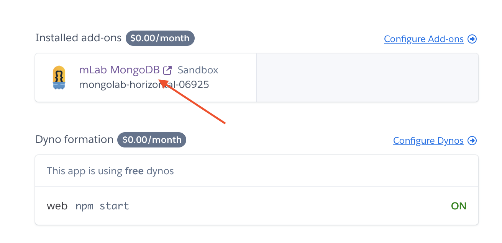
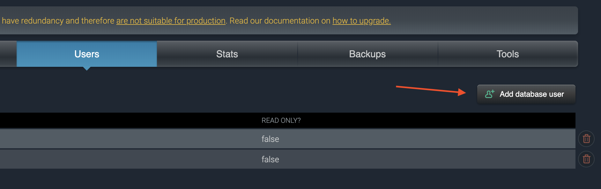
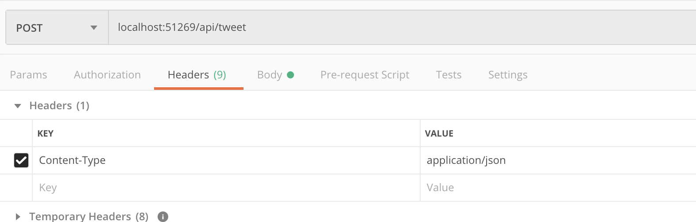
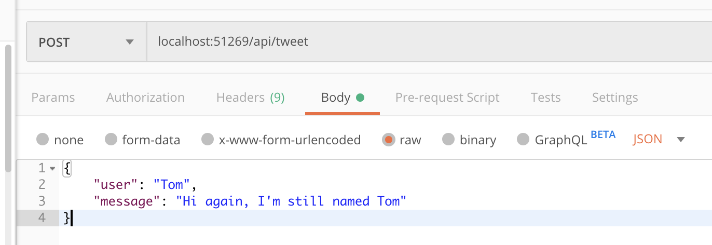

# Node, Part 3: Persistence

## Authors
Sam Tarakajian for NYU

@starakaj

## Essential Questions
- How can we persist data over a long period of time, even if the server restarts?
- What is CRUD? How can we implement it?

## Introduction
We've seen how to put a Node server on the Internet. The question is, how does that server store data? It could store data in memory, but then that goes away when the server closes. It could write files to disk, but file access is slow, especially if multiple people are trying to read/write a file at the same time.

### Target Audience / Prerequisite & Pre-Assessment
The first three Node classes are prerequisite for this class.

### Outcomes & Goals
* In this workshop we will be looking at how to implement data persistance on a web server. We will store data on a server, and update that data using an API call.
* Students will walk away with an understanding of how web servers work. They will understand how to implement a basic CRUD—Create, Read, Update, Delete—data store.

### Pacing / Duration
This workshop is indended to last about three hours

- Class breakdown
  - :15 Discussion of last week's reading
  - :10 Starting from a repo with some basic parts (express)
  - :10 Implementing a counter using just JSON
  - :15 Upgrading to a real database

## Materials Needed
- You should have the following installed on your machine:
    - nvm
    - git
    - Postman (https://www.postman.com/)
    - mongodb
        - See https://docs.mongodb.com/manual/administration/install-community/ for platform-specific installation instructions
    - sign up for heroku
    - (recommended) mongodb compass https://www.mongodb.com/download-center/compass which you can use to visualze your database


### Exercises To Do Before Class
- Introduce yourself to MongoDB concepts
    - https://docs.mongodb.com/manual/introduction/
    - https://docs.mongodb.com/manual/core/databases-and-collections/
    - https://docs.mongodb.com/manual/core/document/
    - https://docs.mongodb.com/manual/crud/

### Vocabulary (example)
* Database
* Deploy
* Virtual Machine

## Exercise Descriptions

### Visit counter

Way back in the day, back when the internet was cool, you would go to someone's home page and it would look like this:


Beautiful. See, these sites used to have a visitor counter, that would count the number of times someone had visited the page. We've already seen how to implement this, using either templates or React to create a page with dynamic contents. A trivial example might look something like this:

```js
const express = require("express");

const app = express();
const port = process.env.PORT || 3000;

let count = 0;

app.get("/", (_, res) => {
    res.send(`
        <html>
            <body>
                This page has been visited ${++count} times
            </body>
        </html>
    `);
});

app.listen(port, () => {
    console.log(`Listening on port ${port}`);
});
```

This is fine and good (except probably for the fact that it's a very bare bones website). The only thing is that none of the data persists. Everything is in-memory, which means that if we restart the server then everything goes away. We could in theory keep the server running forever, but there are other reasons we might want to persist memory:

- We might want to share the web traffic load across multiple websites.
- We might want to run some kind of analysis over our site data, for search or analytics or whatever.
- You can't actually run the server forever, that's madness.
- We might want to create another way of viewing the data, for example an API (more on this later).

So, let's talk about how to persist data.

### File persistence

The easiest way to consider data persistence is to imagine just writing a file to disk. Why not? The basic strategy is, we read in a file, update a piece of data in the file, and then write it back out to disk.

```js
const express = require("express");
const port = process.env.PORT || 3000;
const { promisify } = require("util");
const fs = require("fs");
const path = require("path");
const access = promisify(fs.access);

const app = express();

app.get("/", async (req, res) => {

    const datafile = path.join(__dirname, "data.json");

    try {
        let data = {
            pageviews: 0
        };

        try {
            await access(datafile, fs.constants.F_OK);
            const filecontents = fs.readFileSync(datafile, { encoding: "utf8" });
            data = JSON.parse(filecontents);
        } catch { /* We don't acually care if there's an error here */ }

        // Increment the number of pageviews
        data.pageviews = data.pageviews + 1;

        // Write the result back to disk
        fs.writeFileSync(datafile, JSON.stringify(data));
        
        // Finally, report back the number of pageviews
        res.send(`This page has been viewed ${data.pageviews} times`);
        
    } catch (e) {
        res.send("Some kind of terrible error happened");

        console.dir(e);
    }
});

app.listen(port, () => {
    console.log(`Express app listening on port ${port}`);
});
```

This is better (and also gives us a chance to talk about Promises and async/await!), but not ideal.

- Every time we change anything, we have to load the entire json file into memory, and then write it back to disk. This is slow.
- This just won't work if we can't write files to the machine in question. If we want to run this thing on Heroku, then we can't write files to disk like this, since we don't have a real machine, instead a virtual one.

Now we get to talk about something fun called a database.

### Mongodb

A database does a few important things for us:

- It's persistent storage.
- It's much (much) faster than reading/writing to disk.
- It provides an API, which means the database can be hosted in a number of ways (important for working with a VM).
- It takes care of a lot of messy details for us, like concurrency (two people touching the database at the same time) and consistency (not a problem for us, but a problem for some people).

Let's start a database! See the instructions on `https://docs.mongodb.com/manual/administration/install-community/`

Interacting with the database is a lot like interacting with a remote API. We don't actually deal with modifying any data files. Rather, we connect to the database server, and we handle requests by interacting with that server on the behalf of our client.

`Client -> Server (Our express server) -> Database Server (We don't write this) -> Actual database files`

See [this file](./src/mongo-basic/app.js) for the basics. As you can see, this app is able to stop and restart, while still keeping all of its data.

### Mongodb plus Heroku

Let's throw this up on Heroku. So right now we're running Mongodb locally. We could maybe figure out a way to tell Heroku to install Mongo on our virtual machine, but a better way is with something called a Heroku add-on. Log into Heroku, click on the app you want to use (we could use the same app we used last week, or create a new free one, whichever you prefer). Next, add the mLab add-on. This adds a Mongodb server that will start in parallel to our Heroku VM. 

If you want to push your new repo up to Heroku, follow the usual steps:

```
heroku login
heroku git:remote -a name-of-your-app
git push heroku master
```

If you're pushing over top of a different repository, remember to do `git push -f heroku master`

Another important piece: Last time we pushed a Node app to Heroku, remember that we used `process.env.PORT` to get the open port from the Heroku environment. We need to do the same thing here with Mongodb.

```js
let url = process.env.MONGODB_URI || "mongodb://localhost:27017/my-database";
```

Believe it or not, that's all we need to do in order to add a whole separate server, running Mongodb, connected to our Heroku VM server. Let's push it.

### MongoDB Compass Community

Something else that's kind of fun is that we can look at what's in the database without having to actually connect to our page. You can do this with the Mongo CLI, but you might enjoy more using MongoDB Compass, which provides a nice UI for looking at your database. To get it to work though I had to do the following steps:

1. Click on the mLab link to go to the mLab configuration page 
2. Add a new user. Pick a name and password for them. 
3. Back in MongoDB Compass, open a new connection window, click on `Fill in connection fields individually`, and then add paste in the details from the mLab page. Critically, make sure that the database is not `admin`, but rather the name of your database.

The cool thing about this is, you can see what data is in your database, and even change it out from under your server.

### Dumb Twitter

Okay, let's make something that's similar to Twitter, but much much worse. See also [Dumb Startbucks](https://en.wikipedia.org/wiki/Dumb_Starbucks). To start, let's clone the React starter from https://github.com/starakaj/react-express-starter to a new directory. We're going to be creating a server that mixes a front-end client written in React, with a back-end server that both hosts the client, as well as provides an API wrapper for our database.

Let's start by adding MongoDB as a dependency.

```
npm install mongodb
```

Now, let's change the name of `RootComponent.jsx` to something that actually makes sense, like `DumbTwitter.jsx`. Also let's create another React component called `DumbTwitterForm.jsx`, and another one called `DumbTwitterList.jsx`. Modify `DumbTwitter.jsx` so that it loads `DumbTwitterForm.jsx` and `DumbTwitterList.jsx`.

```js
// DumbTwitter.jsx
const React = require('react');
const DumbTwitterForm = require("./DumbTwitterForm");
const DumbTwitterList = require("./DumbTwitterList");

/* the main page for the index route of this app */
const DumbTwitter = function() {
  return (
    <div>
      <h1>Dumb Twitter</h1>
      <DumbTwitterForm />
      <DumbTwitterList />
    </div>
  );
}

module.exports = DumbTwitter;
```

```js
// DumbTwitterForm.jsx
const React = require('react');

const DumbTwitterForm = function() {
  return (
    <div>
      This is where the dumb Twitter form will go.
    </div>
  );
}

module.exports = DumbTwitterForm;
```

```js
const React = require('react');

const DumbTwitterList = function() {
  return (
    <div>
      This is where the dumb Twitter list will go.
    </div>
  );
}

module.exports = DumbTwitterList;
```

Cool. Now let's add some dummy data and try to display it.

```js
// DumbTwitter.jsx
const React = require('react');
const DumbTwitterForm = require("./DumbTwitterForm");
const DumbTwitterList = require("./DumbTwitterList");

const dummyData = [
  {user: "Tom", message: "Hi I'm Tom"},
  {user: "Alex", message: "Hi I'm Alex"},
  {user: "Tom", message: "Hi Alex, nice to meet you"}
];

const DumbTwitter = function() {
  return (
    <div>
      <h1>Dumb Twitter</h1>
      <DumbTwitterForm />
      <DumbTwitterList tweets={dummyData}/>
    </div>
  );
}

module.exports = DumbTwitter;
```

```js
// DumbTwitterList.jsx
const React = require('react');

/* the main page for the index route of this app */
const DumbTwitterList = function(props) {
    const tweets = props.tweets || [];

    // The map function returns a new array, calling the function on each element of the array
    const tweetComponents = tweets.map((tweet, idx) => {
        return (
            <li key={idx}> {/* In a list of components, each one needs a unique key, or else you'll get a warning */}
                <strong>{tweet.user}:</strong> {tweet.message}
            </li>
        )
    })

    return (
        <div>
            <ul>
                {tweetComponents}
            </ul>
        </div>
    );
}

module.exports = DumbTwitterList;
```

Cool. Now even though this is DumbTwitter, we can't use dummy data forever. Let's actually load some data from our database. To do that, let's start by creating an API endpoint. This actually goes in our server.

```js
const dummyData = [
  {user: "Tom", message: "Hi I'm Tom"},
  {user: "Alex", message: "Hi I'm Alex"},
  {user: "Tom", message: "Hi Alex, nice to meet you"}
];

// Fetch tweets from the database
app.get("/api/tweets", (_, res) => {
  res.json(dummyData);
});
```

Nice next we gotta make it so our React app uses this endpoint to fetch it's data. This is the really cool part IMO, where we go from basically using React for fancy templating, to actually making a single-page web app. Let's modify `DumbTwitter.jsx` to make a fetch request to get the tweets.

```js
const React = require('react');
const DumbTwitterForm = require("./DumbTwitterForm");
const DumbTwitterList = require("./DumbTwitterList");

const DumbTwitter = function() {

  // Initialize an array of tweets with an empty array
  const [tweets, setTweets] = React.useState([]);

  // When this component loads, fetch tweets from the API
  React.useEffect(async () => {
    const response = await fetch("api/tweets");
    const body = await response.json();
    setTweets(body);
  }, []); // Remember, an empty array as the second argument means "just do this once"

  return (
    <div>
      <h1>Dumb Twitter</h1>
      <DumbTwitterForm />
      <DumbTwitterList tweets={tweets}/>
    </div>
  );
}

module.exports = DumbTwitter;
```

Neat right? So the first page loads quick, and then we make a separate request for all of the actual "tweet" data. We can also use Postman to confirm that this get is working.

### Posting to Dumb Twitter

Now let's actually post to this dumb twitter. To do that, let's make an API endpoint for posting.

```js
// server.js

// Need to add body-parser middleware
const bodyParser = require('body-parser');
app.use(bodyParser.json());

// .....

// Post a new tweet
app.post("/api/tweet", (req, res) => {
  const body = req.body;
  const user = body.user;
  const message = body.message;
  if (!user || !message) {
    res.status(400).send("Missing user or message");
  } else {
    dummyData.push({user, message});
    res.sendStatus(200);
  }
});
```

We can test out this endpoint using Postman. We need to be careful though to let the server know, through the request headers, that we're sending JSON. Otherwise the body parser won't work. 

Now we can add a JSON request, as a Raw body 

Cool thing is, after reloading this, we can actually see our tweet on the page if we reload it. Uncool thing is, if we restart our server, all of our amazing tweets are gone. So, let's store them in MongoDB.

### Storing tweets in MongoDB

Now for the really, really fun part. Let's connect our API endpoints to Mongo. First, you'll have to set up Mongo similarly to the way we did at the beginning of class. Next, you'll need to modify your API endpoints to do something like this:

```js
// Fetch tweets from the database
app.get("/api/tweets", async (_, res) => {
  const tweetsCollection = await dbClient.collection("tweets");
  const tweets = tweetsCollection.find({});
  res.json(await tweets.toArray());
});

// Post a new tweet
app.post("/api/tweet", async (req, res) => {
  const body = req.body;
  const user = body.user;
  const message = body.message;
  if (!user || !message) {
    res.status(400).send("Missing user or message");
  } else {
    const tweetsCollection = await dbClient.collection("tweets");
    tweetsCollection.insert({user, message});
    res.sendStatus(200);
  }
});
```

Now, we should be able to make a post request through Postman to update the database, or modify it directly using MongoDB Compass.

Okay! We're so, so close to actually posting tweets from our page. Last thing we need to do is complete the React form so that it actually sends stuff to our API endpoints.

### Posting from the client app

Modify `DumbTwitterForm.jsx` to look like this:

```js
const React = require('react');
const qs = require("qs");

/* the main page for the index route of this app */
const DumbTwitterForm = function(props) {

    const [user, setUser] = React.useState("");
    const [message, setMessage] = React.useState("");

    const updateUser = (event) => {
        setUser(event.target.value);
    }

    const updateMessage = (event) => {
        setMessage(event.target.value);
    }

    const asyncSubmit = async () => {
        const response = await fetch('/api/tweet', {
            method: 'POST',
            headers: {
                'Content-Type': 'application/json',
            },
            body: JSON.stringify(({user, message})),
        });
        if (response.status === 200) {
            setUser("");
            setMessage("");
            if (props.onTweeted) props.onTweeted();
        }
    }

    const handleSubmit = (event) => {
        asyncSubmit();
        event.preventDefault();
    }

    return (
        <form onSubmit={handleSubmit}>
            <label>
                User: 
                <input type="text"value={user} onChange={updateUser}/>
            </label>
            <label>
                Message: 
                <input type="text" value={message} onChange={updateMessage}/>
            </label>
            <input type="submit" value="Submit"/>
        </form>
    );
}

module.exports = DumbTwitterForm;
```

So there's a couple of important things going on here. First and most importantly, we're using a form with `onSubmit` and `onChange`, which means that this form is what React calls a "controlled componnent." That just means that this form doesn't handle its own state. Rather, it passes all of it off to React. So, we create two pieces of state, `user` and `message` to hold that state.

Second, you may notice that handleSubmit is not an asynchronous function, but it does call an asynchronous function. That's okay! This allows us to call `event.preventDefault` without React getting mad at us, which lets us prevent the default behavior for submitting a form, which is reloading the page.

The actual `fetch` request is itself really important. We call `/api/tweet` with method = POST, but the most important thing is `Content-Type: "application/json"`. If we don't do this, then the server won't honor our request, since it's expecting JSON.

Finally, if the call is successful, we bubble up a "onTweeted" event, which the container element can use to fetch the latest tweets.

```js
const React = require('react');
const DumbTwitterForm = require("./DumbTwitterForm");
const DumbTwitterList = require("./DumbTwitterList");

const DumbTwitter = function() {

  // Initialize an array of tweets with an empty array
  const [tweets, setTweets] = React.useState([]);

  const fetchTweets = async () => {
    const response = await fetch("api/tweets");
    const body = await response.json();
    setTweets(body);
  }

  // When this component loads, fetch tweets from the API
  React.useEffect(() => {
    fetchTweets();
  }, []); // Remember, an empty array as the second argument means "just do this once"

  return (
    <div>
      <h1>Dumb Twitter</h1>
      <DumbTwitterForm onTweeted={fetchTweets}/>
      <DumbTwitterList tweets={tweets}/>
    </div>
  );
}

module.exports = DumbTwitter;
```

And that's it, we're all done!

https://dumb-twitter.herokuapp.com/

## Student Reflections, Takeaways & Next Steps

## Post Session

### References

### Implementation Guidance & Teaching Reflection  

***With thanks and acknowledgement, this is based on the template provided by [Eyebeam](https://github.com/eyebeam/curriculum/blob/master/TEMPLATE.md)***