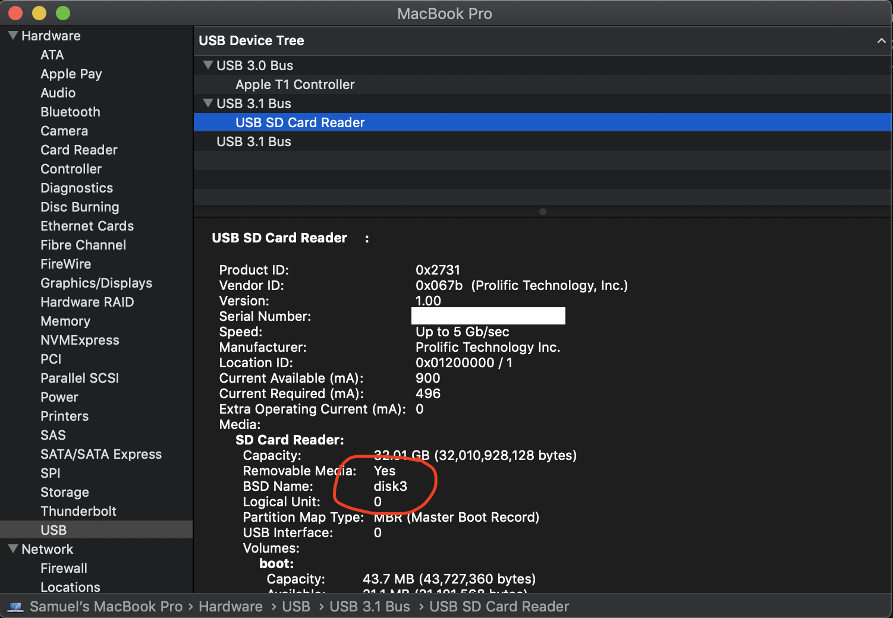
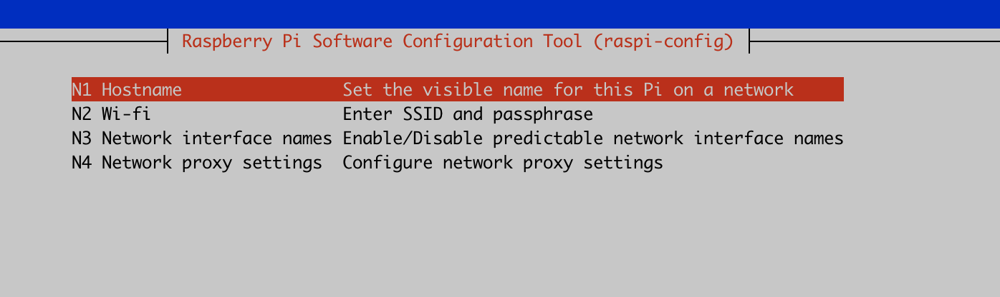
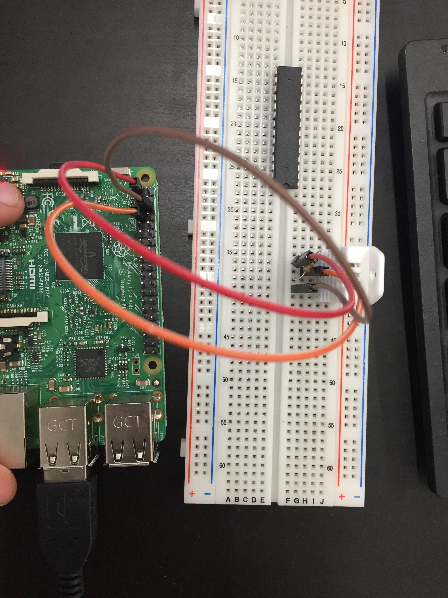

# Raspberry Pi

## Authors
Sam Tarakajian for NYU IDM

DM-GY 6063

@starakaj

## Essential Questions
- What is a Raspberry Pi?
- How can a Raspberry Pi interface with the outside word?
- How can we connect sensors + motors to our Raspberry Pi?

## Introduction
In this class we'll look at how to start up a Raspberry Pi, how to run code on it, and how to use sensors and actuators with our Pi. Finally, we'll see how to upload that code to the internet, using a custom server.

Over the last decade or so, the Raspberry Pi has becomen increasingly recognizable and ubiquitous. It's small, low-cost and extremely powerful. For less than $100, we can install a general purpose computer that can also gather data from the outside world using hardware sensors. When people talk about the Internet of Things, they're talking about the kind of ubiquitous computing that hardware like Raspberry Pi makes possible.

### Target Audience / Prerequisite & Pre-Assessment
This module is part of DM-GY 6063, _Programming is the Art of the Possible_. This is a second semester creative coding course, designed for students who have a strong JavaScript foundation.

### Outcomes & Goals
* In this class we'll be using a Raspberry Pi. That means writing code that will run on a Pi, and determining that the code is operating as expected. We will also see how to gather sensor data from a Raspberry Pi, and how to connect to the internet and upload that data.
* Students will come away understanding the basics of how to get up and running with a Raspberry Pi, and how to turn one into a data gathering device.

### Pacing / Duration
TBD

## Materials Needed
Well a Raspberry Pi obviously. Having a GPIO hat might be nice too.

### Exercises To Do Before Class


### Vocabulary (example)
* Embedded - 
* Raspberry Pi -
* Internet of Things -
* Ubiquitous Computing -
* Sensor -
* Hat -
* GPIO -

## Exercise Descriptions

### Up and running

Believe it or not, the first thing to do is _not_ to get out your Raspberry Pi. The first thing to do is to get out your MicroSD card and install Raspbian OS on it. You can download the OS here: https://www.raspberrypi.org/downloads/raspbian/

Now we get to copy the operating system onto the disk.

#### OS X

Open up "About this Mac" from the apple menu in the top left. Click on System Report... then on USB (or card reader if you're using an internal card reader). Find your drive. Note the BSD name, it will be something like `disk3`.



Now, head over to the command line. First, unmount the disk.

```sh
diskutil unmountDisk /dev/disk3
```

Make sure your copy of the RaspbianOS is somewhere easy to find, and that you've unzipped it so it's a .img and not a .zip. Now, copy it to the MicroSD, replacing what's on the SD with the .img.

```sh
sudo dd bs=1m if=/Users/samueltarakajian/Desktop/2020-02-13-raspbian-buster-lite.img of=/dev/disk3 conv=sync
```

When this completes, hopefully with success, eject the disk.

```sh
sudo diskutil eject /dev/disk3
```

### Setting up Wifi on your Pi

Now you're ready to start your pi. Connect the keyboard, screen and power, then boot up your Pi. The default login is `pi` with password `raspberry`. You can (and should) run `raspi-config` to change this. You may get a notification about needing to run this with "root access", which you can accomplish by prefixing commands with the word "sudo" (superuser-do).

Unlike an Arduino, it's not common to use a wired connection to communicate with a Raspberry Pi. Unlike an Arduino, which simply runs a series of instructions, a Raspberry Pi typically runs a full operating system, capable of things like accessing files, managing users and much more. So often the very first thing that you'll do on setting up a new Pi (after installing the operating system) is configure the WiFi, since `ssh` (more on that later) is the main way to interact with the Pi.

Run `sudo raspi-config` to set a WiFi name and password. This will also have you set the country for your Pi. I'm not sure whether NYU WiFi does something called "access point isolation" --- just in case I'll set up my phone for tethering. 

Now you should be able to run `ifconfig` to find the ipv4 network address for this raspberry pi. Remember this—we'll use it to ssh into the pi in a second.

One last thing we need to do—enable the SSH server for our raspberry pi. Run `sudo raspi-config` again and go to option 5, interfacing options. Enable the ssh server. It might give you a warning about insecure passwords, which you might want to take to heart.

After you've done this, run `reboot` from the pi. Now we're going to connect to it from our desktop.

### A brief aside: wpa_supplicant.conf and nano

The `raspi-config` tool is great and makes configuring a Pi significantly easier than it might otherwise be. However, it's really just a thin wrapper around some simple operations. Adding a WiFi network just creates a new entry in a file called `wpa_supplicant.conf`. This is important because to remove a WiFi entry, you can't use `raspi-config`, you have to edit this file directly. This bit me earlier today when my Pi was connecting to the wrong WiFi network by default, since the wrong network was above the one I actually wanted to connect to in `wpa_supplicant`.

Now, how the heck do you edit this file without a text editor? The answer is that you use something called `nano`, which is a keyboard-only text editor that runs in the command line. This is how people edited text files before the computer mouse. It takes a little getting used to, but there's a nice cheat sheet here https://www.nano-editor.org/dist/latest/cheatsheet.html.

```
sudo nano /etc/wpa_supplicant/wpa_supplicant.conf
```

And then you can manually remove WiFi networks, if you want.

### SSH into your pi.

This is the hacking part. Remember the IP address that we got a second ago from the pi? From your desktop machine, run something like

```sh
ssh pi@172.20.10.2
```

using your own IP address. This will prompt you for the raspberry pi user's password. Now you're in! You're running commands on your Raspeberry Pi, but from your desktop. This is why, when you opened up `ssh` access on your Pi, you got a warning if you hadn't changed the default password. Now anyone who knows the default password to your Raspberry Pi can get root access. But at this point, we don't need the keyboard and screen anymore. You can ssh into your pi directly and work entirely on your desktop machine.

At any time, you can press Ctrl-D to end your SSH session.

### Setting the hostname

It's a bit annoying having to remember the IP address of your Raspberry Pi all the time. Fortunately, if you go back to `raspi-config`, you can change the hostname of your Raspberry Pi.



We've talked a little bit before about DNS, very early in one class. Basically when you connect to `google.com`, your computer first has to check with something called a DNS registry to determine with what numerical IP address the name "google.com" is associated.

Windows and OS X both run local DNS servers by default. When your Raspberry Pi joins the network, it looks for local DNS servers and adds its IP address to the record along with its hostname. The upshot is that if you change your Raspberry Pi's hostname to, say, my-cool-pi, then you can connect to it like so

```
ssh pi@my-cool-pi.local
```

The one gotcha here is that the hostname has to be unique across the local network, otherwise it will get an incrementing numerical suffix. So choose a unique hostname if you want to be able to log in reliably.

### Install Node on you rPi

First SSH into your Pi. Then, from your SSH terminal
```
curl -sL "https://deb.nodesource.com/setup_12.x" | sudo -E bash -
```

And then
```
sudo apt-get install -y git nodejs
```

This will install Node version 12 as well as git. Nice thing about this, we can run the same node on our Raspberry Pi as on the desktop.

### Getting files onto your Raspberry Pi

Okay, now if we want to get code onto our Raspberry Pi, we have a few choices. One very fun option is to use something called scp. I think it's fun anyway. With the `scp` command, you can actually copy files to your Raspberry Pi to your desktop machine.

```
scp MyFile.md pi@172.20.10.2:/home/pi/files
```

Will copy the file `MyFile.md` into a folder called "files" in the home directory of the user called `pi` on your Raspberry Pi. Neat, no? You might download a Git repo as a .zip file on your desktop—you could use this to copy it over to your Raspberry Pi.

SCP is cool but the issue is that you have to copy over an entire folder. What if you just want to copy over whatever has changed? For that there's a tool called `rsync`. Supposing the hostname of your Raspberry Pi is `raspi-one` (you can also use the numerical IP address here) you can use the following command from your desktop:

```
rsync -avz -e ssh folder pi@raspi-one.local:/home/pi/folder
```

This will "push" code from your computer to your Pi, synchronizing the contents of a local folder "folder" with the path "/home/pi/folder" (aka ~/folder) on the Pi.

See more complete instructions here https://www.raspberrypi.org/documentation/remote-access/ssh/rsync.md

Another option, if you're using VSCode, is to take advantage of a plugin for SSH. After installing this plugin, you'll see a "Remote Explorer" icon in the VSCode left toolbar. You can use this to connect to an SSH host, and then to log in to your Raspberry Pi. This lets you modify files on the Pi directly, using the VSCode editor on your desktop. This can be very, very useful. Similar plugins exist for SublimeText and Atom.

Another great way to synchronize folders is to use git. The idea is, you put a central Git repository up on Github. Both the pi as well as your desktop track the same, remote Git repository. This adds Github.com as an intermediary, which can be annoying and which means that your Pi must be connected to the internet. Not always ideal, but it does guarantee that your work will have a backup. Nice if you need to setup a new Pi, or restore an old one (maybe you forgot your password).

1. Create a remote repository on Github.
2. Check it out on your desktop machine
3. Check it out on your Raspberry Pi
4. Make a change on your desktop, push
5. Pull the change on your Raspberry Pi

Note that if you get an error when you try to pull on your Raspberry Pi, it might be because you're trying to pull with ssh. That's something we can set up, but haven't. If you try to use HTTPS instead, you'll be able to pull okay, but you probably won't be able to push, since now Git requires 2-factor authentication. You can either (1) use your Pi as read-only or (2) set up ssh keys on your pi. That's beyond the scope of this class. If you go this route _definitely_ make sure your pi is secured.

### Adding public SSH keys to your Pi

Using your password every time you want to connect to your Raspberry Pi can be a pain. You can generate an SSH key and copy your public key to your Pi. This will remove the extra step of typing in your password every time your try to SSH into the pi (provided you're using the machine that has your private key on it). You might already have done something like this when you were setting up Github for another class, in which case these steps will look familiar. You can find a nice complete guide here https://www.raspberrypi.org/documentation/remote-access/ssh/passwordless.md.

### Doing something interesting

1. Download https://github.com/starakaj/react-express-starter as a .zip file on your desktop.
2. Use rsync to push this folder onto your pi.
3. SSH into your pi and into this folder
4. Run `npm install`
5. Run `npm run watch`
6. Now back on your desktop, you should be able to open the browser and type `http://raspi-one.local:3000/` into the address bar. You're now being served a page from your Raspberry Pi.
7. Okay, now let's do something really cool. From now on, when you `rsync`, you're going to want to exclude `node_modules` from syncronization. Rather than remember the `rsync` command all the time, we can add an npm script for it. On your desktop, modify `package.json` like this:

```json
{
  "name": "starter-react",
  "version": "0.0.1",
  "description": "A small scaffold to get you started using React with Webpack",
  "main": "server.js",
  "scripts": {
    "build": "webpack",
    "rsync": "rsync -avz -e ssh --exclude=node_modules --delete . pi@raspi-one.local:/home/pi/react-express-starter-master",
    "start": "webpack && node server.js",
    "watch": "NODE_ENV=development node server.js"
  },
  "dependencies": {
    "express": "^4.16.4",
    "jsx-loader": "^0.13.2",
    "react": "^16.8.6",
    "react-dom": "^16.8.6",
    "webpack": "^4.30.0",
    "webpack-cli": "^3.3.0",
    "webpack-dev-middleware": "^3.7.2",
    "webpack-dev-server": "^3.10.3"
  },
  "engines": {
    "node": "12.x"
  },
  "repository": {
    "url": "https://glitch.com/edit/#!/starter-react"
  },
  "license": "MIT",
  "keywords": [
    "node",
    "glitch",
    "express"
  ]
}
```

The important bit is that new `rsync` command. That will sync this folder with a folder on your raspberry pi. Using the `--exclude` flag excludes the `node_modules` directory. Using `--delete` means that files will be deleted as well as added/updated.
8. Now you can run `npm run rsync` to sync your desktop with your Pi.
9. Okay, now for the really cool part. Make a change to the app, maybe switching the language from french to english. Now run `npm run rsync`. The watcher on the Pi should pick up the file change and automatically update. Isn't that neat?

...I think it's neat.

### Using the Pi for sensing

Alright well so far we haven't really justified the purchase of this rPi. That's gonna change when we interface the Pi with the messy physical world. We're going to start today by interfacing with a sensor called DHT22, a temperature and humidity sensor with an onboard ADC (analog-digital converter).

We can use this with the Raspberry Pi to take temperature and humidity readings. To start with, create a new folder on the Pi (rsync or directly with VSCode + SSH, whichever you prefer). Run `npm init` and install something called `node-dht-sensor`.

Now we need to actually build the circuit. To help it with building the cirtuit we're going to use a breadboard.


The lines connecting the little holes tell you which holes are connected. So you can form a connection between two wires by sticking them into any two holes where are connected by a rail. This is why these boards are so cool, because you don't need to solder a physical connection to join two pieces together.

Okay, the other thing you'll probably want to check out is this diagram of the [pins on the Raspberry Pi](https://www.raspberrypi.org/documentation/usage/gpio/README.md).


GPIO stands for "General Purpose Input/Output", and it's how we can do things like read a value off of a sensor into the Raspberry Pi. Similar to Arduino, we can build voltage-comparison circuits and read these values directly. Often (and especially for popular sensors like this one) there's a Node or Python library that will wrap these calls for us.

Look at the circuit diagram on this page https://pimylifeup.com/raspberry-pi-humidity-sensor-dht22/.

A promise-based implementation of the temperature and humidity reading code might look something like this:

```js
console.log("Starting node sensor script");

const sensor = require("node-dht-sensor").promises;
 
sensor.setMaxRetries(10);

sensor.read(22, 4).then(reading => {
    const temp = reading.temperature;
    const humi = reading.humidity;
    console.log(`temp: ${temp}°C, humidity: ${humi}%`);
}).catch(e => {
    console.log("Error!");
    console.log(e);
});
```

It's very hard to take a picture of the circuit but it's something like this. Ignore the IC (integrated circuit, aka the long black thing) in the breadboard.



### Making multiple readings
Of course you probably don't want to just give one reading and then exit. Probably you want to keep making readings so long as the program is active. You can set a timer that will execute this function over and over using `setInterval`. This is very similar to the browser-based function `setInterval`, except Node backs this timer rather than the browser. Note that the Node process will not exit so long as there is an active timer. You can use Ctrl-C to force the process to exit.

```js
console.log("Starting node sensor script");

const sensor = require("node-dht-sensor").promises;
 
sensor.setMaxRetries(10);

setInterval(async () => {
    try {
        const reading = await sensor.read(22, 4);
        const temp = reading.temperature;
        const humi = reading.humidity;
        console.log(`temp: ${temp}°C, humidity: ${humi}%`);
    } catch (e) {
        console.log("Error!");
        console.log(e);
    }
}, 1000);

```

Here we're only sampling every 1000 milliseconds, which is coincidentally exactly how long this sensor takes to make a reading.

### try...catch...finally

You'll notice this code makes use of `try...catch`. This is JavaScript syntax for exception handling. [Read more about exception handling here](https://developer.mozilla.org/en-US/docs/Web/JavaScript/Guide/Control_flow_and_error_handling). The basic idea is, if an error is thrown within a `try` block, program flow immediately exits the block and passes to the `catch` block. The `catch` block also receives the error in a function-like syntax. Anything in the `finally` block will be executed no matter what, after `try` and `catch` complete.

### Logging errors
With your Pi, it's not always possible to break into a debugger, or to get a live stream of info printing. You might plug in your code, your Pi is sitting out in the field, and later on you might come back to it and wonder what happened. To deal with this kind of situation, it's common to log what's happened on your Raspberry Pi to a file that you can read later.

A really nice library for doing this kind of thing is called `bunyan`. There's another one called `winston` that people also like, but we'l use `bunyan` here. It's up to you which you prefer.

When you use `bunyan` for logging, rather than `console.log` you use the `bunyan` logger. Such a logger must be created, you'll see why in a second.

```js
const bunyan = require("bunyan");
const log = bunyan.createLogger({ name: "dht" });

log.info("Hi there"); // An info level logging
```

The `bunyan` library does a few nice things for us. For starters, it introduces the notion of log levels. Different log libraries handle this differently, but the basic idea is that you might want to log some things with more urgency than others. Maybe there's some stuff you want to print out, but for errors you actually want to write out something to a file. That idea is captured by the idea of a log level. There isn't necessarily a "correct" way to use log levels, in general the idea is to make it easy to access the most relevant information.

That being said, you probably don't need `log.trace`.

To record to a file, `bunyan` introduces the concept of a stream. Basically when you create a logger, you can also specify a stream that will tell the logger where to send your message. [You can read more here](https://github.com/trentm/node-bunyan#streams)

```js
const bunyan = require("bunyan");
const log = bunyan.createLogger({
    name: "dht",
    streams: [
        {
            stream: process.stdout,
            level: "debug"
        },
        {
            path: "/var/tmp/dhtsensor.log",
            level: "error"
        }
    ]
});

log.info("This will be printed to the console, since 'info' is a log level above 'debug'");
log.error("This will also be written to a log file, since the file stream is for 'error' and higher");

```

### Viewing log files

To actually view the log files (which are JSON and perhaps not very human readable), there's a bunyan CLI tool. When you install `bunyan` this goes in `node_modules/.bin/bunyan`. You can also install this tool globally like `npm install -g bunyan`. This will make it easier to access the tool and to view the logs. 

### Starting the code automatically

Last thing we want to do is start up all this code automatically when the Raspberry Pi first starts up. After all, we don't want to have to log into the Pi and start up the node process every single time. It would be much better if we could simply plug in the Raspberry Pi and be done with it. [See this detailed description for more](https://www.raspberrypi.org/documentation/linux/usage/rc-local.md). Basically, we want to edit the file at `/etc/rc.local` to run our Node script on startup.

```
sudo nano /etc/rc.local
```

```sh
#!/bin/sh -e
#
# rc.local
#
# This script is executed at the end of each multiuser runlevel.
# Make sure that the script will "exit 0" on success or any other
# value on error.
#
# In order to enable or disable this script just change the execution
# bits.
#
# By default this script does nothing.

# Print the IP address
_IP=$(hostname -I) || true
if [ "$_IP" ]; then
  printf "My IP address is %s\n" "$_IP"
fi

node /home/pi/pip-dht-example/index.js &

exit 0
```

Very important is the `&` after the node command. Since our command runs forever, we need the `&` to tell the shell to start the process in its own fork. That way it will run without blocking the main process, and the Pi will continue to boot.

### Killing the process

If you start the Pi with a monitor attached, you'll see a whole bunch of print statements. That's because we didn't redirect `stdout`, and so all of the console.log statements are going to be printed to the console. Maybe we'd like this to stop. If we want we can ssh into the pi and stop this process using `kill`. First, we find the process. We can run `ps aux` to get all running processes, but it might be more info than we want. We can pipe that command to `grep` to filter for just ones containing `node` or perhaps `index.js`. The result might look like this:

```sh
pi@raspi-one:~ $ ps aux | grep index.js
root       482  1.0  2.6 137304 25564 ?        Sl   20:54   0:02 node /home/pi/pip-dht-example/index.js
pi         796  0.0  0.0   7348   532 pts/0    S+   20:58   0:00 grep --color=auto index.js
```

That second number is the process number. Using `kill` we can stop the process.

```sh
pi@raspi-one:~ $ kill 482
-bash: kill: (482) - Operation not permitted
pi@raspi-one:~ $ sudo kill 482
```

You'll notice that we have to use sudo to kill the process. That's because we don't own the process, the `root` user does. Processes that are started from `rc.local` are run as root.

Last thing of all, if we don't want all those messages from `console.log` filling up the console we can redirect to `/dev/null`. So you might do something like this:

```sh
#!/bin/sh -e
#
# rc.local
#
# This script is executed at the end of each multiuser runlevel.
# Make sure that the script will "exit 0" on success or any other
# value on error.
#
# In order to enable or disable this script just change the execution
# bits.
#
# By default this script does nothing.

# Print the IP address
_IP=$(hostname -I) || true
if [ "$_IP" ]; then
  printf "My IP address is %s\n" "$_IP"
fi

node /home/pi/pip-dht-example/index.js > /dev/null &

exit 0
```

## Student Reflections, Takeaways & Next Steps
How many Raspberry Pis, or devices powered by Raspberry Pi, do you think are out there in the world right now, with the username `pi` and the password `raspberry`?

## Homework
There will be two pieces to this homework. The first part should be pretty simple, and you'll find [the assignent here](../../homework/04-raspberry-hw.md). In our next class we'll start working on our midterm assignment. That assignment will involve putting together everything that we've talked about so far. We'll upload data from a Raspberry Pi, collect it on a server in a MongoDB database, and present it to the user with a client-facing application. You'll need to come prepared for that class. See details at [midterm prep hoemwork](../../homework/05-midprep.md).

### References
TBD

### Implementation Guidance & Teaching Reflection  
TBD

***With thanks and acknowledgement, this is based on the template provided by [Eyebeam](https://github.com/eyebeam/curriculum/blob/master/TEMPLATE.md)***