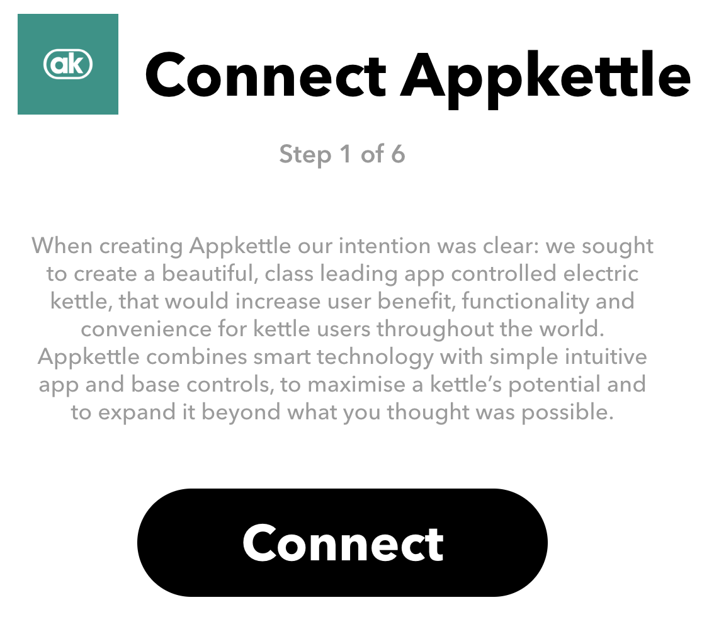
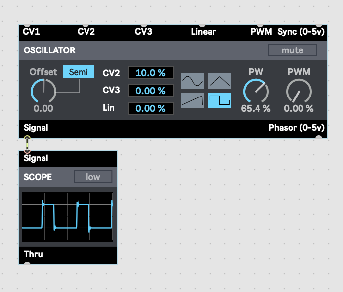
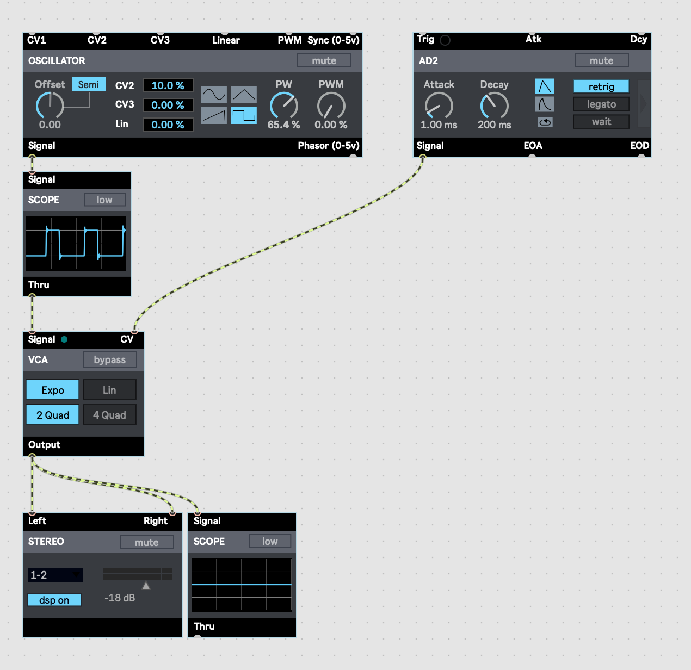
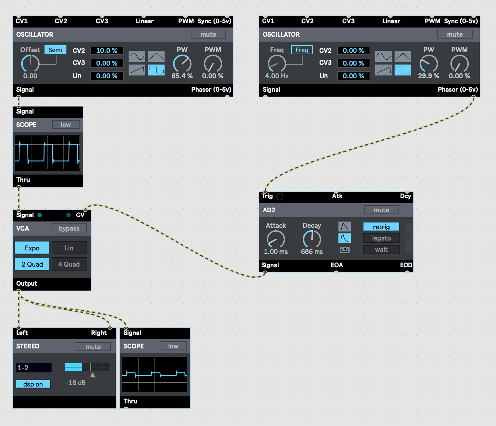
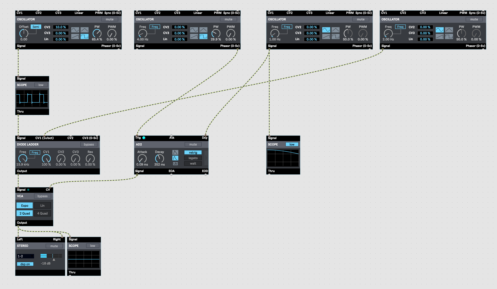
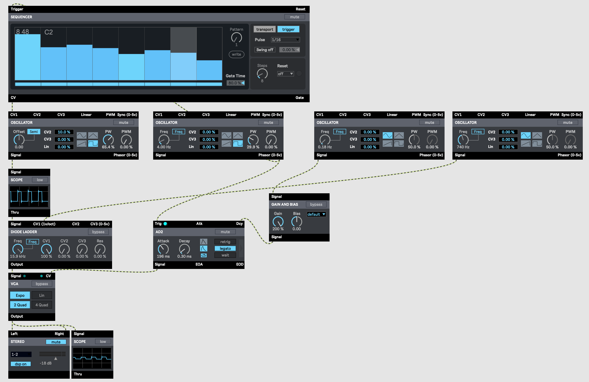
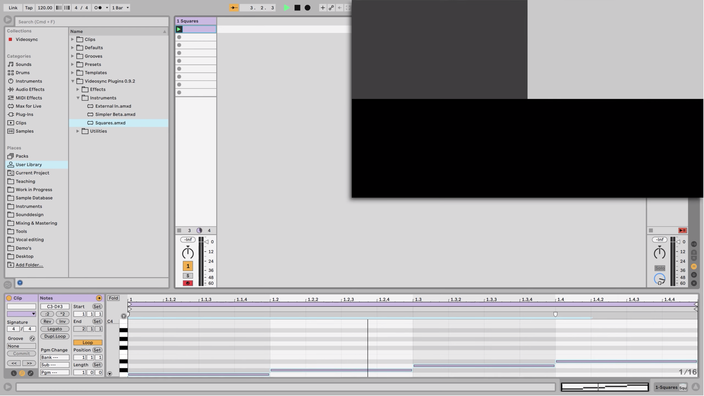
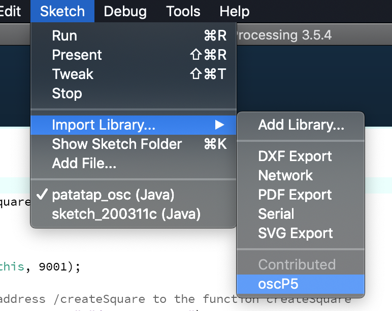
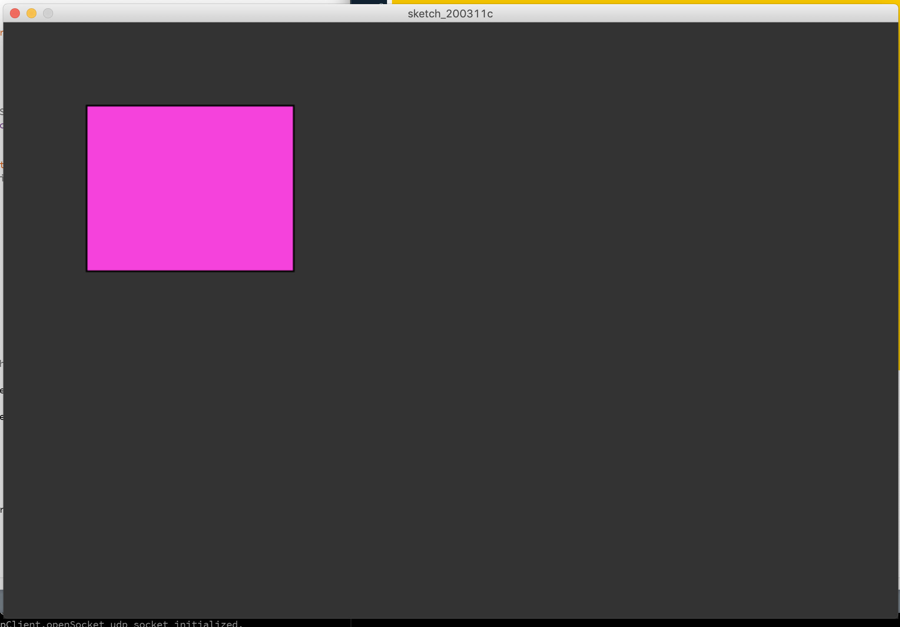

# OSC, UDP and IPC (alphabet soup the class)

## Authors
Sam Tarakajian for NYU IDM

DM-GY 9103

@starakaj

## Essential Questions
- How do programs communicate with each other?
- What is the difference between TCP and UDP?
- What can we accomplish by making programs work together?
- Wnat is Link?

## Introduction
Interacting with hardware and software, we sometimes expect different pieces to be in communication. We expect our phone to sync contacts with our desktop. We expect our browser to connect to the internet. However, in many other cases each program is like its own walled garden. If we're composing music in Logic, we don't really expect to be able to synchronize our music with something happening in Photoshop. Usually that's not a problem, but often when we're trying to do something unique and creative, it's useful to be able to make programs communicate with each other.

OSC stands for Open Sound Control, but the protocol is not limited to sound and in fact is extremely useful in a number of situations that have nothing to do with sound. Since it's built on top of UDP, OSC can be much lower overhead than HTTP or other communication protocols. It makes it super useful for defining interesting and complex interaction when we have the skill to write just a bit of our own code.

### Target Audience / Prerequisite & Pre-Assessment
This module is part of DM-GY 6063, _Programming is the Art of the Possible_. This is a second semester creative coding course, designed for students who have a strong JavaScript foundation.

### Outcomes & Goals
* In this workshop we'll be working with OSC to define communication between two unlikely programs. Along the way, we'll see how to start a UDP server, as well as how to format and route messages.
* Students will walk away with a deeper understanding of how programs communicate. They'll also be empowered to create their own complex systems involving multiple programs on their own machine.

### Pacing / Duration
TBD

## Materials Needed
TBD

### Exercises To Do Before Class
TBD. Maybe there's a document on OSC that they can read or something.

### Vocabulary
* Protocol - A guideline for interaction that preserves an invariant. TCP and UDP protocols allow endpoints to consume a series of bits while preserving sensible communication.
* UDP - User Datagram Protocol is an internet protocol like TCP, with some major differences. UDP is optimized for speed of transmission, so their are no guarantees that packets will arrive in order, or at all. Further, UDP doesn't need a bound connection for transmission.
* OSC - Open Sounds Control is a protocol built on top of UDP. Inspired by MIDI, it allows endpoints to communicate with typed, timestamped and addressed data.
* Address - The intended destination of an OSC packet (or any other packet)
* Socket - A point of connection between two endpoints (better definition).

## Exercise Descriptions

### Connecting things together

Congratulations! We've made it throught the first half of this course, where we talk about the basic stuff like getting a web server set up and attaching it to a bunch of other pieces. In the second half of this course, we're going switch up and talk about how to bring together different libraries and techniques in the context of making artwork. Breaking down this problem, there are two basic areas that we'll focus on. The first, which we'll address one library at a time over the next few weeks, is how to extract understanding from different sources of data. If we want to control video using audio, how do we extract useful information from the audio? If we want to work with human faces, what libraries are out there for extracting features from images containing face pixels?

The second problem is a simple one of communication. We're starting to pull together disparate parts. There's an application that will do face detection—how do we use that to drive processes in another application, or on another machine? The application stack that we've been working with so far, Node and Express, is made to work with the HTTP protocol. However, there many other ways to get applications talking to each other, many of them better suited for the task that HTTP.

So that's what we're going to talk about today. Also, we'll look a bit at the weird world of IoT.



### Control Voltage


This is a modular synthesizer. It maybe looks complex and vaguely sci-fi (the aesthetic of modulars tends to lean into this to be honest), but at it's heart modular synthesis isn't that complicated. Each of the individual pieces, or modules, controls one tiny aspect of synthesis. You've got modulets that make noises or patterns or which shape sound somehow, and you connect them together to determine their behavior. 

The neat thing about these modules is that the communication between theme is (with some exception) entirely analog. When you make a web request to google.com, your computer is making a request to a remote server encoded in binary. There are electromagnetic vibrations that travel either through the air as radio waves (WiFi) or through a fiber-optic cable as pulses of light. Something about those pulses is translated to either a one or a zero, and this signal is turned into a digital format that the computer then tries to understand. The upshot is that these transmissions are not very tolerant of errors. They are "binary" not only in the sense that the data is encoded in a binary format, but also in the sense that they either work or they don't. It's very different from, say, a car radio, which can be crystal clear, just okay, somewhat staticky or completely unlistenable.

So back to modular synthesizers. If you think about music, there's all kinds of stuff that you might want to represent. There is for example the pitch of a musical note, or the rate at which notes are playing, or the shape and position of a filter. The "modular" in modular synths comes from the fact that each piece of the system is trying to handle only one part of this complex system. But the amazing thing is that in order to communicate, they make use of just two different kinds of signals: audio signals between -5 and 5 volts, and control voltage signals between 0 and 5 volts. That's all they have, and that's all they need, and even those two are somewhat interchangeable.

I'm going to open up Max now, which is a program that we haven't talked about yet but which is very dear to my heart. I just want to give you a super-quick, high-level introduction to how modular synthesizers work.



This is an oscillator. In a sense it represents the simplest kind of sound, just a static waveform making a constant sound without any dynamics whatsoever. As you can see, we can choose between a few different shapes, like a triangle wave, a square wave and a sawtooth wave. We can listen to this oscillator. We can also shape the sound by applying an envelope to it.



I can click on this little invisible button to "trigger" the envelope and play a sound. Maybe I don't want to do that though, maybe that's annoying. What's cool is that the envelope can be triggered by a signal as well. How does that work, if the signal is just a steady stream of values? Well, a continuous signal can still contain discrete information. Inside the envelope, the module watches for the signal to cross the 2.5 volt threshold. When it does, it triggers a sound. That means that we can use an oscillator to trigger the envelope.



We can go one step further and modulate parameters of the system using a an oscillator as well.



Finally, the same "trigger" can mean different things to different modules. When you "trigger" an envelope, it causes the envelope to restart. When you "trigger" a sequencer, you cause the sequencer to advance.



Now we're almost at the point where we're starting to make music. Maybe now you're starting to get a sense of how you can use control voltage to start to build a piece using modular synthesizers. Next time you see one of these things in the wild, you might have a slightly better idea what's going on. But I just wanted to use this as a jumping off point to talk about other forms of communication.

### MIDI

Modular synthesizers often contain digital components, but they could exist perfectly happily in a world where everything was analog. At some point though there was a need for a digital representation of the information that could pass between musical components. This need gave rise to MIDI, which stands for Music Instrument Digital Interface. MIDI has some nice advantages over control voltage, for example it's much more compact. You can represent a chord in MIDI with just a few bytes. Representing the same information in control voltage would require thousands and thousands of samples.

The main reason I want to bring up MIDI in this class is just because it turns out it's a useful protocol for things other than music. Here https://videosync.showsync.com/ for example is a piece of software called "Videosync" (no, this class is not going to become a Videosync commercial). This program uses MIDI to sequence and control video. The launching of video clips and the modulation of video effects is all managed through Ableton Live. You can use a sequence of MIDI "notes" to trigger a sequence of videos.



At the beginning of the semester, we watched that Daito Manabe video, where he used MIDI clips to synchronize the motion of some drones to music. In case you thought this was a super rare thing to do, here's a clip from a Robert Henke piece called Lumière that's doing something very similar.

https://www.youtube.com/watch?v=rrcG4nq_vqk

You wouldn't know it to look at it necessarily, but the visual part of this piece is drawn with a laser. That laser is controlled using a special set of commands. Those commands are formatted from—you guessed it—a MIDI clip that has been synchronized with audio in Ableton Live. I don't have documentary evidence of this but that's what he told me.

### OSC + UDP

Have you seen this site called Patatap https://www.patatap.com/ ? It's on the older side now, but when it first came out people were really excited about it. You press keys, and when you do you hear a sound and see some pretty visuals. I know, it's not much more than a p5 sketch, but when this dropped p5 didn't exist.

Okay so what I want us to build is something a bit Patatap inspired. The idea is, we'll have a Node server that connects to the Internet. That Node server will connect to a running instance of Processing, telling it what to draw. "But Sam," you ask, "does that mean we have to run an Express server in Processing or something?"

We would have to do that if we were using HTTP to control the Processing sketch. Instead, we'll use something called OSC. OSC stands for Open Sound Control. Like MIDI, it's a communication protocol that can be used to control sound, but very often is not. What makes OSC interesting to us is that it's implemented on top of a totally different stack than HTTP.

#### TCP vs UDP

There's a lot to say about the difference between these two different protocols, but for the purposes of this class there are some high level takeaways. TCP is a connected, bidirectional protocol. In order to communicate over TCP, two endpoints need to form a connection. That connection involves a certain amount of handshaking (messages sent back and forth) and incurs a certain amount of overhead. In return, there are some nice guarantees. With a TCP connection, the sender knows when the client has received a message, and the receiver has a guarantee that all messages will be received in order.

UDP on the other hand is a connection-free protocol. The sender just fires off a bunch of packets, and doesn't really pay attention to whether the client has recieved them at all. As a consequence the client doesn't know whether it's gotten all the packets, or even if they've arrived in order. The upshot is that UDP transmission can be faster, especially for streams of continuous data. Imagine you're transmitting the value of a knob as you turn is—this kind of information might be very useful to communicate over UDP. Technically, OSC doesn't really care how it's transmitted, but it's a protocol designed specifically for UDP.

#### Using OSC

Okay, let's talk just a little bit about the OSC protocol. Basically, an OSC message looks something like this when it goes out over the wire:

`<address string> <type tag info> <actual data>`

In practice you don't have to worry about the type tag info. The important thing to consider is the address

`/squares/1/rotation 45`

As you can see, the address looks a lot like a URL. There are some neat things though, for example pattern matching.

`/squares/*/rotation 45`

You could imagine this setting the rotation of all squares to 45, since the character `*` matches any sequence of zero or more characters. There are some other pattern matching rules that you should check out!

The basic workflow for working with OSC goes something like this:

1. Start an OSC server on a port (say port 9001)
2. Start an OSC client with a given port and host address (usually a numeric IP address). Note that this does not form a connection.
3. Send messages to the server at a given address.

So let's do it!

#### The example

Our goal is to set up a Processing sketch that can respond to commands from an Express server. We'll keep it simple: the Processing sketch can draw a rectangle at some position, with some size and color. Let's start by seting up the server, starting with a super simple Express server.

```js
const express = require("express");

const app = express();

app.get("/randomrectangle", (req, res) => {
    res.send("Drew rectangle successfully");
});

app.listen(3000, () => {
    console.log("App listening on port 3000");
});
```

Next, let's extend this by adding simple OSC support. 

```sh
npm install node-osc
```

```js
const express = require("express");

// Look at this object destructuring
const { Client } = require("node-osc");

// 127.0.0.1 is localhost, meaning this same machine. 9001 is the port we want to listen on.
const oscClient = new Client("127.0.0.1", "9001");

const app = express();

app.get("/randomRectangle", (req, res) => {
    res.send("Drew rectangle successfully");
});

app.listen(3000, () => {
    console.log("App listening on port 3000");
});

```

Remember, this doesn't actually create any kind of connection. It just creates a UDP client that we can use to send packets to a server. Finally, let's adjust this so that it actually creates a random rectangle, and sends off a udp packet.

```js
// Send an OSC message to processing that creates a random rectangle
app.get("/randomRectangle", (req, res) => {

    // Create random dimensions that will fit the rectangle on the screen
    const randomWidth = Math.random() * 250;
    const randomHeight = Math.random() * 250;
    const randomX = Math.random() * (1080 - randomWidth);
    const randomY = Math.random() * (720 - randomHeight);

    // Send an OSC packet
    oscClient.send("/createRectangle", randomX, randomY, randomWidth, randomHeight, () => {

        // Send back status when the packet gets sent
        res.status(200).send(`Added a rectangle:
            x: ${randomX.toFixed(1)}
            y: ${randomY.toFixed(1)}
            width: ${randomWidth.toFixed(1)}
            height: ${randomHeight.toFixed(1)}`);
    });
});
```

If you run this, you'll notice that sending the osc packet with `oscClient.send` appears to "succeed", even though there's no one listening on the other end. Remember, UDP doesn't get any kind of confirmation that the message was actually sent successfully. Now, let's take a look at the processing sketch. I'm using Processing and not p5 here, which means we have to write Java. There are some subtle differences between Java and JavaScript (actually there are a lot of differences) but if you're familiar with p5, then things should look pretty similar. Let's start with a simple processing sketch

```java
void setup() {
  size(1080, 720);
}

void draw() {
  background(51);
  
  strokeWeight(2);
  stroke(0);
  fill(245, 66, 221);
  
  rect(250, 250, 200, 170);
}
```

This could be JavaScript, except for the `void` keyword before the setup and draw functions. This is because unlike JavaScript, Java is strongly typed, which means that we must declare the type of variables and function when we declare them. Now, let's add the actual OSC server. Before anything else, we'll need to import the oscp5 library. The best way to do this is from the Processing menu.



```java
import netP5.*;
import oscP5.*;

// Create a global variable to store our oscP5 server 
OscP5 oscP5;

void setup() {
  size(1080, 720);
  
  // Make an oscP5 server that listens on port 9001
  oscP5 = new OscP5(this, 9001);
}

// ...
```

Now, we'd like to be able to actually do something with endpoint. So we'll write a function to create and draw a rectangle. We might first talk about how we're going to actually draw rectangles. The way Processing works, we only have access to drawing functions while we're inside the setup or draw functions. Outside of these functions, we can create objects that we want to draw, but we can
't actually draw them. So we'll create an array of rectangles that we want to draw.

```java
import netP5.*;
import oscP5.*;

// Create a global variable to store our oscP5 server 
OscP5 oscP5;

// The list of rectangles that we want to draw
ArrayList<float []> rectangles = new ArrayList<float []>();

void setup() {
  size(1080, 720);
  
  // Make an oscP5 server that listens on port 9001
  oscP5 = new OscP5(this, 9001);
}

// ...
```

As you can see, rather than the word `const` or `let`, we have to tell the JavaScript compiler what the type of `rectangles` is. Here, it's an `ArrayList` containing `float []`, which is an array or floats. That's because to draw a rectangle we need four numbers: the x, y positions, as well as the width and height. In order to try out our new rectangle list, let's add a rectangle to the list and draw it.

```java
import netP5.*;
import oscP5.*;

// Create a global variable to store our oscP5 server 
OscP5 oscP5;

// The list of rectangles that we want to draw
ArrayList<float []> rectangles = new ArrayList<float []>();

void setup() {
  size(1080, 720);
  
  // Make an oscP5 server that listens on port 9001
  oscP5 = new OscP5(this, 9001);
  
  // Push a test rectangle to the array
  float[] testRectangle = {100, 100, 250, 200};
  rectangles.add(testRectangle);
}

void draw() {
  background(51);
  
  strokeWeight(2);
  stroke(0);
  fill(245, 66, 221);
  
  for (float[] rectangle : rectangles) {
    rect(rectangle[0], rectangle[1], rectangle[2], rectangle[3]);
  }
}
```

As you can see, the syntax for looping over an array of rectangles looks similar to, but not the same as, JavaScript. But this should be enough to draw a rectangle.



Okay, so now all we need is a function to add a rectangle to the list of rectangles. We can just take the code that we used to add a test rectangle, and move it to a `createRectangle` function.

```java
import netP5.*;
import oscP5.*;

// Create a global variable to store our oscP5 server 
OscP5 oscP5;

// The list of rectangles that we want to draw
ArrayList<float []> rectangles = new ArrayList<float []>();

void setup() {
  size(1080, 720);
  
  // Make an oscP5 server that listens on port 9001
  oscP5 = new OscP5(this, 9001);
  
  // Push a test rectangle to the array
  createRectangle(100, 100, 250, 200);
}

void createRectangle(float x, float y, float w, float h) {
  float[] newRectangle = {x, y, w, h};
  rectangles.add(newRectangle);
}

// ...
```

Finally, we want to remove the code to add the test rectangle, and we want to use the oscP5 server to connect to the `createRectangle` function. That could not be easier. We can use an `oscP5` function called "plug" that binds an OSC addresss to a function call.

```java
import netP5.*;
import oscP5.*;

// Create a global variable to store our oscP5 server 
OscP5 oscP5;

// The list of rectangles that we want to draw
ArrayList<float []> rectangles = new ArrayList<float []>();

void setup() {
  size(1080, 720);
  
  // Make an oscP5 server that listens on port 9001
  oscP5 = new OscP5(this, 9001);
  
  // this binds the address /createRectangle to the function createRectangle
  oscP5.plug(this, "createRectangle", "/createRectangle");
}

void createRectangle(float x, float y, float w, float h) {
  float[] newRectangle = {x, y, w, h};
  rectangles.add(newRectangle);
}

// ...
```

That's it! Now if we visit the web address `localhost:3000/createRectangle`, this will add a random rectangle to the scene. There is just one tiny, tiny thing that we might want to change. If you run this code and add enough rectangles, you'll eventually encounter an error like "ConcurrentModificationException". We've mostly been able to avoid talking about things like "threads" and "concurrency" up to this point, but now that we've crossed from Node to Java, we're no longer guaranteed that everything is happening on the same thread. In fact, the methods for oscP5.plug will be called from a different thread than `draw`. So if we try to add to the list while we iterate over it, we'll get an error. There's a few solutions, a simple one that's fine here is to just make the two functions `synchronized`. 

```java
// ...
synchronized void createRectangle(float x, float y, float w, float h) {
  float[] newRectangle = {x, y, w, h};
  rectangles.add(newRectangle);
}

synchronized void draw() {
  background(51);
  
  strokeWeight(2);
  stroke(0);
  fill(245, 66, 221);
  
  for (float[] rectangle : rectangles) {
    rect(rectangle[0], rectangle[1], rectangle[2], rectangle[3]);
  }
}
```

Now, here's the final code, with a couple of small changes added.

```js
// index.js

const express = require("express");

// Look at this object destructuring
const { Client } = require("node-osc");

// 127.0.0.1 is localhost, meaning this same machine. 9001 is the port we want to listen on.
const oscClient = new Client("127.0.0.1", "9001");

const app = express();

// We don't have anything to do at the root, so we may as well redirect to /randomRectangle
app.get("/", (req, res) => {
    res.redirect("/randomRectangle");
});

// Send an OSC message to processing that creates a random rectangle
app.get("/randomRectangle", (req, res) => {

    // Create random dimensions that will fit the rectangle on the screen
    const randomWidth = Math.random() * 250;
    const randomHeight = Math.random() * 250;
    const randomX = Math.random() * (1080 - randomWidth);
    const randomY = Math.random() * (720 - randomHeight);

    // Send an OSC packet
    oscClient.send("/createRectangle", randomX, randomY, randomWidth, randomHeight, () => {

        // Send back status when the packet gets sent
        res.status(200).send(`Added a rectangle:
            x: ${randomX.toFixed(1)}
            y: ${randomY.toFixed(1)}
            width: ${randomWidth.toFixed(1)}
            height: ${randomHeight.toFixed(1)}`);
    });
});

app.listen(3000, () => {
    console.log("App listening on port 3000");
});
```

```java
// patatap_osc.pde

import netP5.*;
import oscP5.*;

// Create a global variable to store our oscP5 server 
OscP5 oscP5;

// The list of rectangles that we want to draw
ArrayList<float []> rectangles = new ArrayList<float []>();

void setup() {
  size(1080, 720);
  
  // Make an oscP5 server that listens on port 9001
  oscP5 = new OscP5(this, 9001);
  
  // this binds the address /createRectangle to the function createRectangle
  oscP5.plug(this, "createRectangle", "/createRectangle");
}

synchronized void createRectangle(float x, float y, float w, float h) {
  float[] newRectangle = {x, y, w, h};
  rectangles.add(newRectangle);
}

synchronized void draw() {
  
  background(51);
  
  for (float[] rectangle : rectangles) {
    
    strokeWeight(2);
    stroke(0);
    
    // Just for fun, we can highlight any rectangles that intersect the mouse
    if (mouseX > rectangle[0]
      && mouseX < rectangle[0] + rectangle[2]
      && mouseY > rectangle[1]
      && mouseY < rectangle[1] + rectangle[3])
     {
       fill(245, 66, 221);
     } else {
       fill(255);  
     }
    
    rect(rectangle[0], rectangle[1], rectangle[2], rectangle[3]);
  }
}
```


## Student Reflections, Takeaways & Next Steps
TBD

## Post Session

### References
- [Processing Reference](https://processing.org/reference/)
- [Open Sound Countrol](http://opensoundcontrol.org/)
- [Open Sound Control Notes](https://www.music.mcgill.ca/~gary/306/week9/osc.html)
- [Robert Henke - Lumiere](https://roberthenke.com/concerts/lumiere-1.html)

### Implementation Guidance & Teaching Reflection  
TBD

***With thanks and acknowledgement, this is based on the template provided by [Eyebeam](https://github.com/eyebeam/curriculum/blob/master/TEMPLATE.md)***