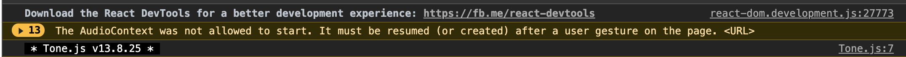
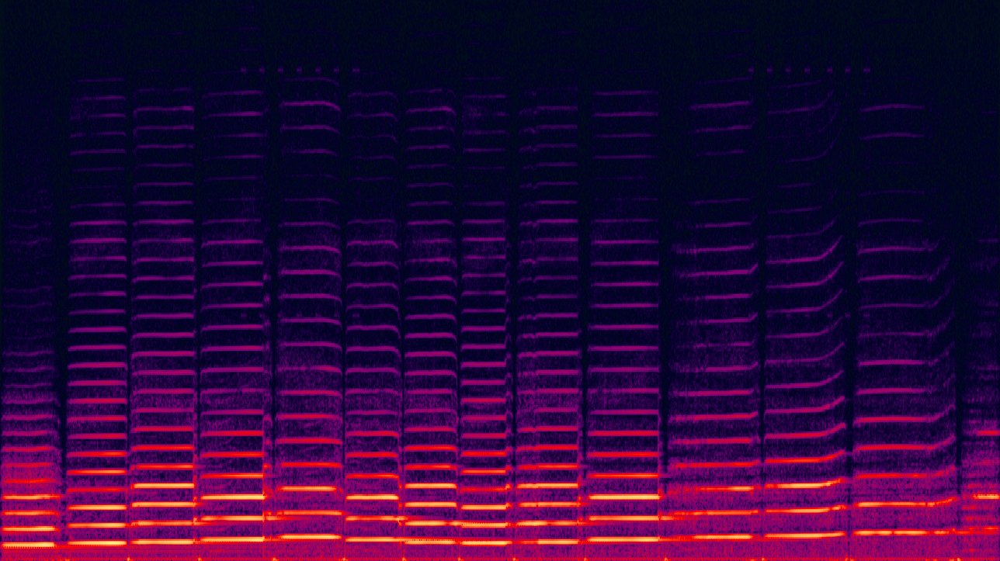

# Audio  Analysis

## Authors
Sam Tarakajian for NYU IDM

DM-GY 6063

@starakaj

## Example Implementation

You'll find an example implementation of everything that we talk about today in the `meyda-app` directory. You may notice two other directories: `meyda-demo` and `tonetest`. Feel free to ignore there, as they're based on an eariler version of this lesson. Or, check them out. Up to you.

## Essential Questions
- How do computers encode audio data?
- What are the salient features of audio?
- How can we detect and analyze those features?
- What are some creative applications?

## Introduction
Simply put, sound is just vibrations in the air, and light is just an electromagnetic vibration. However, human beings and other living organisms have evolved complex biomechanical systems for detecting these vibrations, and equally complex neural machinery for analyzing them. Microphones and cameras do the work of ears and eyes, recording sound and light for later reproduction. In this class, we'll start talking about how to analyze and undestand these streams, starting with a focus on audio data.

When we talk about the meaning of a data stream, we're often talking about features, and usually grouping those features into hierarchical levels. We might talk about low level features like color or loudness, in addition to high level features like emotion or genre. We'll look at techniques for extracting low and high level features, and investigate some creative applications.

### Target Audience / Prerequisite & Pre-Assessment
This module is part of DM-GY 6063, _Programming is the Art of the Possible_. This is a second semester creative coding course, designed for students who have a strong JavaScript foundation.

### Outcomes & Goals
* In this class we'll be working with audio and recordings, as well as live audio streams. We'll look at how computers represent this data, and we'll explore some software libraries for analyzing that data.
* Students will walk away with a deeper understanding of how audio works. They'll take away some useful tools for performing that analysis, and they'll have exposure to creative techniques for working with extracted features.

### Pacing / Duration


## Materials Needed
We'll be using meyda.js along with p5.js and dat.gui in this class
- Meyda.js
- Synopsis
- Max/MSP
- Freesound/Essentia

### Vocabulary (example)
* Feature - (find a good definition of this, it's not trivial).
* Envelope - The slow-moving amplitude of a sound, related to its loudness. Commonly divided into Attack, Decay, Sustain, Release portions for modeling instruments.
* Spectrum - A power-histogram representation of the frequency content of a signal.
* Discrete Fourier Transform - A function for transforming a series of samples from a time domain representation to a frequency domain representation.
* Harmonic - Sounds whose spectral content is mostly grouped into bands, the center frequencies of which are whole number multiples of each other.

## Exercise Descriptions
Given their availability, we'll be using JavaScript tools mostly in this class. However the concepts that we'll be covering extend to other domains as well. Tools as diverse as Ableton Live, Max/MSP, Tone.js, p5 Sound, Supercollider, and many others, all have a common set of concepts and vocabulary. So, with that in mind, let's get started.

### Getting started with Meyda

In this class we're going to be working with an audio analysis library called Meyda.js. When we talk about audio analysis, we're referring to techniques that let us describe an audio signal in terms of its features. For example, a sound might have a given pitch, which is a perceptual quality related to the fundamental frequency of the sound.

Let's start by getting Meyda installed. We're going to be using a npm-based installation of Meyda. You can also use Meyda (along with dat.gui and p5) by including them in script tags, but for now we'll just be using Webpack to bundle them with our application.

Start by copying the repo at https://github.com/starakaj/webpack-express-starter. This is basically the same as the react-express-starter that we've been using up to this point, but I've removed the react depenedncy. It's up to you whether to use the .zip, or to clone the repository. Downloading the .zip might be cleaner.

Now, let's cd into this directory and install Meyda.

```
cd whatever-you-named-the-directory
npm install
npm install meyda
```

Now let's use Meyda to get some information about a playing sound. The first thing we want to do is get a stream of audio. For now the easiest thing to do is just to get input from the microphone. To do this, add a function like this to your `app.js` file.

```js
// app.js

// Open a connection to the microphone, then call a callback
// when everything is ready. The callback will receive the
// new web audio context, as well as the audio stream itself
function readAudioFromMicrophone(callback) {
    // Call this function when the user media (the microphone)
    // returns successfully
    const handleSuccess = function(stream) {
        // Create a new Web Audio context
        const context = new AudioContext();

        // Create a Web Audio node to wrap the microphone stream
        const source = context.createMediaStreamSource(stream);

        // Execute the callback with the new context and Web Audio Node
        if (callback) callback(context, source);
    };
    
    // Ask the user's permission, and then grab their microphone stream
    navigator.mediaDevices.getUserMedia({ audio: true, video: false })
        .then(handleSuccess);
}
```

We can use this function like so:

```js
readAudioFromMicrophone((context, source) => {
    // Do whatever we want to do
});
```

As you can see, this function returns two important objects: a Web Audio context, and a Web Audio Node wrapping the microphone stream. The Web Audio context is an instance of AudioContext. It wraps the operation of the audio graph. The browser represents audio as a graph, where each node in the graph can receive and also supply audio. You could imagine a microphone node, like we have, connected to a reverb node, connected to the audio output node (the computer speakers). The `source` is just that—a Web Audio node containing the microphone. We need to pass these two objects to Meyda when we create an analyzer.

```js
// app.js

// Near the top
const Meyda = require("meyda");

//...

// Near the bottom
readAudioFromMicrophone((context, source) => {
    const analyzer = Meyda.createMeydaAnalyzer({
        audioContext: context,
        source,
        bufferSize: 512, // this must be a power of two
        featureExtractors: ["loudness"], // Whatever analyzers you want
        callback: (features) => {
            // Do something with your features
            console.log(features);
        }
    });
    analyzer.start();
});
```

This should be enough to see some values in our console.

### What if my web audio context isn't starting

If you don't see numbers streaming past you at light speed, you might see something like this in your console.



Basically, the Web Audio standard says that the browser should start audio unless the user knows about it and wants it. So you can't start web audio unless you do so from within a function that the user started with an event. One very easy way to handle this is with an npm package called `startaudiocontext` that provides a function called "StartAudioContext".

```
npm install startaudiocontext
```

Then in your file

```js
// app.js
const StartAudioContext = require("startaudiocontext");

// once you have an audio context named context
StartAudioContext(context);
```

This won't start the context right away (necessarily) but it will add a listener to the "body" element. When the user taps on the background of the page, the audio context will start.

### Doing something with analyzed audio

So far we've been able to extract a feature called "loudness", which we can see has an array called "specific' and another property "total". But can we do something with this? Why not draw something? And so long as we're drawing something, why not use p5?

```
npm install p5
```

If you're used to working with the p5 editor, you've been using it in something called "global mode". In this mode, p5 creates global `setup` and `draw` functions. It also adds functions from the p5 library to the global namespace. Because we want a little more control here, we're going to be using "instance mode" of p5. You can read more about it here https://github.com/processing/p5.js/wiki/Global-and-instance-mode. Before anything else, we're going to need a place to put our p5 canvas. So let's make a div to hold it.

```html
<!-- index.html -->

<body>
    <!-- All your drawing can happen here -->
    <div id="drawing">
    </div>
</body>
```

Now here's how we start p5 in instance mode

```js
// app.js
// near the top
const p5 = require("p5");

// ...
// later

const myP5Instance = (p) => {
    p.setup = () => {
        // do setup
        p.createCanvas(720, 400);
        p.background(255)
    }

    p.draw = () => {
        p.fill(0);
        p.rect(100, 100, 250, 200);
    }
}
const myp5 = new p5(myP5Instance, "drawing");
```

Hopefully, when you do `npm run watch`, you should see a big black rectangle in your browser. As you can see, this requires us to create an instance of p5 explicitly, and to have the id of a DOM element into which we can add it. We also pass a function defining that p5 instance. Inside that function, we're required to add two functions to that instance: setup and draw. Lastly, all of the builtin p5 functions are properties of that object.

Now, let's actually use the properties of our microphone to do something. First let's just make something respond to our loudness. The one small trick is that we can't just use the features directly in our p5 functions, because they only exist inside the audio callback. So we create a local variable to store them.

```js
// app.js
// near the top
let lastFeatures;

//...

// Where we add our analyzer
readAudioFromMicrophone((context, source) => {
    const analyzer = Meyda.createMeydaAnalyzer({
        audioContext: context,
        source,
        bufferSize: 512, // this must be a power of two
        featureExtractors: ["loudness"], // Whatever analyzers you want
        callback: (features) => {
            lastFeatures = features; // Here, instead of printing our features out, we store them
        }
    });
    analyzer.start();
});

// ...
// Where we define our p5 function

const myP5Instance = (p) => {
    p.setup = () => {
        // do setup
        p.createCanvas(720, 400);
        p.background(255)
    }

    p.draw = () => {
        if (lastFeatures) {
            p.background(255 * loudness.total / loudness.length);
        }
    }
}
const myp5 = new p5(myP5Instance, "drawing");
```

You see, we've created a variable to store our features called `lastFeatures`. Having done that, we can use them inside our p5 function. We check if they exist first to avoid an error.

### Separating consonants and vowels

If you check the page at https://meyda.js.org/audio-features, you'll see that Meyda gives you access to tons of different features. More than anything I can tell you in this class, I encourage you to experiment with these and to come up with something that works. But let's look at a specific example of something that we can do: separating vowels and consonants.

To understand the approach here, it's helpful to have an idea of what an audio spectrum is. There's a great example at https://meyda.js.org/ that you can play with, but also take a look at this:



What you're looking at is called a spectrogram. On the x axis is time, on the y axis is frequency. The striped pattern comes from the particular pattern of overtones associated with a violin. When someone plays a note on the violin—or indeed any harmonic instrument—many frequencies are generated in addition to the fundamental. These are called overtones and they vibrate at a whole-number multiple of the frequency of the fundamental. Hence the striped pattern. Now, what does this have to do with vowels and consonants?

Well, most of the energy of a vowel is concentrated in the lower parts of the spectrum. Most of the energy of consonants is in the higher part. So using the spectral centroid, we can determine if the energy of a sound is coming from a high or low frequency. First, let's add "spectralCentroid" to the list of featureExtractors on our analyzer.

```js
// app.js

readAudioFromMicrophone((context, source) => {
    const analyzer = Meyda.createMeydaAnalyzer({
        audioContext: context,
        source,
        bufferSize: 512, // this must be a power of two
        featureExtractors: ["loudness", "spectralCentroid"], // Whatever analyzers you want
        callback: (features) => {
            lastFeatures = features; // Here, instead of printing our features out, we store them
        }
    });
    analyzer.start();
});
```

Now, let's create a new p5 instance.

```js
// app.js
const p5VowelConsonant = (p) => {
    let ampScale = 0.2;

    p.setup = () => {
        p.createCanvas(700, 410);
        p.background(255);
    }

    p.draw = () => {
        p.background(255);

        if (lastFeatures && !Number.isNaN(lastFeatures.spectralCentroid)) {
            const px = p.width / 2;
            const py = p.height / 2;

            let radiusC = 200;

            // Draw half of the sphere in red
            p.fill(200, 10, 10);
            p.arc(px, py, radiusC, radiusC, 0, p.PI);

            let radiusV = 200

            // Draw the other half in black
            p.fill(10, 10, 10);
            p.arc(px, py, radiusV, radiusV, p.PI, p.PI * 2);
        }
    }
}

// Don't forget to comment out the other p5 drawing thing, and to put this one in its place
// const myp5 = new p5(myP5Instance, "drawing");
const myp5 = new p5(p5VowelConsonant, "drawing");
```

All we're doing is drawing two halves of a circle. Okay but now let's scale these by the loudness. The trick is, we want to create two additional scaling factors. The first simply multiplies the loudness by the spectral centroid. This works great for consonants, since when the spectral centroid is small this will scale down.

```js
// app.js
const p5VowelConsonant = (p) => {
    let ampScale = 0.2;

    p.setup = () => {
        p.createCanvas(700, 410);
        p.background(255);
    }

    p.draw = () => {
        p.background(255);

        if (lastFeatures && !Number.isNaN(lastFeatures.spectralCentroid)) {
            const px = p.width / 2;
            const py = p.height / 2;

            let radiusC = lastFeatures.spectralCentroid * lastFeatures.loudness.total * ampScale;
            // let radiusC = 200;

            // Draw half of the sphere in red
            p.fill(200, 10, 10);
            p.arc(px, py, radiusC, radiusC, 0, p.PI);

            let radiusV = 200

            // Draw the other half in black
            p.fill(10, 10, 10);
            p.arc(px, py, radiusV, radiusV, p.PI, p.PI * 2);
        }
    }
}

// Don't forget to comment out the other p5 drawing thing, and to put this one in its place
// const myp5 = new p5(myP5Instance, "drawing");
const myp5 = new p5(p5VowelConsonant, "drawing");
```

Now the red half maps nicely to the intensity of our consonants. For vowels we need to go in the opposite direction. Here, the closer to zero the spectral centroid is, the more we want to boost the scaling factor. So we invert the spectralCentroid by subtracting it from its maximum value. Instead of 

```js
let radiusC = lastFeatures.spectralCentroid * lastFeatures.loudness.total * params.ampScale;
```

We write

```js
let radiusV = (bufferSize - lastFeatures.spectralCentroid) * lastFeatures.loudness.total * params.ampScale;
```

Of course, for this to work we nede to make sure that `bufferSize` is also a local variable, declared somewhere where p5 can see it.

```js
// app.js

let lastFeatures;
let bufferSize = 512;

// and update the analyzer to use this new value

readAudioFromMicrophone((context, source) => {
    const analyzer = Meyda.createMeydaAnalyzer({
        audioContext: context,
        source,
        bufferSize: bufferSize, // this must be a power of two
        featureExtractors: ["loudness", "spectralCentroid"], // Whatever analyzers you want
        callback: (features) => {
            lastFeatures = features; // Here, instead of printing our features out, we store them
        }
    });
    analyzer.start();
});
```

To make it really nice, we also need to shift the scale of the vowel scale factor down a bit, since the spectral centroid never gets that high up anyway. Otherwise the scaling factor for vowels will always be way too big.

```js
let radiusV = (bufferSize - lastFeatures.spectralCentroid - 185) * lastFeatures.loudness.total * params.ampScale;
```

That 185 number doesn't come from anywhere, except I tried a lot of different values until I got something that worked. It's what you might call a fudge factor. With this audio visualization stuff, you're free to experiment and add offsets and things like that. So long as it works, you're good. With all this in place, the two halves of the circle respond differently to different qualities of sound.

### Audio chroma

One last sound descriptor that we'll look at is audio chroma. You've probably familiar with the idea that musical pitch is, in a Western system at least, divided into 12 pitch classes: A, A#, B, C, C#, D, D#, E, F, F#, G, and G#. The chroma descriptor returns an array with the amount of energy contained in each. The chroma measurement is periodic, in the sense that pitches separated by an octave are equivalent. So it makes some sense to render chroma as a circle. Let's see what that might look like.

```js
const p5Chroma = (p) => {
    p.setup = () => {
        p.createCanvas(700, 410);
        p.background(255);
    }

    p.draw = () => {
        // Wipe the background
        p.colorMode(p.RGB, 255);
        p.background(255);

        if (lastFeatures) {
            lastFeatures.chroma.forEach((c, i) => {
                const startAngle = (i / lastFeatures.chroma.length) * p.PI * 2;
                const arcAngle = (1 / lastFeatures.chroma.length) * p.PI * 2;
                const radius = 300;
                p.arc(p.width / 2, p.height / 2, radius, radius, startAngle, startAngle + arcAngle);
            });
        }   
    }
}

// Don't forget to comment out the other p5 drawing thing, and to put this one in its place
// const myp5 = new p5(myP5Instance, "drawing");
// const myp5 = new p5(p5VowelConsonant, "drawing");
const myp5 = new p5(p5Chroma, "drawing");
```

So far we haven't done anything here except to draw a circle. The first thing that we can do that might be fun is to render each slice of the circle a different color. For this we switch to HSB color mode, which makes it much easier to rotate through hues.

```js
const p5Chroma = (p) => {
    p.setup = () => {
        p.createCanvas(700, 410);
        p.background(255);
    }

    p.draw = () => {
        // Wipe the background
        p.colorMode(p.RGB, 255);
        p.background(255);

        if (lastFeatures) {
            p.colorMode(p.HSB, 255);
            lastFeatures.chroma.forEach((c, i) => {
                const startAngle = (i / lastFeatures.chroma.length) * p.PI * 2;
                const arcAngle = (1 / lastFeatures.chroma.length) * p.PI * 2;
                const radius = 300;
                fill(255 * i / lastFeatures.chroma.length, 255, 255);
                p.arc(p.width / 2, p.height / 2, radius, radius, startAngle, startAngle + arcAngle);
            });
        }   
    }
}

// Don't forget to comment out the other p5 drawing thing, and to put this one in its place
// const myp5 = new p5(myP5Instance, "drawing");
// const myp5 = new p5(p5VowelConsonant, "drawing");
const myp5 = new p5(p5Chroma, "drawing");
```

Now you should see rendered a fully saturated pie slice. What about each chroma? Well, we could do something like this:

```js
const radius = c * 300;
```

But you might find that you like the results better if the peak values are a bit more peaked. We can achieve this by squaring the chroma. Raising a value to a power above 1 emphasizes large values while diminishing small ones.

```js
const radius = c * c * 300;
```

Again, the motivation for doing this is taste, rather than anything rigorous. And with that, we should have some nice pretty chroma. Oh, one more thing, you'll want to increase the buffer size for this one. At smaller buffer sizes, the chroma separation isn't as sharp.

```js
// app.js
// at the top
let bufferSize = 2048

const p5Chroma = (p) => {
    p.setup = () => {
        p.createCanvas(700, 410);
        p.background(255);
    }

    p.draw = () => {
        // Wipe the background
        p.colorMode(p.RGB, 255);
        p.background(255);

        if (lastFeatures) {
            p.colorMode(p.HSB, 255);
            lastFeatures.chroma.forEach((c, i) => {
                const startAngle = (i / lastFeatures.chroma.length) * p.PI * 2;
                const arcAngle = (1 / lastFeatures.chroma.length) * p.PI * 2;
                const radius = c * c * 300;
                fill(255 * i / lastFeatures.chroma.length, 255, 255);
                p.arc(p.width / 2, p.height / 2, radius, radius, startAngle, startAngle + arcAngle);
            });
        }   
    }
}

// Don't forget to comment out the other p5 drawing thing, and to put this one in its place
// const myp5 = new p5(myP5Instance, "drawing");
// const myp5 = new p5(p5VowelConsonant, "drawing");
const myp5 = new p5(p5Chroma, "drawing");
```

### Smoothing things out

So let's go back to the vowel-consonant example. You might notice that it's really jittery, and you might not want that. Is there a way that we can smooth out these values? Well, when we calculate a new scaling factor, we could decide that instead of using it right away, we want to mix it with an older value. This has the effect of smoothing out our values.

```js
const p5VowelConsonant = (p) => {

    p.setup = () => {
        p.createCanvas(700, 410);
        p.background(255);
    }

    let oldConsonantRadius = 0;

    p.draw = () => {

        p.colorMode(p.RGB, 255);
        p.background(255, 255, 255);

        if (lastFeatures && !Number.isNaN(lastFeatures.spectralCentroid)) {
            const px = p.width / 2;
            const py = p.height / 2;

            let newConsonantRadius = lastFeatures.spectralCentroid * lastFeatures.loudness.total;
            let consonantRadius = 0.5 * oldConsonantRadius + 0.5 * newConsonantRadius;
            oldConsonantRadius = consonantRadius;

            // Draw half of the sphere in red
            p.fill(200, 10, 10);
            p.arc(px, py, consonantRadius, consonantRadius, 0, p.PI);
```

This achieves a bit of smoothing, which is nice. There are two things we might want to adjust, however. The first is the balance between the new and historical value. Right now we're mixing them 50-50. But the more we weight the historical value, proportionally, the more smoothing we achieve.

```js
const p5VowelConsonant = (p) => {

    p.setup = () => {
        p.createCanvas(700, 410);
        p.background(255);
    }

    let oldConsonantRadius = 0;
    let smoothing = 0.9;

    p.draw = () => {

        p.colorMode(p.RGB, 255);
        p.background(255, 255, 255);

        if (lastFeatures && !Number.isNaN(lastFeatures.spectralCentroid)) {
            const px = p.width / 2;
            const py = p.height / 2;

            let newConsonantRadius = lastFeatures.spectralCentroid * lastFeatures.loudness.total;
            let consonantRadius = smoothing * oldConsonantRadius + (1 - smoothing) * newConsonantRadius;
            oldConsonantRadius = consonantRadius;

            // Draw half of the sphere in red
            p.fill(200, 10, 10);
            p.arc(px, py, consonantRadius, consonantRadius, 0, p.PI);
```

Finally, we might not want to smooth in both directions the same. If the sound is getting more intense, we might not want smoothing at all. We might prefer only to have smoothing as the sound attenuates.

```js
const p5VowelConsonant = (p) => {

    p.setup = () => {
        p.createCanvas(700, 410);
        p.background(255);
    }

    let oldConsonantRadius = 0;
    let smoothing = 0.9;

    p.draw = () => {

        p.colorMode(p.RGB, 255);
        p.background(255, 255, 255);

        if (lastFeatures && !Number.isNaN(lastFeatures.spectralCentroid)) {
            const px = p.width / 2;
            const py = p.height / 2;

            let newConsonantRadius = lastFeatures.spectralCentroid * lastFeatures.loudness.total;
            let consonantRadius = newConsonantRadius > oldConsonantRadius ?
                newConsonantRadius :
                smoothing * oldConsonantRadius + (1 - smoothing) * newConsonantRadius;
            oldConsonantRadius = consonantRadius;

            // Draw half of the sphere in red
            p.fill(200, 10, 10);
            p.arc(px, py, consonantRadius, consonantRadius, 0, p.PI);
```

### Real-time modulation with dat.gui

Having gone through all of this, it would be ridiculous not to mention `dat.gui`, which really can make figuring out exactly how to map and modulate these parameters a million times easier.

```
npm install dat.gui
```

```js
// app.js

// near the top
const dat = require("dat.gui");

// ...

// Later, when you're doing p5 things
const p5VowelConsonant = (p) => {
    let params = {
        ampScale: 0.2,
        smoothing: 0.9
    };
    let gui = new dat.GUI();
    gui.add(params, "ampScale", 0, 1);
    gui.add(params, "smoothing", 0, 1);

    p.setup = () => {
        p.createCanvas(700, 410);
        p.background(255);
    }

    let oldConsonantRadius = 0;
    let smoothing = 0.9;

    p.draw = () => {

        p.colorMode(p.RGB, 255);
        p.background(255, 255, 255);

        if (lastFeatures && !Number.isNaN(lastFeatures.spectralCentroid)) {
            const px = p.width / 2;
            const py = p.height / 2;

            let newConsonantRadius = lastFeatures.spectralCentroid * lastFeatures.loudness.total * params.ampScale;
            let consonantRadius = newConsonantRadius > oldConsonantRadius ?
                newConsonantRadius :
                params.smoothing * oldConsonantRadius + (1 - params.smoothing) * newConsonantRadius;
            oldConsonantRadius = consonantRadius;

            // Draw half of the sphere in red
            p.fill(200, 10, 10);
            p.arc(px, py, consonantRadius, consonantRadius, 0, p.PI);
```

### Reading audio from a file

It's also possible to run a Meyda analyzer on an audio stream coming from a file, rather than the microphone. Instead of creating a Web Audio node wrapping the microphone, we create an `audio` DOM element, and then make a Web Audio node wrapping that. Of course to do that we first need an audio file. You can use any audio file from your computer, or you can download one from https://freemusicarchive.org/. Regardless, put it in the "public" directory, next to your `style.css` file. You might also want to add a line to your .gitignore like this:

```
public/*.mp3
```

if you've added an mp3 file. You could also make a folder `audio` in your `public` directory, in which case your gitignore would look like this:

```
public/audio/*
```

 In general you don't want to be adding large media files to your github repository if you can avoid it. Anyway, once you've got that audio file, the next step is to add an audio tag to your index.html.

```html
<!-- index.html -->

<!DOCTYPE html>
<html lang="en">
  <head>
    <title>Audio Visualizer Demo</title>
    <meta name="description" content="A cool thing made with Webpack + Express">
    <meta charset="utf-8">
    <meta http-equiv="X-UA-Compatible" content="IE=edge">
    <meta name="viewport" content="width=device-width, initial-scale=1">
    <link rel="stylesheet" href="style.css">
  </head>
  <body>

    <audio
      controls
      loop
      id="audio"
      src="Xylo-Ziko_-_02_-_Phase_2.mp3"
    >
    </audio>
    
    <!-- All your drawing can happen here -->
    <div id="drawing">
    </div>
  
    <!-- bundle all the scripts! thanks to webpack -->
    <script type="text/javascript" src="/bundle.js"></script>
  </body>
</html>
```

You can see the audio tag include here. The important piece is the `id`, which we'll use in JavaScript to get a reference to this audio element, and the `src`, which is a path to the file we want to load. With that, it's now possible to create a function that will take this audio element, returning an audio context and a Web Audio node.

```js
// app.js

// Create a web audio node to wrap the DOM audio element, then call a callback
// when everything is ready. The callback will receive the
// new web audio context, as well as the audio stream itself.
function readAudioFromFile(callback) {
    // If we want to route the audio around, and do arbitrary things to it, then we
    // need to create an audio context in which to do it.
    const audioContext = new AudioContext();

    // Add StartAudioContext, so the context starts when you click the background
    StartAudioContext(audioContext);

    // Grab the audio element
    const htmlAudioElement = document.getElementById("audio");

    // Create a Web Audio node that wraps the media in that element
    const source = audioContext.createMediaElementSource(htmlAudioElement);

    // Connect it to output, so we can hear it when we play
    source.connect(audioContext.destination);

    // Set up the analyzer
    if (callback) callback(audioContext, source);
}
```

Of course, if you want to use this audio player instead of your microphone as input, then you will need to call this function instead of the function that sets up the microphone.

```js
// app.js

// Kick everything off
readAudioFromFile(setupAnalyzer);
// readAudioFromMicrophone(setupAnalyzer);
```

## Student Reflections, Takeaways & Next Steps
TBD

## Post Session
If you like, it might also be highly fun to play around with Tone.js. Tone dramatically simplifies the task of getting a music synthesizer set up in the browser, and 

### Getting started with Tone.js
I'm going to start by copying the starter from https://github.com/starakaj/react-express-starter to a new directory, and renaming that directory to `tonetest`. You can rename it however you like. So, at this point you should have a directory somewhere on your machine, that's a copy of the repo from the react-express-starter link. It's up to you whether you want that to be a clone of that repo, or a .zip of that repo, but you might prefer to use a .zip.

Okay, let's start by adding a dependency to `tone` to the root of this repo.

```sh
npm install tone
```

This adds a dependency to a library called Tone.js. Tone simplifies working with the Web Audio API, and has support for things like timing, synthesis and playback. To do the simplest possible thing with Tone, let's have it play a note. In order to do that, we need to add two lines of code to our app.

```js
//create a synth and connect it to the master output (your speakers)
var synth = new Tone.Synth().toMaster()

//play a middle 'C' for the duration of an 8th note
synth.triggerAttackRelease('C4', '8n')
```

This react starter comes with a clock, so let's add this code in a way that makes the clock play a new note every second (just like a very annoying clock would). For now, let's modify our code like this:

```js
// ClockFace.jsx

const React = require("react");

function ClockFace(props) {

    const [date, setDate] = React.useState(new Date());

    // Create the tone synth
    const synth = new Tone.Synth().toMaster();

    // This will be called whenever the component renders, but because we pass an empty
    // array as the second argument, it will only be called once, when the component
    // first renders.
    React.useEffect(() => {

        const timerId = setInterval(() => {
            setDate(new Date);

            // Play a note each second
            synth.triggerAttackRelease('C4', '32n');
        }, 1000);

        // By returning a function from useEffect, we tell React that we'd like this
        // function called when the component is unmounted
        return () => { clearInterval(timerId) };

    }, []);

    let prefix = "";
    let postfix = ""
    if (props.language === "en") {
        prefix = "It is";
        postfix = "o'clock";
    } else if (props.language === "fr") {
        prefix = "Il est";
        postfix = "heures";
    }

    return (
        <p>{prefix} {date.getHours()}:{date.getMinutes()}:{date.getSeconds()} {postfix}</p>
    );
}

module.exports = ClockFace;
```

From the command line, try `npm run watch` and check out localhost:3000. If you don't hear anything, try clicking on the page. I can't remember when Chrome made this change, but it's been standard for awhile now to disable audio on the page until it receives some user interaction. If you open up the web inspector, you'll see a warning about this.


Before we go too much further, there's a tiny thing that we ought to change. If you take a closer look at this code, you'll see that we're creating the synth during the render callback of this component. That's a no-no, since it means every time we're rendering the component, we're also creating a new synth. That synth goes out of scope immediately when the function finishes rendering, but it's still a waste of time. A better pattern would be to make a global synth, and to pass it down as a prop. Assuming there's one and only one RootComponent, we could modify the code like this.

```js
// RootComponent.jsx

const React = require("react");
const ClockFace = require("./ClockFace");
const Tone = require("tone"); // 1

const synth = new Tone.Synth().toMaster(); // 2

/* the main page for the index route of this app */
const RootComponent = function() {
  return (
    <div>
      <h1>Hello!</h1>

      <p>Your app here</p>

      {/* // 3 */}
      <ClockFace language="fr" synth={synth} /> 
    </div>
  );
}

module.exports = RootComponent;
```

```js
// ClockFace.jsx

const React = require("react");

function ClockFace(props) {

    const [date, setDate] = React.useState(new Date());

    // This will be called whenever the component renders, but because we pass an empty
    // array as the second argument, it will only be called once, when the component
    // first renders.
    React.useEffect(() => {

        const timerId = setInterval(() => {
            setDate(new Date);

            // Fetch the synth from props, and play a note each second
            props.synth.triggerAttackRelease('C4', '32n');
        }, 1000);

        // By returning a function from useEffect, we tell React that we'd like this
        // function called when the component is unmounted
        return () => { clearInterval(timerId) };

    }, []);

    let prefix = "";
    let postfix = ""
    if (props.language === "en") {
        prefix = "It is";
        postfix = "o'clock";
    } else if (props.language === "fr") {
        prefix = "Il est";
        postfix = "heures";
    }

    return (
        <p>{prefix} {date.getHours()}:{date.getMinutes()}:{date.getSeconds()} {postfix}</p>
    );
}

module.exports = ClockFace;
```

We make these changes and... silence. What happened? Well as I mentioned before, Chrome doesn't want us to start playing audio in the browser without user interaction. It's a security and useability thing. Basically, we need to call `.resume` on the Web Audio context during a user event. There's an extremely handy npm library for this called `startaudiocontext` that provides a function called "StartAudioContext".

```sh
npm install startaudiocontext
```

```js
// RootComponent.jsx

const React = require("react");
const ClockFace = require("./ClockFace");
const Tone = require("tone"); 
const StartAudioContext = require("startaudiocontext"); // 1

const synth = new Tone.Synth().toMaster();
StartAudioContext(Tone.context); // 2

/* the main page for the index route of this app */
const RootComponent = function() {
  return (
    <div>
      <h1>Hello!</h1>

      <p>Your app here</p>
      
      <ClockFace language="fr" synth={synth} /> 
    </div>
  );
}

module.exports = RootComponent;
```

StartAudioContext adds a listener to the given element (or elements) and starts the audio context whenever the user interacts with one of those elements. Without an optional second argument, it binds to the `<body>` element. Now reload the page and click on the background, and you should hear some audio.

### Modulating Parameters

What exactly have we done so far?

```js
const synth = new Tone.Synth().toMaster();
```

This creates a new component called `Synth`, which is one of the built in Tone synthesizers. `toMaster` is a method on a synth, that connects that synthesizer to the master audio output. This synth is just a basic synthesizer, but there are some others. Let's take the FM synthesizer for a spin. Change that line to this:

```js
const synth = new Tone.FMSynth().toMaster();
```

If you reload the page, you'll hear it's got a slightly different timbre to it. Let's do something where we modulate that timbre. In general, when we're talking about something like and audio or video effect, modulating simply means to change one of its parameters.

Before we do that, let's enlarge the root of our React app so that it takes up the whole screen. Add the "root" class to the JSX returned by the RootComponent

```js
    // RootComponent.jsx
  return (
    <div className="root" >
      <h1>Hello!</h1>

      <p>Your app here</p>

      <ClockFace language="fr" synth={synth} /> 
    </div>
  );
```

And then add this to your CSS to stretch the component out to fill the viewport

```css
/* style.css */
.root {
    position: absolute;
    background-color: palevioletred;
    top: 0;
    left: 0;
    width: 100%;
    height: 100vh;
    padding-left: 20px;
}
```

Okay, now we can do the interesting piece, adding a bit of code to add some modulation. Looking at the API for the Tone FM synthesizer, we can see that it has a parameter called `modulationIndex`. Tone parameters are interesting because we don't just set them the way we'd set normal JavaScript properties. Rather, we set them by using special functions that change them continuously over time. So rather than doing `synth.modulationIndex = 100`, we do something like `synth.modulationIndex.rampTo(100)`. This creates a continuous ramp that avoids something called zipper noise, which are audible audio artifacts caused by changing a sound discontinuously.

Adding an `onMouseMove` event to our div lets us track the mouse position, and change the modulationIndex accordingly.

```js
const RootComponent = function() {

  const handleMouseMove = (mouseevent) => {
    synth.modulationIndex.rampTo(100 * mouseevent.clientX / window.innerWidth);
  };

  return (
    <div className="root" onMouseMove={handleMouseMove} >
      <h1>Hello!</h1>

      <p>Your app here</p>

      <ClockFace language="fr" synth={synth} /> 
    </div>
  );
}
```

### References
- [Tone.js](https://tonejs.github.io/)

### Implementation Guidance & Teaching Reflection  
TBD

***With thanks and acknowledgement, this is based on the template provided by [Eyebeam](https://github.com/eyebeam/curriculum/blob/master/TEMPLATE.md)***