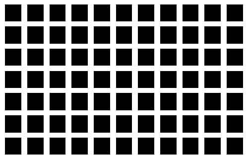
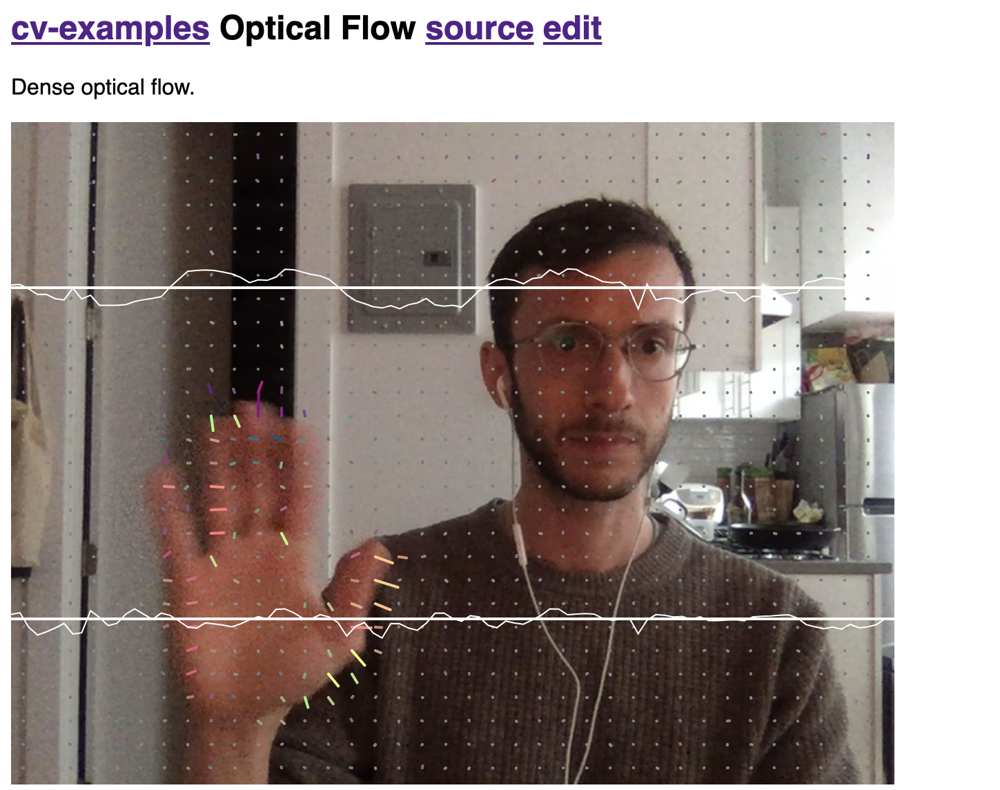
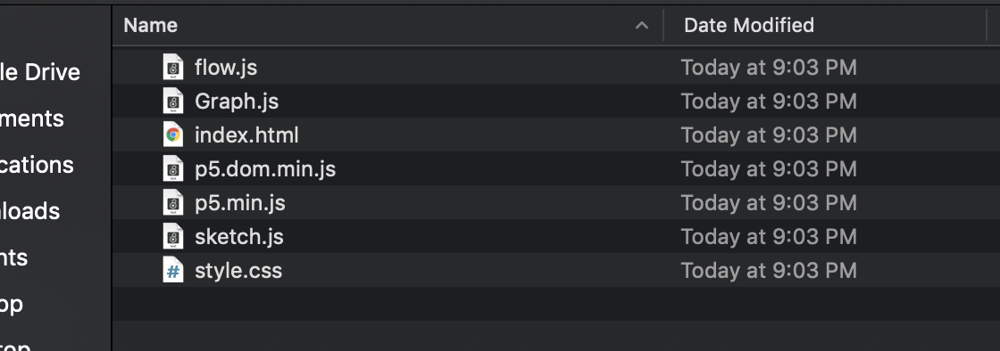
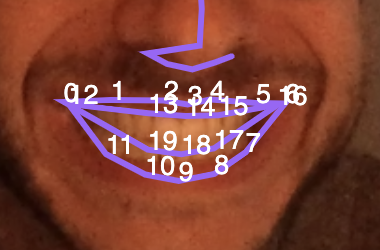

# Video Analysis

## Authors
Sam Tarakajian for NYU IDM

DM-GY 9103

@starakaj

## Essential Questions
- How do computers encode audio and video data?
- What are the salient features of audio and video?
- How can we detect and analyze those features?
- What are some creative applications?

## Introduction
Last week we talked about analyzing a live audio stream, using the output to direct a drawing in real time. In this class we'll look at something similar: analyzing a video to extract salient features. We'll be leaning heavily on a computer vision library called OpenCV. 

### Target Audience / Prerequisite & Pre-Assessment
This module is part of DM-GY 9103, _Programming is the Art of the Possible_. This is a second semester creative coding course, designed for students who have a strong JavaScript foundation.

### Outcomes & Goals
* In this class we'll be working with video recordings, as well as live video streams. We'll look at how computers represent this data, and we'll explore some software libraries for analyzing that data.
* Students will walk away with a deeper understanding of how video analysis works. They'll take away some useful tools for performing that analysis, and they'll have exposure to creative techniques for working with extracted features.

### Pacing / Duration
TBD

## Materials Needed
We'll be using meyda.js along with p5.js and dat.gui in this class
- Meyda.js
- Synopsis
- Max/MSP
- Freesound/Essentia

### Exercises To Do Before Class
TBD. Maybe a reading about Luke's work with SPL measurements? Maybe something from sonic weapons?

### Vocabulary (example)
* Feature - Distinguishing measure of information
* Computer vision - Algorithms that enable computers to interpret visual data.
* Optical Flow - A matrix describing the flow of pixels between images (needs a better definitions).
* Face Tracking - Automatically estimating the position of a face in an image or video, possibly including its size and orientation.

## Exercise Descriptions
Today we're going to talk a bit about computer vision. Broadly speaking, computer vision is the challenge of getting computers to understand what they're seeing. It often seems to be the case that it's very hard to teach computers to do something that comes easy and naturally to people. Teaching computers to recognize an object, or separate an object from its background, or to detect a face–we've had to wait for deep learning techniques to make any significant progress.

### Visual Features
Before Deep Learning (more on that in a bit) a lot of computer vision work went into something called feature extraction. A feature is some measure of the information in an example that helps to distinguish it from other examples. So you might want to ask a distinguishing question, like "is this a picture of the sky?" To figure out the answer, you might look at the color palette of the image. If the image contains mostly blues and whites, you're probably looking at a picture of the sky (or the ocean).

In computer vision we're often talking about an image processing pipeline, where between the raw image data itself, and categorial descriptions of the data, we're pulling out distingushing features of the data. Here's a picture of what that kind of thing might look like.


One thing that's really cool is that the visual processing system seems to do something similar when it comes to biological computing. One of the motivating examples for designing neural networks in the first place were dissections of horseshoe crab eyes,, where there was observed a phenomenon called lateral inhibition.



The idea is simple: a neural fires less strongly if its neighbors are also firing. So in the middle of a field of color, an optical neuron fires relatively weakly because its neighbors inhibit it. Near the edges of the field, the neuron fires more strongly. This enhances the perception of edges. The really cool thing is that this doesn't happen in the brain, this happens in the retina itself—the eye is doing image processing before the signal ever reaches the brain.

### Optical Flow
One extremely powerful visual feature is something called optical flow. With optical flow, we're typically looking at video or a sequence of two images, and trying to describe how the pixels in one map to the pixels in the other. For each pixel, which direction is it moving and how fast? Optical flow is extremely important in animals; optical flow in peripheral vision is one way that animals determine in which direction they are moving and how fast. We also use optical flow to detect motion. Incoherent optical flow helps us separate foregroud from background, or to detect something moving where things are otherwise still.

Before we talk too much more about optical flow, let's get a project set up so we can play around a bit. Once again we're going to be copying the project from https://github.com/starakaj/webpack-express-starter. Go ahead and copy this to a new directory.

Next, we're acutally going to be starting from some Other People's Code. Specifically, we're going to be working from a project written by Kyle MacDonald.

First, let's head over to https://kylemcdonald.github.io/cv-examples/ to check out some of the examples.

When you've checked out enough to feel satisfied (but maybe don't go too deep into the high-level or machine-learning examples just yet), try out the Optical Flow example.



You'll notice that as you move around, you'll see lots of lines drawn on the screen. Each one of these lines is an estimate of how the scene is moving under that pixel. The color of the line corresponds to its motion, with the hue corresponding to its direction. The red channel represents left-right motion and the green channel represents up-down motion. The two graphs, as you can probably figure out, sum together motion in the horizontal and vertical directions.

Okay, so we're going to incorporate Kyle's code into our application, and then modify it in order to achieve a nice result. Before we do that though, let's create some space for it. Let's install p5 and use it to draw video.

### Using p5 to draw video
First let's install p5

```sh
npm install p5
```

Next modify `app.js` in the following way

```js
// app.js
const p5 = require("p5");

const p5video = (p) => {
    let video;

    p.setup = () => {
        p.createCanvas(400, 300);
        p.background(255);

        video = p.createCapture(p.VIDEO);
        video.hide();
    }

    p.draw = () => {
        p.image(video, 0, 0, p.width, p.height);
    }
}

const myp5 = new p5(p5video, "main");
```

If you run this, you should see your webcam start up, and a video of yourself appear in the window. This is extremely similar to what we were doing last week when we grabbed the microphone–`createCapture` is actually a thin wrapper around `navigator.mediaDevices.getUserMedia` that gets the webcam. After creating the capture context, we call `video.hide` so that we don't see the video element in the page in addition to the p5 context. Calling `p.image` in the draw function puts the video into the page.

### Getting Kyle's Code

Now we prepare to add Kyle's code to our page. There's a couple of small steps that we have to do, so follow carefully. First, download the source. You can find the p5 sketch demo at this link:

https://editor.p5js.org/kylemcdonald/sketches/rJg3gPc3Q

Once there click File > Download. You'll get a .zip file containing all the files you need to run this project.



First, copy `flow.js` and `Graph.js` into the `app` directory, next to our `app.js`. Next, _delete_ our copy of `app.js` and _replace_ it with `sketch.js`. Rename `sketch.js` to `app.js`. Yes, we're throwing away all the work that we just did to set up the video. That's because I wanted us to actually learn how to do it, instead of just copying stuff around.

Now there are two main things that we need to fix to make this work correctly. First, we need to modify `flow.js` and `Graph.js` to export their contents. Remember, if `webpack` is going to bundle everything up for us, then we need to use `require` to link up our dependencies. Modify `flow.js` to export the FlowCalculator class:

```js
// flow.js

// ...

module.exports = class FlowCalculator {
  constructor(step = 8) {
    this.step = step;
  }

// ...

```

Cool. Now we need to do something similar to `Graph.js`.

```js
// Graph.js

module.exports = class Graph {
    constructor(historyLength, minValue, maxValue) {
        this.minValue = minValue;
        this.maxValue = maxValue;

// ...
```

Then, at the top of `app.js`, we need to require these.

```js
// app.js

// https://kylemcdonald.github.io/cv-examples/

const Graph = require("./Graph");
const FlowCalculator = require("./flow");

var capture;
var previousPixels;

// ...
```

Okay, now follows the slightly tricky business of converting this to instance mode. Why am I so annoying about instance mode? Basically, p5 is super cool and very easy to use, but if we want to use it as part of an application, and not as something standalone, then it's good practice to get used to converting to instance mode. Anyway it takes a bit of practice but it's not so bad.

1. Create a function wrapping setup and draw
```js
// 1. 
const p5Flow = (p) => {

    function setup() {

    //...
```
2. Set the `setup` and `draw` properties of the p5 instance argument to be the `setup` and `draw` functions.
```js
// 1. 
const p5Flow = (p) => {

    // 2.
    p.setup = () => {

    //...
```
3. Create a p5 instance calling that function
```js
// After your wrapping function

// 3.
const myp5 = new p5(p5Flow, "main");
```
4. Make sure than any calls to global p5 functions refer to the instance instead. This is the tricky one, it might take a couple of tries to get this right.
```js
// Finding all the instances of `width` and `height` can be a pain, so you can do this at the top of the draw function

const width = p.width;
const height = p.height;

// 4.
//createCanvas(w, h);
p.createCanvas(w, h);

// 4.
capture = createCapture({
capture = p.createCapture({
```

If you try this now it still won't work—you'll find an error inside Graph.draw. If we take a look inside `Graph.js`, it should be obvious what the error is.

```js
// Graph.js
draw(width, height) {
    push();
    noFill();
    strokeWeight(1);
    beginShape();
    var range = this.maxValue - this.minValue;
    for (var offset = 0; offset < this.historyLength; offset++) {
        var i = (this.index + offset) % this.historyLength;
        var x = (offset * width) / this.historyLength;
        var normalized = (this.history[i] - this.minValue) / range;
        var y = height - (normalized * height);
        vertex(x, y);
    }
    endShape();
    pop();
}
```

Graph is expecting a bunch of p5 functions to be in the global scope. One easy way to get around this is to modify the `draw` function so that it takes the p5 context object, like so:

```js
// Graph.js
draw(p, width, height) {
    p.push();
    p.noFill();
    p.strokeWeight(1);
    p.beginShape();
    var range = this.maxValue - this.minValue;
    for (var offset = 0; offset < this.historyLength; offset++) {
        var i = (this.index + offset) % this.historyLength;
        var x = (offset * width) / this.historyLength;
        var normalized = (this.history[i] - this.minValue) / range;
        var y = height - (normalized * height);
        p.vertex(x, y);
    }
    p.endShape();
    p.pop();
}
```

One more small thing, we need to remember to pass the p5 context to the drawing function when we call draw.

```js
// app.js

// ...
    // draw left-right motion
    uMotionGraph.draw(p, width, height / 2); // Pass p here to the draw function
    p.line(0, height / 4, width, height / 4);

    // draw up-down motion
    p.translate(0, height / 2);
    vMotionGraph.draw(p, width, height / 2); // Pass p here to the draw function
    p.line(0, height / 4, width, height / 4);
// ...
```

And now hopefully you'll see your own face.

### Doing something interesting with it

Okay now let's do something interesting with it. What I'd like do to is this: whenever the image moves, fire off a particle in the direction of motion. So, let's start by creating a class to hold our particle. We haven't talked about JavaScript classes yet, but they're a very snazzy feature of es6 that lets us attach together some functions with a little bit of state. Imagine a toy object like this.

```js
class Counter {
    constructor() {
        this.currentCount = 0;
    }

    increment() {
        this.currentCount = this.currentCount + 1;
    }

    decrement() {
        this.currentCount = this.currentCount - 1;
    }

    description() {
        return `The current count is: ${this.currentCount}`;
    }
}
```

You could use it like this.

```js
const x = new Counter();

x.increment();

console.log(x.description()); // prints "The current count is: 1"
```

You'll notice that inside of each of these functions there's a reference to `this`. When you call a function like `myObject.doSomething()`,`this` is bound to `myObject`. Now, what does our particle need to do? First, let's create a new file to hold the description of our particle called `particle.js`.

```js
module.exports = class Particle {

}
```

Now, the first thing we want to do is initialize the particle with some position and velocity.

```js
module.exports = class Particle {
    constructor(x, y, vx, vy) {
        this.x = x;
        this.y = y;
        this.vx = vx;
        this.vy = vy;
    }
}
```

Now, how do we update the particle? Easy, we just add the velocity to the positon.

```js
module.exports = class Particle {
    constructor(x, y, vx, vy) {
        this.x = x;
        this.y = y;
        this.vx = vx;
        this.vy = vy;
    }

    update() {
        this.x += this.vx;
        this.y += this.vy;
    }
}
```

Nice. Now, how do we draw it? For now, let's just draw a little circle. Remember to pass in the p5 context, since we'll need access to that to use p5 methods.

```js
module.exports = class Particle {
    constructor(x, y, vx, vy) {
        this.x = x;
        this.y = y;
        this.vx = vx;
        this.vy = vy;
    }

    update() {
        this.x += this.vx;
        this.y += this.vy;
    }

    draw(p) {
        p.strokeWeight(0);
        p.fill(255);
        p.ellipse(this.x, this.y, 2, 2);
    }
}
```

One last small thing this might be useful is a way to know if the particle is still in bounds, or if it's gone off the screen somehow. Let's add one more function: `isOutOfBounds`

```js
module.exports = class Particle {
    constructor(x, y, vx, vy) {
        this.x = x;
        this.y = y;
        this.vx = vx;
        this.vy = vy;
    }

    update() {
        this.x += this.vx;
        this.y += this.vy;
    }

    draw(p) {
        p.strokeWeight(0);
        p.fill(255);
        p.ellipse(this.x, this.y, 2, 2);
    }

    isOutOfBounds(p) {
        return this.x < 0 ||
            this.x > p.width ||
            this.y < 0 ||
            this.y > p.height;
    }
}
```

And that's it. Now, how do we use this particle class? First, in our `app.js`, we need a structure to hold all of our particles. Why not an array?

```js
// https://kylemcdonald.github.io/cv-examples/

const Graph = require("./Graph");
const FlowCalculator = require("./flow");
const p5 = require("p5");

// Don't forget this!!
const Particle = require("./Particle");

var capture;
var previousPixels;
var flow;
var w = 640,
    h = 480;
var step = 8;
let particles = []; // Add this array
```

Next we'd like to add a particle to the array whenever the flow is beyond a certain value. Take a look down in the drawing code and you'll see some lines of code like this:

```js
    if (flow.flow && flow.flow.u != 0 && flow.flow.v != 0) {
        uMotionGraph.addSample(flow.flow.u);
        vMotionGraph.addSample(flow.flow.v);

        p.strokeWeight(2);
        flow.flow.zones.forEach(function(zone) {
            p.stroke(p.map(zone.u, -step, +step, 0, 255),
                p.map(zone.v, -step, +step, 0, 255), 128);
            p.line(zone.x, zone.y, zone.x + zone.u, zone.y + zone.v); // Draw the flow
        })
    }
```

That looks like the perfect place to create a new particle. But only do it if the flow is fast enough.

```js
flow.flow.zones.forEach(function(zone) {
    p.stroke(p.map(zone.u, -step, +step, 0, 255),
        p.map(zone.v, -step, +step, 0, 255), 128);
    p.line(zone.x, zone.y, zone.x + zone.u, zone.y + zone.v);

    const flowVelocity = Math.sqrt(zone.u * zone.u + zone.v * zone.v);
    if (flowVelocity > 10) {
        particles.push(new Particle(zone.x, zone.y, zone.u, zone.v));
    }
})
```

Now we're definitely adding new particles. But what about drawing them? There are three steps here. First, draw the particles. Then, update their positions. Finally, clear out any offscreen particles.

```js
// app.js

// Add this anywhere in the draw function
    particles.forEach(part => part.draw(p));
    particles.forEach(part => part.update());
    particles = particles.filter(part => !part.isOutOfBounds(p));
```

That's it. Reload and run an you should see some particles! You may want to limit the total number of particles to something sensible

```js
const flowVelocity = Math.sqrt(zone.u * zone.u + zone.v * zone.v);
    if (flowVelocity > 10 && particles.length < 500) {
        particles.push(new Particle(zone.x, zone.y, zone.u, zone.v));
    }
```

You might also want to comment out all the stuff that draws stuff on top of your face. Other things that might be fun: add some gravity:

```js
// particle.js

    update() {
        this.x += this.vx;
        this.y += this.vy;
        this.vy += 1.0;
    }
```

### A totally different thing
Okay, we're going to step away from this now and do something different. We're going to dip our toes into ml5, the not-yet-quite-released machine learning library released in association with the Processing Foundation. The ml5 library can do a ton of stuff; I want to show you how we can work with its face detection algorithm.

First, we're going to start from a partically completed project. You can download the starter from https://github.com/starakaj/ml5-face-starter. It should look very familiar to you. Go ahead and run it, see what you get.

Now, based on this, what I'd like to do is the following: make a face-controlled synthesizer. When you open your mouth, a sound should play. When you close your mouth, that sound stops playing. Simple enough, right? So we need to do two things: figure out how to play a sound, and figure out when the mouth is open. Let's start with the mouth opening piece.

### How to know when your mouth is open
How do you know when your mouth is open? Take a look at the face in front of you. You can sort of see that the lips are outlined, and you can maybe imagine that we would know that the mouth was open when the lips are apart.

How are the lips drawn? It looks like this function has something to do with it.

```js
drawPart(mouth, true);

// ...

function drawPart(feature, closed) {
    p.beginShape();
    for(let i = 0; i < feature.length; i++){
        const x = feature[i]._x
        const y = feature[i]._y
        p.vertex(x, y)
    }
    
    if(closed === true){
        p.endShape(p.CLOSE);
    } else {
        p.endShape();
    }
}
```

As you can see, the lips are just polygons. Each feature is just an array of objects with an `_x` and `_y` property. We can measure the distance between two points to determine if the mouth is open or not. Just one problem: how do we know which part of the feature corresponds to which point? Why don't we create a function, `drawLabels`?

```js
function drawLabels(feature) {
    p.push();
    p.textSize(9);
    p.strokeWeight(0);
    p.fill(255);

    feature.forEach((v, i) => {
        p.text(`${i}`, v._x, v._y);
    });

    p.pop();
}
```
And then call this for the mouth?

```js
    drawPart(mouth, true);
    drawLabels(mouth);
    drawPart(nose, false);
```

It's a bit hard to see since some of the points overlap, but you can see that point 14 is the bottom-middle of the top lip, and point 18 is the top-middle of the bottom lip. 



Now, how to tell how far apart the points are? A distance function is easy enough to write.

```js
function distance(p1, p2) {
    const dx = p1.x - p2.x;
    const dy = p1.y - p2.y;
    return Math.sqrt(dx * dx + dy * dy);
}
```

Now we can use this to measure the mouth distance in draw

```js
// Somewhere in the draw function

if (detections.length > 0) {
    const mouth = detections[0].parts.mouth;
    const mouthDistance = distance(mouth[14], mouth[18]);
    p.textAlign(p.CENTER);
    p.strokeWeight(0);
    p.fill(255);
    p.textSize(14);
    p.text(`The mouth distance: ${mouthDistance}`, p.width / 2, p.height - 10);
}
```

One thing that you'll notice about this is that it works fine, but that it doesn't take into account the overall size of the mouth. We can factor out how near the mouth is to the camera by dividing by the width of the head.

```js
// Somewhere in the draw function

if (detections.length > 0) {
    const mouth = detections[0].parts.mouth;
    const headWidth = detections[0].alignedRect._box._width;
    const mouthDistance = distance(mouth[14], mouth[18]) / headWidth;
    p.textAlign(p.CENTER);
    p.strokeWeight(0);
    p.fill(255);
    p.textSize(14);
    p.text(`The mouth distance: ${mouthDistance}`, p.width / 2, p.height - 10);
}
```

If we want to know when exactly the mouth is open, then we can apply a threshold. If we print out the mouth distance, we can sort of see that above about 0.03, the mouth is open. Below that it seems to be closed. So we can wrap all this in a function.

```js
function mouthOpen(detections) {
    if (detections.length === 0) return false;
    const mouth = detections[0].parts.mouth;
    const headWidth = detections[0].alignedRect._box._width;
    const mouthDistance = distance(mouth[14], mouth[18]) / headWidth;
    return mouthDistance > 0.03;
}

// ... Back in the draw function
if (detections) {
    drawBox(detections);
    drawLandmarks(detections);

    p.textAlign(p.CENTER);
    p.strokeWeight(0);
    p.fill(255);
    p.textSize(14);
    p.text(`Mouth is ${mouthOpen(detections) ? "open" : "closed"}`, p.width / 2, p.height - 10);
}
```

### Playing some sound

Now we've got a function that will predict when the mouth is open. To play a sound, let's get Tone in the mix.

```sh
npm install tone startaudiocontext
```

We've also installed the startaudiocontext package as well, which will be useful for starting the audio context (clearly). Okay, adding Tone to our project is now very easy.

```js
// app.js
// At the top
const p5 = require("p5");
const Tone = require("tone"); // 1
const StartAudioContext = require("startaudiocontext"); // 2

const synth = new Tone.Synth().toMaster(); // 3
StartAudioContext(Tone.context); // 4

// ...
```
After requiring Tone and StartAudioContext, the first thing that we do is create a new Tone synth. Remember last week we talked about the audio graph—this is a useful model to keep in mind when thinking about Tone. A synthesizer is literally that—a component that synthesizes audio. Typically you send the synthesizer MIDI notes, in response to which it will start making sound. In order for us to hear that sound, the synthesizer needs to send its audio to the speakers, in this case the master output of the window. On the line marked 3 we actually see an example of chaining: the toMaster function returns the synth that we just created, so we can create the synth, connect it to master, and then assign it immediately to the value synth. Finally, we use StartAudioContext to attach an audio starting function to any clicks on the body of the page.

What about playing a sound? All we need to do is call one function when the mouth opens, and another when it closes. We'll also need a variable to keep track of the mouth state.

```js
// app.js
// Near the top
let mouthIsOpen = false;

// ... down in the draw function
if (detections) {
    drawBox(detections);
    drawLandmarks(detections);

    const mouthState = mouthOpen(detections);
    if (mouthIsOpen !== mouthState) { // Only do something if the state changes
        mouthIsOpen = mouthState;
        if (mouthIsOpen) {
            synth.triggerAttack("C4"); // Start playing a note
        } else {
            synth.triggerRelease(); // Stop the note
        }
    }
```

We use the variable `mouthIsOpen` to keep track of the previous mouth state, which we need since we only want to start playing a note when the mouth state changes. We don't want to play notes continuously while the mouth is open, even though that might sound interesting.

### Adding modulation

This is cool but there's a small change we could make that would make it way cooler. Suppose the mouth width affected the quality of the sound in some way. First we'll need some way to measure the mouth width. Returning to our mouth labels, we can see that points 0 and 6 determine the outer edges of the mouth. So it should be simple enough to measure their distance.

```js
// app.js
function mouthWidth(detections) {
    if (detections.length === 0) return false;
    const mouth = detections[0].parts.mouth;
    const headWidth = detections[0].alignedRect._box._width;
    const mwidth = distance(mouth[0], mouth[6]) / headWidth;
    return mwidth;
}
```
This should look very similar to the mouth open function, because it is. We're just measuring the distance between two different points. However, one thing that might be nice to do would be to normalize the mouth width. By that I mean, rather than reporting the absolute mouth width, we could send a zero for "as narrow as it can be" and a 1 for "as wide as it can be". Normalizing the value makes it easier to map to other values later.

```js
function mouthWidthNormalized(p, detections) {
    if (detections.length === 0) return false;
    const mouth = detections[0].parts.mouth;
    const headWidth = detections[0].alignedRect._box._width;
    const mwidth = distance(mouth[0], mouth[6]) / headWidth;
    const normalizedWidth = p.map(mwidth, 0.22, 0.42, 0, 1);
    return normalizedWidth;
}
```

Passing in the processing context allows us to use the `map` function, which takes our mouth width and maps it to the normalized range of zero to one. We just have to remember to actually pass the processing context when we call this function. Now, we're almost there, we just need to modulate some parameter of the synthesizer as the mouth width changes. The vanilla synth doesn't have that expressive a voice, but we can use the FMSynth, which has this nice `modulationIndex` parameter.

```js
// app.js
// Change to an FMSynth
// const synth = new Tone.Synth().toMaster();
const synth = new Tone.FMSynth().toMaster();

// Adjust the modulationIndex for mouth width
// in draw
    const mwidth = mouthWidthNormalized(p, detections);
    synth.modulationIndex.rampTo(mwidth * 20, 0.5);
    p.textAlign(p.CENTER);
// ...
```

## Student Reflections, Takeaways & Next Steps
TBD

## Post Session

### References
TBD

### Implementation Guidance & Teaching Reflection  
TBD

***With thanks and acknowledgement, this is based on the template provided by [Eyebeam](https://github.com/eyebeam/curriculum/blob/master/TEMPLATE.md)***