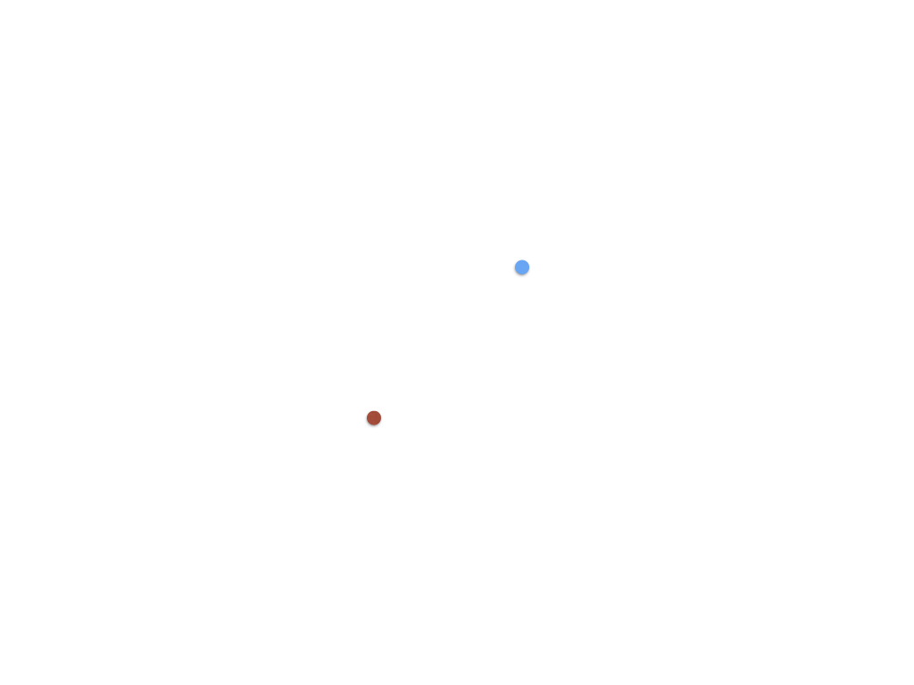
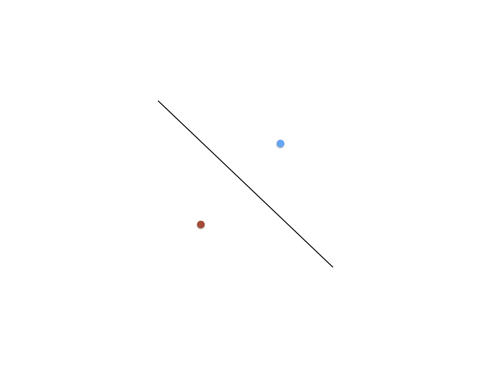
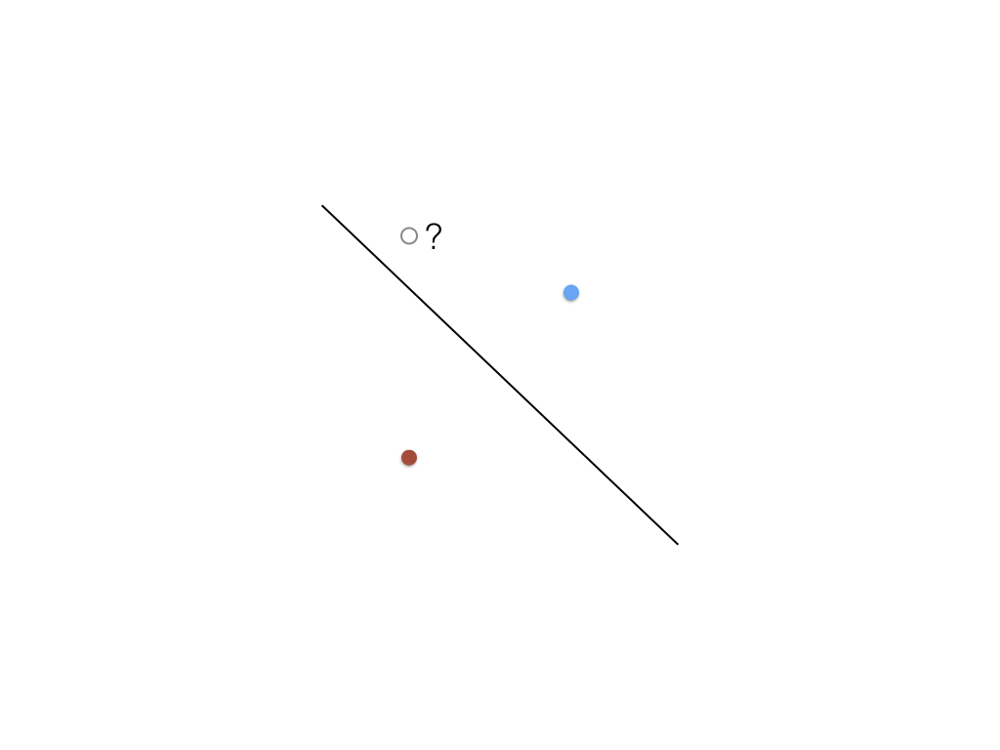
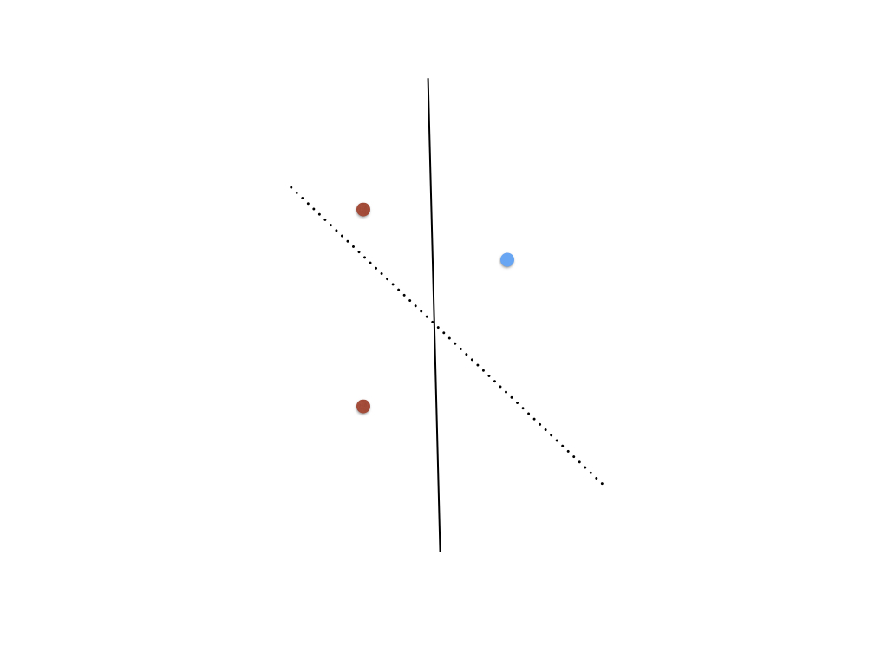
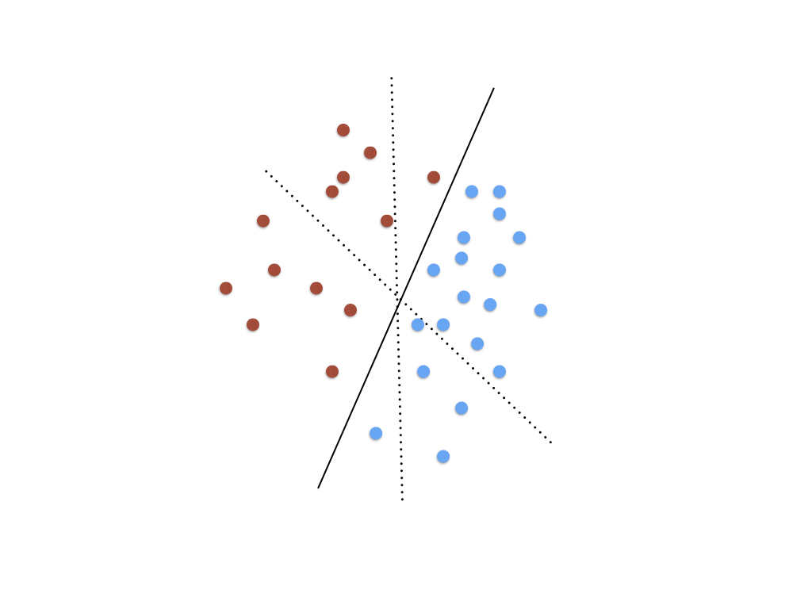

# Machine Learning

## Authors
Sam Tarakajian for NYU IDM

DM-GY 6063

@starakaj

## Essential Questions
- What is Machine Learning? How is it similar to/different from human learning?
- How is Machine Learning different from other statistical techniques?
- What kinds of problems can be solved with Machine Learning?
- What are some challenges facing Machine Learning?

## Introduction
By now everyone has some familiarity with Machine Learning and Artificial Intelligence. It's the fuel for technological fantasies like self-driving cars and self aware computers, and for technological anxieties about disappearing jobs and authoritarian governments. One class is hardly enough time to cover all the complexities of working with and living with AI, but we'll cover as much as we can.

In this class, we'll develop a deeper understanding of how Artifical Intelligence works, especially the Deep Network architectures that have revolutionized the field in recent years. We'll contrast AI with other machine learning techniques, and we'll see how some libraries make it easier to work with AI.

### Target Audience / Prerequisite & Pre-Assessment
This module is part of DM-GY 6063, _Programming is the Art of the Possible_. This is a second semester creative coding course, designed for students who have a strong JavaScript foundation.

### Outcomes & Goals
* In this workshop, we will be talking about AI and about working with Teachable Machine.
* Students will walk away with a deeper understanding of how AI works and what they can do with it.

### Pacing / Duration
TBD

## Materials Needed
- node
- Access to http://teachablemachine.withgoogle.com/

### Vocabulary (example)
* Machine Learning - Any algorithm by which a system can change its behavior in response to data
* Artificial Intelligence - Machine learning systems that appear to exhibit intelligence. This includes properties like adapting to new data, separating salient features from noise, and generalizing to new and unfamiliar problems.
* Deep Neural Net - Neural nets incorporating many layers. These nets require much more training data than shallower nets and take longer to train, but they can do some pretty amazing things.
* Training - Presenting a ML system with data, so that it will change its internal configuration in some way. This can be supervised or unsupervised. Generally a ML system attempts to minimize error, perhaps with a heuristic that optimizes for simplicity.
* Generalization - Understanding a broad class of problems from some subset of the problem set.
* Overfitting - A machine learning system is overfit if it performs well for a small set of examples but fails to generalize.
* Topology - The graph structure of a neural network. How many nodes are in each layer, how are the nodes connected. Connections can be sparse, dense, recurrent or not.

## Exercise Descriptions
Let's start by talking just a little bit about AI.

### Just a little bit about AI
We aren't going to be diving too deep into how AI works at the level of code, but we can at least start by getting a feeling for how it works. Nowadays when we talk about Machine Learning, we're usually talking about the application of deep neural nets to decision making problems. But machine learning describes more ways of modeling statistics than just those involving neural nets. And artifical intelligence really just describes any non-biological intelligence, which we can loosely define as learning to change your behavior in response to your environment. That learning part is what's so important, and what separates writing a Node script, where each step of the process must be defined in advance by a human programmer, from building an AI model, which usually involves presenting an ML algorithm with lots of examples.

To get a handle at a very high level for how training an ML model works, consider an example like this:



You might have two examples of dots in an xy plane. Your challenge is, given those dots, can you make a prediction about what the color of a third dot would be, given its position. You might start by drawing a line between the dots.



Then given a new dot, you might guess that it would be blue.



If you then learned that the dot was actually red, you could update your model to reflect new information.



As you saw more and more examples, you would eventually be able to draw a line that was more and more accurate.



This simple example doesn't rely on a technique nearly as sophisticated as a deep neural net, but it does exhibit two important properties of artificial intelligence:

- It can adapt to new data.
- It can generalize to examples it hasn't seen before.

This also happens to be one of a particular kind of machine learning tasks, called supervised learning. In this example, we have a dataset that's already been tagged. When the model makes a prediction, we can tell it what the answer should have been. The model can then adapt itself in response. In the case of our line, that simply involves changing the slope. For a neural net, it would involve backpropagation. At some level, the two aren't that much different.

There is another kind of machine learning task called unsupervised learning. Here, the algorithm isn't told beforehand how the data is tagged. In fact, it might not be known what the correct tags would be. Looking at points on a two dimensional grid, it's generally pretty easy to see how they cluster. But what about a higher dimensional data set? Given all the statistics about a basketball player, suppose you asked "how many different kinds of basketball players are there?" So many different statistical measures can be used, it's hard to know the most meaningful way to cluster players. An unsupervised learning technique can figure out categories, even when no categories are given beforehand.

In either case, we're limiting ourselves today to classification problems. These problems are of the form "given what is known about a particular instance, how likely is it that the instance is a member of one or more classes?" Obviously we're dealing with a classic machine learning task, but more problems than you think are actually classification problems. "Talk to Transformer" for example is on some level simply classification: given the characters (or words) that came before, what's the most likely character (or word) to come next?

There's much, much more to say about machine learning in general, and specifically about neural nets. For now, let's set all that aside and talk about how we can use them.

### Starting with Teachable Machine

Let's head to Teachable Machine. You can find it at https://teachablemachine.withgoogle.com/

Once there click on Get Started, which will take you to a page where we can see the three kinds of data that Teachable Machine can work with. Click on Image and you'll be taken to a page where you can train TM on video data. Here you can train a model on two different kinds of image or video data. To get started, let's work with video. Think of something you can do with your hands, like giving a thumbs up or making "heart hands" https://image.shutterstock.com/image-photo/woman-making-heart-her-hands-600w-1211985307.jpg. Now, label your first class accordingly, and press "Webcam" and then "Hold to Record." If you picked a two-handed sign, you might have to click on the little gear and disable "Hold to Record." Once you're reading, start recording samples.

One thing to keep in mind is that you need to show the model variety. If you're teaching a chind what a thumbs up is, they probably don't need to see it from thousands of different angles to understand what it is that you're trying to show them. Neural nets don't really know anything about the world, and so they need a bit more help. They don't really know what a hand or a finger is, so you need to make lots of examples of whatever hand sign you want the machine to recognize.

Cute aside, this "model of the world" thing is part of why natural language sentence processing is so hard. Consider a sentence like the following:

```
The trophy couldn't fit inside the suitcase because it was too big.
```

Does "it" refer to the trophy or the suitcase? What if it were too small instead of two big? People are very good at this task, but it's only easy because we know what a trophy is and what a suitcase is. We have real-world, tactile experience with these things. An AI that's read billions of lines of text never can. Sentences that are formulated this way are an example of somethign called a [Winograd Schema](https://en.wikipedia.org/wiki/Winograd_Schema_Challenge).

Aside over. Now let's train the net on examples of things that are not our hand sign. Here we want variety. Turn the camera on and show it all kinds of stuff. Turn your computer around. Leave the frame. When you're ready, close the webcam viewer and hit "Train Model." You will be amazed how fast the thing trains, and how accurate the results seem to be.

One thing you might notice when testing your model is that it makes some obvious misclassifications. If you trained it to recognize a thumbs up, it might think that a closed fist is a thumbs up as well. When you give your training data, it's important to show lots of examples of almost-but-not, so the net learns what's really distinguishing about the class you want it to recognize.

If you want to come back to your model and keep making changes, you can open the menu at the top left and either save your project to Google Drive, or download it to your desktop. You can load this project back into Teachable Machine later.

### Using the model

Cool so now we've generated our model, let's use it in our own work. Once you're happy with your model (maybe you needed to go back and retrain it on some new data) click "Export Model" over on the right. Now you can either upload your model to the cloud, where Google will host it for free, or else you can download it. Let's upload it and let Google host it for now, though it's just as valid to use one that you've downloaded yourself. Once it's finished uploading, you'll get a link. Hold on to that, you'll need it in a minute.

Now head over to https://github.com/starakaj/teachable-machine-starter. This starter contains a few small sketches that will help you get started working with Teachable Machine models, side by side with p5. Once you've copied the starter, first run

```sh
npm install
```

to pull in dependencies, then 

```sh
npm run watch
```

to start it up. Over at localhost:3000, you should be see a webcam example that recognizes "heart hands" like the stock image photo above.

Let's look quickly at the code. If you take a look inside the `app` folder, you'll see a three different Detector folders, along with the usual `app.js`. Rather than hosting one example, this starter contains multiple starting points depending on whether you're working with a video stream, an audio stream, or a drawing. In `app.js` you should see code like this:

```js
// app.js

// Require different files to change behavior
const setup = require("./imageDetector/imageDetectorApp");
// const setup = require("./soundDetector/soundDetectorApp");
// const setup = require("./drawDetector/drawDetectorApp");

// Calls the setup function when the page is loaded
window.addEventListener("DOMContentLoaded", setup);
```

As you can see, by changing which setup function is loaded, this will run a different starter example. Taking a look at the image detector in `imageDetector/imageDetectorApp.js`, you should see a line like this:

```js
// imageDetectorApp.js

// Model URL
// If you make your own model, this is where you'd link to it. This is a model
// that I trained on making "heart hands", like this
// https://image.shutterstock.com/image-photo/woman-making-heart-her-hands-600w-1211985307.jpg
const imageModelURL = 'https://teachablemachine.withgoogle.com/models/sltRChS8U/';
```

Here's where you can put in your own model to run a different kind of classification. Try pasting in your own model, and see if after reloading the page you're able to recognize a different kind of hand sign.

### p5 and drawing layers

If you take a close look at this example, you'll see that we actually create a separate drawing context for the video.

```js
// imageDetectorApp.js

p.setup = () => {
    // ...
    offscreenGraphics = p.createGraphics(width, height);
    // ...
}
```

We haven't seen this `createGraphics` before, but you can think of it a lot like Photoshop or Illustrator layers. Basically, we're asking p5 for another "sheet of paper" on which we can draw. To build up a final image, we can "stamp" this other context back onto the main p5 context. That's done with the `image` function, which you can see a bit later on down in the `draw` function.

```js
// imageDetectorApp.js

p.draw = () => {
    // ...
    p.image(offscreenGraphics, 0, 0, p.width, p.height);
    // ...
}
```

This is where the `offscreenGraphics` are drawn back onto the main p5 canvas. In this example we're just using this offscreen canvas to hold a horizontally flipped copy of our webcam, but keep this idea in mind. We'll see it again when we look at the drawing example.

### Modifying the drawing example

If you think back to the audio/video examples, we almost had something like two parallel threads going. There was the draw thread, and then there was the analysis thread. Of course we don't really have separate threads in JavaScript, but the point is that we didn't call `analyze` or `classify` in the `draw` function. Rather, we had a classify function that would keep calling itself. As it did, it would update some kind of global variable that the `draw` function could read from. As this example shows, that's a common pattern. Here it's the `label` variable that's shared between these two different pseudo-threads. So if we wanted to change the functionality here, we could do some drawing in response to a label being recognized. We would just check the value of the `label` variable, and then do something different in our draw function depending on its value.

### Working with sound

Training the model to respond to sound is very similar to training it on images. In the case of sound, Teachable Machine will automatically cut our sound up into second-long chunks. It then tries to classify each chunk, probably based on its spectrogram (if I had to guess). Now the interesting thing is that this example requires you to train a special class that will always be called "background noise." Let's try this one now, it's very similar to the image example.

If we want to use this model, the first thing we'll have to do is to change the particular setup function that we load in `app.js`

```js
// Require different files to change behavior
// const setup = require("./imageDetector/imageDetectorApp");
const setup = require("./soundDetector/soundDetectorApp");
// const setup = require("./drawDetector/drawDetectorApp");
```

Next, you can find the place where we load the sound model in the `soundDetectorApp.js` file, and swap out your own model.

```js
// Model URL
// If you make your own model, this is where you'd link to it. This is a model
// that I trained on making on saying the word "beep". Hopefully
// if you say the word "beep" in isolation it will detect it. Unfortunately
// it's only trained on my voice.
const soundModelURL = 'https://teachablemachine.withgoogle.com/models/Q-n8u5SXp/';
```

Other than that, this example is extremeely similar to the image detection example. There are two important differences that are worth pointing out. The first is that you only have to call the `classifier.classify` function once in the audio example. With video, you were analyzing a single frame. In the audio domain, you're continuously analyzing a stream of audio data. The callback function you provide will get called every time a new frame of audio data is analyzed. The other very important difference is in the `soundClassifierOptions`.

```js
// These are the options that you can pass to your sound classifier when creating 
// it. Unless you pass "invokeCallbackOnNoiseAndUnknown: true", the callback
// will only trigger when one of the non-noise categories is recognized.
const soundClassifierOptions = {
    includeSpectrogram: true, // in case listen should return result.spectrogram
    probabilityThreshold: 0.75,
    invokeCallbackOnNoiseAndUnknown: true,
    overlapFactor: 0.50 // probably want between 0.5 and 0.75.
}
```

The two most important ones are the last ones. The `invokeCallbackOnNoiseAndUnknown` option determines whether or not `_background_noise_` will trigger a callback. Whether or not you want this on depends on your application. The last bit, the `overlapFactor` determines how often sound will be analyzed. An overlap factor of 0.5 means that sound will be analyzed twice each second. The 0.75 value means sound analysis will happen four times each second. The higher the overlap factor, the more processing you're doing, but the more time resolution you'll get. However! There will always be a bit of latency, because it takes some time to gather enough samples to make one frame of audio data.

### Working with drawings

To look at the last built in example, uncomment the last line from `app.js`

```js
// app.js

// Require different files to change behavior
// const setup = require("./imageDetector/imageDetectorApp");
// const setup = require("./soundDetector/soundDetectorApp");
const setup = require("./drawDetector/drawDetectorApp");
```

Reload the page, and you'll see an interface in which you can make drawings. Currently the system is using a model that's trained on drawings of squares and drawings of circles. Let's train it on something else. As the interface says, you can press space to clear your drawing and "s" to save the current context to a file. Maybe you want to recognize the letter A as well as the letter B. Make 10 drawings of each, and put them in separate folders. Also make another folder that you won't use for training, but simply for evaluating your model. You can put a mix of letters in here.

Now go back to Teachable Machine. Create a new Image model, and use these folders of drawings to train it to recognize your shapes. You should be able to upload the model, swap out the appropriate URL in `drawDetectorApp.js`, and have a system that can recognize whatever drawings you like.

Now I want to draw your attention to a couple interesting lines:

```js
        // Draw a small black circle under the mouse
        if (p.mouseIsPressed) {
            drawingCanvas.strokeWeight(0);
            drawingCanvas.fill(0);
            drawingCanvas.ellipse(p.mouseX, p.mouseY, 5, 5);
        }

        // To draw what we see, first erase
        p.background(235);

        // Draw the drawing canvas
        p.image(drawingCanvas, 0, 0, width, height);

        // Draw the label
        let textToDraw = label === "" ? "Draw! Space to clear, s to save." : label;
        p.fill(0);
        p.textSize(16);
        p.textAlign(p.CENTER);
        p.text(textToDraw, width / 2, height - 4);
```

What's going on here? How come we're drawing the circles into the drawing canvas, and then drawing that to the screen? Think about it... it's because we need to keep the circles around, and we don't want calling `background` to erase them.

### Recognizing Stuff from Image Net

Cool, let's change gears now for just a second and talk about recognizing stuff in general. Imagine instead of feeding video into the Image classifier, you used some images you happened to have. But to train a good model you need thousands of images. Where are you going to get thousands and thousands of tagged images? Fortunately for us there's an amazing resource called Image Net, run by the Stanford Vision Lab in partnership with Princeton University. You can see their website here http://www.image-net.org/.

Image Net has thousands of photos for each word in its hierarchy, millions of images overall. That hierarchy is actually based on something called Word Net, which arranges thousands and thousands of nouns into a totalizing hierarchy. So for example the entry "barber chair" is under the hierarchy in artifact / instrumentation / furnishing / seat / chair / barber chair. Associated with each noun is a sysnet identifier, which looks like n###### or `n` followed by some numbers. That `n` refers to the part of speech (again the hierarchy actually comes from Word Net, not Image Net) and is always noun for everything in Image Net.

How can you use this amazing resource? Inside Teachable Machine Starter there's a script that will automatically download images from Image Net for you. Nice, no? So for example you can run:

```sh
npm run images -- -o data/random
```

to download 100 random images into a directory called `data/random`. Notice the kind of funny syntax, with the `--` separating two parts of the command. If you look in `package.json` at what exactly `npm run images` does:

```json
"images": "node scripts/imageDownloader.js",
```

This particular node script is actually set up to parse its arguments using flags, a very common pattern for a command line script. In order for npm to know that you want to pass the flags down to the script that you're actually calling, rather than using the flags itself, you need the `--` before any flags that you want to pass down. If you run `npm run images -- --help` you can see exactly what all the flags do:

```
> node scripts/imageDownloader.js "--help"

Usage: imageDownloader [options]

Options:
  -d, --dry              Dry run--print what would happen but don't do it
  -r, --randomize        Randomize the order of downloaded images
  --count <count>        number of images to download (default: 100)
  -o, --output <outDir>  Directory to write to (default: "/Users/samueltarakajian/nyu/teachable-machine-starter")
  --wnid <word-net-id>   Source Word Net ID. Leave blank for random images
  -h, --help             display help for command
```

So to download 100 images of a particular thing, you'd first search for that thing on Image Net. Say you wanted 100 images of a barber chair. In that case you'd run a script like this (keeping in mind that n02791124 is the sysnet id of a barber chair):

```
npm run images -- -o data/barber --wnid n02791124 --randomize
```

You can use this to train a model that will detect the presence of a particular object. Let's try it now. Download 100 random images, and 100 random images of something else. Train a model using 90 of each. Finally, test your model to see how well it performs on what remains.

### Addendum - Working with commander

The command line downloader was written with an npm package called `commander`, which is very handy for writing command line tools. Let's quickly try writing our own command line tool using this package.

```sh
mkdir commander-test
cd commander-test
npm init
npm install commander
```

Now make a file called `myscript.js` or whatever. With commander, a super basic setup looks something like this:

1. Require commander, specifically the `program` bit
2. Specify your options with `.option("<option stuff>")`
3. Run `program.parse(process.argv)` to read the arguments from argv into program

Maybe you want to make a pasta cooking script? It could look something like this:

```js
const { program } = require("commander");

program
    .option("-p <pasta>", "What kind of pasta you want", "spaghetti")
    .option("-s, <sauce>", "What kind of sauce you want", "tomato")
    .parse(process.argv);

console.log(program.P);
console.log(program.S);
```

Breaking this down a bit, you'll see each option has three parts. The first defines the option `"-p , <pasta>"` for example. The `-p` bit is the flag that you can use to indicate which part of your command specifies the pasta. The nice thing about using flags is that you can format the command in lots of different ways. So for example you can do

```
node myscript.js -p ravioli -s cheese
```

or

```
node myscript.js -s cheese -p ravioli
```

and the result will be exactly the same. The next bit of the option is the description. You won't see this unless you run `node myscript.js --help`, but when you do, the description will be used to construct the help string.

```
➜  commander-test git:(master) ✗ node myscript.js --help
Usage: myscript [options]

Options:
  -p <pasta>   What kind of pasta you want (default: "spaghetti")
  -s, <sauce>  What kind of sauce you want (default: "tomato")
  -h, --help   display help for command
```

Lastly you've got the default value. This can be a string, nubmer or boolean, up to you. Finally, you call `parse(process.argv)` to parse the arguments in `argv` and read them into process. You'll notice that, in the case of single-character flags, these get stored in a capital-letter property. That's not the case if you use a longer form flag. So for example if you do something like

```js
const { program } = require("commander");

program
    .option("-p, --pasta <pasta>", "What kind of pasta you want", "spaghetti")
    .option("-s, <sauce>", "What kind of sauce you want", "tomato")
    .parse(process.argv);

console.log(program.pasta);
console.log(program.S);
```

then the pasta option is stored in `program.pasta` and _not_ in `program.P`. Notice too that whatever you put between the angle brackets is not used for the name, it's purely part of the documentation. If you omit the angle brackets you get a boolean flag. So here

```js
const { program } = require("commander");

program
    .option("-r", "Raw pasta", false)
    .option("-p, --pasta <pasta>", "What kind of pasta you want", "spaghetti")
    .option("-s, <sauce>", "What kind of sauce you want", "tomato")
    .parse(process.argv);

console.log(program.R);
console.log(program.pasta);
console.log(program.S);
```

if you run the command like

```sh
node myscript.js -r -p spaghetti -s vodka
```

then `program.R` will be `true`. There are plenty more ways to use commander, much better documented at the project [homepage](https://github.com/tj/commander.js)

One final note, flags are weird. You can throw flags around like crazy. The above could have been written as

```sh
node myscript.js -rp spaghetti -s vodka
```

and it would have been the same.

## Student Reflections, Takeaways & Next Steps
TBD

## Post Session
TBD

### References
TBD

### Implementation Guidance & Teaching Reflection  
TBD

***With thanks and acknowledgement, this is based on the template provided by [Eyebeam](https://github.com/eyebeam/curriculum/blob/master/TEMPLATE.md)***